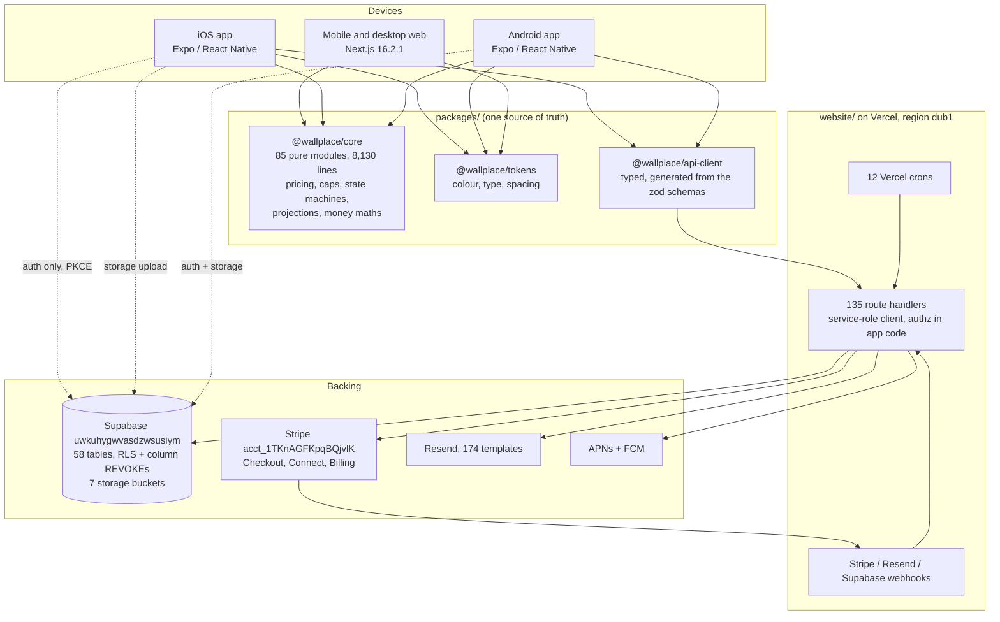

# Wallplace mobile: the definitive iOS and Android implementation plan

**Date:** 2026 September 6
**Branch:** `claude/wallplace-mobile-plan-0459e9`
**Repository state at time of writing:** `main` merged to `1bdc0646`, `npm run check` exit 0, 468 test files, 4,957 tests passing (run 2026-09-06 in this worktree)
**Companion files:**
`docs/plans/2026-09-06-wallplace-mobile-parity-matrix.csv` (361 rows)
`docs/plans/2026-09-06-mobile-adr-01-expo-react-native.md`
`docs/plans/2026-09-06-mobile-adr-02-subscription-purchase-channel.md`
`docs/plans/2026-09-06-mobile-adr-03-visualiser-in-a-webview.md`
`docs/plans/2026-09-06-mobile-adr-04-one-token-source.md`

**Status:** plan only. No application code, migration, Supabase write, Stripe write, Vercel change or git push was made in producing it.

**Reading conventions.** Every claim about the codebase carries a file path. Every claim about store policy carries a URL and the date it was retrieved. Facts are labelled **Verified** (read from the code, the live database, the live Stripe account, the live site, or a primary policy source on 2026-09-06), **Inferred** (derived from something verified, with the derivation shown), or **Assumed** (a stated assumption with the check that would confirm it). Requirement identifiers are stable: `WP-N-*` is new server work, `WP-C-*` is a change to existing server work, `WP-X-*` is an optional extra. Parity matrix identifiers are `PG-*` (page), `RT-*` (route), `CR-*` (cron), `EM-*` (email family), `NT-*` (notification kind), `FL-*` (flag), `XC-*` (cross-cutting).

---

# 1. Executive summary

## 1.1 The recommendation in one page

Build one **Expo / React Native** application, in TypeScript, living in the same repository as `website/`, sharing a workspace package of pure domain logic with it, and consuming the existing Next.js route handlers as its only backend. Ship it to iOS and Android from one codebase. Do not build a WebView shell, and do not build two native codebases.

The evidence for that choice is measured, not asserted. 85 of the 170 non-test modules in `website/src/lib` (8,130 lines) import nothing outside the repository at all, and a further 15 (2,669 lines) import only `@supabase/supabase-js`, which runs unchanged on React Native. That is where pricing, the platform fee, the outreach cap, both state machines, the arrangement-type semantics, the public projections, the shipping calculator, the order money maths and the tier tables live. Expo SDK 56 ships React 19.2, the same React major the web runs on (`website/package.json` pins `react` at 19.2.4), so a shared package needs no version bridge. React Native is also the only candidate on the list where the founder, who works alone with AI coding agents, keeps one language, one type system, one test runner and one set of zod schemas across web and app. Section 4 scores all six candidates against all eleven criteria.

The mobile product is not the website in a frame. It is **an operator's app**: the artist and the venue are the people who live in Wallplace daily, and the two jobs the phone does better than the desktop are answering a placement request within minutes and photographing a wall or an artwork where it stands. Buyers keep the mobile web as their primary surface, because a QR label on a café wall must work for a stranger with no app, and section 6.1 shows the App Clip and Play Instant option is a phase-four experiment rather than a launch decision.

**Revenue is preserved by keeping the artist subscription entirely on the web, in Stripe, and never selling it inside either app.** This is not timidity. Wallplace's artist funnel already runs through the web (apply at `/apply`, an admin accepts, Supabase sends an invite email, the artist subscribes on `/artist-portal/billing`), so the app was never going to be the acquisition path. Selling the £9.99 to £49.99 monthly plan through in-app purchase would cost 29.2 pence in the pound at Apple's Small Business Program rate once UK VAT is deducted, against 4.2 pence in the pound through Stripe. At 1,000 artists on the stated plan mix that is £57,432 a year given away to solve a problem the funnel does not have. Artwork sales, which are the bulk of GMV, **must** use Stripe on both stores: Apple guideline 3.1.3(e) requires a non-IAP method for physical goods and names Apple Pay, and Google Play's payments policy carves physical goods out explicitly. Venue paid loans, Curated and Programmes are physical services and take the same route. Section 6 does the full mapping, the per-region analysis, the per-pound maths and the contingency if Apple rejects the posture at review.

## 1.2 Phasing

| Phase | Goal | What the user gets at the end | Estimate (engineer-weeks, one senior engineer with AI agents) |
|---|---|---|---|
| **P0 Foundations** | The app exists, signs in, and can be governed | Nothing ships to users. Internal TestFlight and Play internal build: sign in, see your role, read remote config, forced update works, crashes are reported | 4 to 6 (confidence: medium) |
| **P1 Operator core** | The two jobs the phone does better | TestFlight and Play closed testing: browse, artist profile, artwork, the QR landing with attribution intact, placements list and detail with the full negotiation, messages with push, an action-first Home per role | 8 to 12 (confidence: low to medium) |
| **P2 Money and the portals** | Everything an operator does in a week | Public release candidate: native checkout with Apple Pay and Google Pay, orders, offers, refunds, the works editor, QR label printing, profiles, walls, settings, account deletion | 8 to 12 (confidence: low) |
| **P3 Depth** | The rest of parity | Public 1.0: the visualiser and showroom editors, collections, artwork requests, Curated and Programmes enquiries, offline caching, native sharing, analytics | 5 to 7 (confidence: medium) |
| **P4 Native delta** | The things only a phone can do | 1.1: AR wall measurement, home screen widgets, order Live Activities, tablet layouts, App Clip and Play Instant experiment | 4 to 8 (confidence: low) |

Total 29 to 45 engineer-weeks. Section 16 gives the task-level breakdown, the backend changes with migration numbers, and the critical path.

**When to start.** Not before three owner actions land, because each one invalidates work done ahead of it: the Supabase Auth Site URL (A2 below, which today makes every password reset and invite in production point at `http://localhost:3000`, so the app's sign-in recovery path cannot be tested at all), the Stripe live webhook endpoint (A3, without which no live payment is ever fulfilled), and incorporation (A1, because Apple and Google both require a verified legal entity with a D-U-N-S number and bank details before a single build can be submitted, and that has the longest lead time of anything in this plan). P0 can begin the day A1 is filed, because developer-account approval runs in parallel with foundation work. Section 14.7 explains how the app avoids chasing a daily-deploying API.

## 1.3 Top five risks

1. **The seed catalogue reads as a placeholder app to a store reviewer.** `NEXT_PUBLIC_FLAG_SEED_CATALOG` is on in production and puts 41 fictional artists and 21 fictional venues in the marketplace behind a grey "Sample" pill (`website/src/lib/feature-flags.ts`, `website/src/data/artists.ts`). Against 12 approved real artists and 9 real venues in the live database, the catalogue a reviewer opens is 77% invented. Apple 4.2.2 and the metadata rules exist for exactly this. Mitigation in section 15.5.
2. **The artist subscription posture is the one judgement call a reviewer can overturn.** Apple guideline 3.1.3(b) permits an app to honour a subscription bought on the web, but its wording ("provided those items are also available as in-app purchases within the app") has been enforced inconsistently across the industry. If Apple insists, the fallback is StoreKit at a grossed-up price, priced in section 6.6, which costs the owner either 29% of iOS subscription revenue or a 35% price rise for iOS artists.
3. **The QR attribution chain is a silent failure.** Verified live on 2026-09-06: `GET /api/qr/james-okafor?vs=the-curzon` 302s to `/browse/james-okafor?ref=qr&venue=the-curzon&va=<signed>&venueName=The+Curzon` and the browser writes `wallplace:qr-context` to `localStorage` with the signed claim. If the app's universal-link handler drops the `va` parameter, every venue's revenue share silently becomes zero and nothing errors. Requirement WP-C-QRJSON and test `MOB-CONTRACT-QR` exist for this one thing.
4. **The browse feed does not survive a mid-range Android device.** Measured on production 2026-09-06: `GET /api/browse-artists` returns 191,044 bytes containing 41 artists and 260 embedded works, takes 263ms, and the page then renders 120 cards in one 6,791-pixel scroll and filters client-side. A native list cannot consume that. `WP-N-BROWSE` (a paged, server-filtered feed) is on the critical path and is the largest single piece of new server work in the plan.
5. **The API moves daily and the app cannot.** `main` took 20 commits in the days before this plan was written, and a shipped binary cannot be redeployed. Without the remote-config document, the minimum-supported-build gate and the additive-only response contract in section 5.9, the first week-old app build breaks against a Tuesday deploy and there is no way to fix it inside a store review cycle.

## 1.4 What the owner must do

Full list with lead times in section 18. The five that block everything:

- **A1. Incorporate**, then obtain a D-U-N-S number and enrol in the Apple Developer Program as an organisation. Lead time 4 to 8 weeks end to end and it is the longest pole in this plan. `website/src/lib/company.ts` still holds `legalName: ""`, `number: ""`, `registeredOffice: ""`.
- **A2. Set the Supabase Auth Site URL** to `https://www.wallplace.co.uk` and add `https://www.wallplace.co.uk/**` plus the app scheme to the redirect allow-list. Still `http://localhost:3000` as of the last recorded check (`website/docs/qa/LAUNCH-MANUAL-CHECKLIST.md` §0a). Ten minutes of work, blocks the entire auth surface.
- **A3. Create the Stripe live webhook endpoint.** Verified 2026-09-06 through the Stripe MCP against live account `acct_1TKnAGFKpqBQjvlK`: `GET /v1/webhook_endpoints` returns an empty list and `GET /v1/prices` returns an empty list. There are no live prices and no live webhook. Nothing about mobile matters until money works.
- **A4. Move Vercel off the Hobby plan.** Verified 2026-09-06: project `wallspace` is on Hobby. Vercel's fair-use guidelines restrict Hobby to "non-commercial personal use" and name "any method of requesting or processing payment from visitors of the site" as commercial usage ([vercel.com/docs/limits/fair-use-guidelines](https://vercel.com/docs/limits/fair-use-guidelines), retrieved 2026-09-06). A marketplace taking card payments on Hobby is outside the terms it is running under, independent of anything mobile.
- **A5. Decide the four questions in section 17.1** that only the owner can answer: the Android link-out, buyer persona scope, dark mode, and the services budget.

---

# 2. Product understanding, as it is today

## 2.1 What Wallplace is

A UK marketplace that puts independent artists' work on the walls of real venues (cafés, restaurants, bars, hotels, offices, salons, coworking spaces) and lets the people who see it buy it. Three sides:

- **Artists** publish a portfolio and a public profile, ask venues for wall space or accept requests, print a QR label for each placed work, and sell originals and prints. They pay a monthly membership and a flat 15% platform fee on sales.
- **Venues** register free, publish their walls, request or accept placements, and settle in one of four ways: display the work and take a share of QR-attributed sales, pay a monthly loan fee to keep it hanging, buy it outright, or a mix.
- **Buyers** scan a label on a wall or browse online, and check out with card payment, shipping, collection from the artist, or collection from the venue.

Two curated services sit on top, sold to venues: **Wallplace Curated** (a one-off shortlist, £49 for a single wall or £149 for a full space, both pay-first, plus a £299-anchored bespoke project quoted by an admin) and **Wallplace Programmes** (a quoted twelve-month managed art programme for offices, hotels and restaurants, from £79.99 a month, where artists earn monthly rent per piece and rent settles quarterly). `docs/superpowers/plans/2026-09-02-launch-readiness.md` positions Programmes as the paid pitch at launch.

## 2.2 Personas, in the order the app should serve them

**Verified from the live database on 2026-09-06:** 47 auth users, 17 artist profiles of which 12 are approved, 9 venue profiles, 36 works, 91 placements, 19 orders, 181 messages, 249 notifications, 7,834 analytics events, 2 subscriptions in `active` or `trialing`.

1. **The artist (primary).** Owns 24 portal pages, the largest client components in the codebase (`website/src/components/portfolio/WorksEditor.tsx` at 4,774 lines, `website/src/app/(pages)/artist-portal/placements/page.tsx` at 1,997), and 57 of the 174 email templates. Their weekly loop is: check for placement requests, answer messages, photograph and upload work, print labels before a venue visit, watch scans and sales. Four of those five are better on a phone in the venue than on a laptop at home.
2. **The venue (primary).** 15 portal pages, 39 email templates. Their loop is: answer a placement request, look at who is available, photograph a wall, confirm an installation, check the scans. Every one of those happens standing in the venue.
3. **The buyer (secondary, and deliberately so).** Arrives by scanning a QR label on a wall, which is a stranger with a camera app and no intention of installing anything. Mobile web is the correct surface for that person and already works. A buyer who returns often enough to want an app is a customer-portal user with 5 pages and 30 email templates, which is a thin app on its own. Section 6.1 argues the buyer persona in full.
4. **The admin (excluded).** One person. 11 pages of desk work: reading applications, adjudicating disputes, writing programme quotes, running the moderation queue. Section 7.4 justifies the exclusion.

## 2.3 The journeys that matter

**The QR journey (the product's whole thesis).** Verified end to end on production 2026-09-06. A printed label points at `/api/qr/[slug]?w=&t=&vs=&v=&size=`. The route logs a `qr_scan` event to `analytics_events`, resolves the venue slug to a `venue_user_id` and its canonical display name, mints an HMAC-signed venue attribution claim with a 24-hour expiry (`website/src/lib/qr-attribution-token.ts`, signed with `ORDER_TOKEN_SECRET`), and 302s to `/browse/{slug}?ref=qr&venue={slug}&va={token}&venueName={name}`. The artist page writes that into `localStorage["wallplace:qr-context"]` with a 24-hour TTL (`website/src/lib/qr-context.ts`). At checkout, `POST /api/checkout` verifies the claim, checks the artist named in it is actually in the cart, and moves the venue's revenue share out of the artist's net. `QR_ATTRIBUTION_ENFORCE` will one day refuse a bare slug; it is not set in production today. **If a mobile client drops the `va` parameter, the venue is paid nothing and no error is raised anywhere.**

**The placement negotiation.** A venue or an artist opens a request. `arrangement_type` is one of `paid_loan`, `revenue_share`, `mixed`, `purchase`, plus the legacy `free_loan` whose meaning depends on whether a fee is attached (ADR 0007, `website/src/lib/arrangement-type.ts`). Status moves `pending → active | declined | cancelled`, `declined → pending` only through a counter, `active → completed | cancelled | paused` (`website/src/lib/placements/state-machine.ts`); `sold` is terminal with no incoming transition. Counters flip `proposed_by_user_id`. Stage timestamps are `accepted_at`, `scheduled_for`, `installed_at`, `live_from`, `collected_at`. Multi-work placements ride `extra_works`. A consignment record carries versions, photos and a private contract exchanged for a 10-minute signed URL. Paid loans bill the venue monthly through a Stripe subscription created by Checkout, minimum £15 (`PAID_LOAN_MIN_GBP`), reconciled in `website/src/lib/placements/paid-loan-billing.ts`.

**The sale.** `POST /api/checkout` re-prices every line from the database (frame uplifts, per-size stock, per-artist shipping, collect-from-venue prices taken from the placement row rather than the client), writes `cart_sessions` as the data of record keyed by the Stripe session id, and creates a Checkout Session in `payment` mode. The webhook fulfils on `checkout.session.completed`, creating an `orders` row with a TEXT id and a human order number such as `WP-WSP06D`, splitting the money, recording `stripe_transfers` with a 14-day hold (immediate for collection orders), and firing the emails and bells. Guest checkout is allowed and a signed 90-day token lets a guest track the order.

**Artist onboarding.** `/signup/artist` creates the auth user, `/apply` submits the application (`website/src/components/ApplicationForm.tsx`, 1,019 lines), an admin accepts, `artist_profiles.review_status` moves to `approved`, Supabase sends an invite email, and the artist subscribes on `/artist-portal/billing`. `PortalGuard` (`website/src/components/PortalGuard.tsx`, 384 lines) renders five distinct states along the way: unconfirmed email, pending, rejected, approved-not-paid, and `past_due` or `canceled`.

## 2.4 Roles and authority

Four roles: `artist`, `venue`, `customer`, `admin`. The hint lives in `user_metadata.user_type` and is used **for navigation only** (`website/src/lib/auth-roles.ts`). Authority comes from server-owned facts: profile-table ownership (`artist_profiles.user_id`, `venue_profiles.user_id`, `customer_profiles.user_id`) and, for admins, the `ADMIN_EMAILS` allowlist or the `admin_users` table (ADR 0008, which supersedes ADR 0001 after establishing that `user_metadata` is writable by the user it belongs to and therefore worthless as a second factor).

Accounts are one per role by design; people switch by signing out. `GET /api/account/roles` returns `roles` (every account sharing the email) and `ownRoles` (profiles this auth user owns). Two production accounts own both an artist and a venue profile on one auth user, and `PortalGuard` honours that by waiting for `ownRoles` before deciding whether to bounce, failing closed when the lookup fails.

## 2.5 Money, from the constants

Read from `website/src/lib/pricing.ts`, `curation-tiers.ts`, `outreach-cap.ts`, `tier-features.ts` and `platform-fee.ts` on 2026-09-06.

| Thing | Value | Source |
|---|---|---|
| Artist Core | £9.99/month, £99.99/year | `PLAN_PRICES` |
| Artist Premium | £24.99/month, £249.99/year | `PLAN_PRICES` |
| Artist Pro | £49.99/month, £499.99/year | `PLAN_PRICES` |
| Platform fee | flat 15% on every plan | `PLATFORM_FEE_PERCENT` |
| Standard trial | 30 days | `STANDARD_TRIAL_DAYS` |
| Founding cohort | first 20 approved artists, 180 days | `FOUNDING_ARTIST_LIMIT`, `FOUNDING_TRIAL_DAYS` |
| Works cap | 8 / 20 / 50 | `WORKS_CAP` |
| Concurrent active placements | 2 / 5 / unlimited | `ACTIVE_PLACEMENT_CAP` |
| New venue approaches | 7 / 15 / 30 per rolling 7 days | `OUTREACH_WEEKLY_LIMIT` |
| Featured artist | Pro only | `isFeaturedArtistPlan` |
| Artwork of the Week | Premium and Pro, 7 days | `canFeatureArtwork`, `ARTWORK_OF_THE_WEEK_DAYS` |
| Paid-loan floor | £15/month | `PAID_LOAN_MIN_GBP` |
| Suggested venue share | 10%, capped at 50% | `VENUE_SHARE_SUGGESTED_PERCENT`, `MAX_VENUE_SHARE_PERCENT` |
| Curated single wall / full space | £49 / £149, pay first | `CURATION_TIERS` |
| Curated bespoke | £299 anchor, quote first | `CURATION_TIERS` |
| Programmes | from £79.99/month, quoted, 12-month term | `CURATION_TIERS`, `PROGRAMME_LADDER` |
| Programme rent to artists | about £10 per piece per month, floor £5, pool capped at 70% of the quote, target 40% | `PROGRAMME_PIECE_RENT_*`, `PROGRAMME_RENT_SHARE_*` |
| Visualiser render quotas | guest 0, customer 2/day, artist 3/10/25, venue 5/20 | `website/src/lib/visualizer/tier-limits.ts` |
| Referral reward | 30-day fee-free window on `artist_profiles.free_until` | `platformFeePercentForArtist` |
| Terms version | `v1.1-2026-09` | `website/src/lib/terms-version.ts` |

The fee is discounted to 0% only while `subscription_status` is `active` or `trialing` **and** `trial_end` or `free_until` is in the future. A cancelled Pro artist reverts to the default rate; `platform-fee.ts` documents why that ordering matters and what broke twice before it was fixed.

## 2.6 Discrepancy log

Every place where a source contradicts the code. The code wins for what exists; the plan documents explain why; nothing below is reconciled silently.

| # | Claim | Source of the claim | What the code and the live system say (verified 2026-09-06) | How this plan treats it |
|---|---|---|---|---|
| D1 | "Wallplace has a £9.90/month Pro subscription" | The brief given to this plan | Pro is **£49.99/month or £499.99/year**; the ladder is £9.99 / £24.99 / £49.99 (`website/src/lib/pricing.ts`). No £9.90 exists anywhere in the repository | Every figure in this plan is read from `pricing.ts`. The £9.90 claim is not used |
| D2 | Outreach caps are 7/15/30 per rolling week | The brief, and `website/src/lib/outreach-cap.ts` | Agrees with the code. But **ADR 0009 states 3/6/15** and is marked Accepted | The ADR is stale: `outreach-cap.ts` records an owner decision of 2026-09-03 raising the numbers. The plan uses the code. ADR 0009 should carry an amendment note; that is a documentation fix, not this plan's work |
| D3 | Vercel functions run in `iad1` (Washington DC), roughly 100ms from the eu-west-1 database on every call | The brief, and `website/docs/qa/2026-09-05-launch-audit/LIVE-CONFIG-EVIDENCE.md` | **Fixed.** `website/vercel.json` sets `"regions": ["dub1"]` as of commit `687f658a` (2026-09-05, "perf(vercel): run functions in Dublin, beside the database"), and a live probe on 2026-09-06 returned `x-vercel-id: lhr1::dub1::…` with a 216ms total round trip to `/api/stats/public` | The plan's latency budgets in section 12 assume `dub1`. The audit evidence file predates the fix |
| D4 | 14 real artists, 9 real venues, 46 auth users | The brief | 47 auth users, 17 artist profiles of which **12 are approved**, 9 venue profiles | Section 15.5's seed-catalogue risk is computed from 12, not 14, which makes it slightly worse |
| D5 | Migrations on disk run 001 to 135; next free is 136 | The brief, and the launch-audit evidence file | Production's applied ledger reaches **138** (`138_collection_size_tiers`), and also carries a duplicate-numbered `136_artist_profile_review_flow` alongside `136_placements_end_date` and a `137`. Local files reach 138 | Every migration this plan proposes is numbered from **139** and section 16 tells the implementer to re-run `list_migrations` before naming one, because production moves faster than any branch |
| D6 | 4,725 vitest tests across 453 files | The brief | **4,957 tests across 468 files**, all passing, `npm run check` exit 0, run in this worktree 2026-09-06. ESLint: 0 errors, 217 warnings | The plan quotes the measured number. The warning count is the ratchet baseline any new work must not raise |
| D7 | "Wallspace" naming | Stripe account `acct_1TKnAGFKpqBQjvlK` display name, Vercel project `wallspace`, and the 25 `plan/*` strategy documents | The product, the domain, the code and every user-facing string are **Wallplace**. The `plan/` documents also describe a concierge model with a £29/£49/£89 tier ladder that the code replaced | The app is Wallplace everywhere. The Stripe account display name reaches customers on card statements, so section 18 lists renaming it as an owner action before the first live charge |
| D8 | Upstash rate limiting is configured | Implied by `website/src/lib/rate-limit.ts` being written against it | `UPSTASH_REDIS_REST_URL` and `_TOKEN` are **absent** from the 25 production environment variable names. The limiter silently falls back to a per-instance in-memory Map, which the file's own comment says "provides NO protection in production" | Section 11.5 makes configuring Upstash a launch blocker for mobile, because carrier NAT makes per-IP limiting worse on mobile, not better |
| D9 | Turnstile protects signup | The signup pages render it when configured | `TURNSTILE_SECRET_KEY` and `NEXT_PUBLIC_TURNSTILE_SITE_KEY` are absent in production, and the runtime error log for the seven days to 2026-09-05 shows an ongoing "Turnstile secret unset" cluster | The app replaces it with App Attest and Play Integrity (WP-N-ATTEST) rather than porting a widget that is not working |
| D10 | Stripe production is in test mode with no live webhook | The brief, and the audit evidence | **Confirmed on 2026-09-06** through the Stripe MCP against the live account: `GET /v1/webhook_endpoints` and `GET /v1/prices` both return empty lists | Owner action A3, and a hard prerequisite for any mobile payment work |
| D11 | The `contracts` and `wall-photos` buckets are private | `website/docs/security/AUDIT.md` | **Confirmed 2026-09-06:** `storage.buckets` shows `contracts` and `wall-photos` with `public=false`; `artworks`, `avatars`, `collections`, `message-attachments` and `wall-renders` are public. `message-attachments` also carries a 10MB size limit and a MIME allow-list | Unchanged by this plan. The app must keep using the signed-URL exchange for contracts |
| D12 | A sharp-based server render pipeline exists for the visualiser | `website/src/lib/visualizer/render-service.ts`, `website/docs/products/WALL_VISUALIZER.md` §D3 | The route exists (`/api/walls/[id]/layouts/[lid]/render`) but a grep across `src/components` and `src/app/(pages)` finds **zero client call sites** for it or for `/api/walls/render-quick` | The app inherits nothing from it. Recorded as a pre-existing cleanup, not mobile work (matrix rows RT for both routes) |
| D13 | `plan/` describes the product | The 25 documents in `plan/` | They pre-date the build, use the name "Wallspace", and describe a concierge model and a tier ladder the code replaced | Used for intent and history only, never for what exists, exactly as the brief instructs |

---

# 3. Evidence log

## 3.1 Enumerations run against the repository

All from the worktree at `1bdc0646` on 2026-09-06, and all reconciled against `website/docs/qa/2026-09-05-launch-audit/`.

| Command | Result | Reconciles with |
|---|---|---|
| `find website/src/app -name page.tsx` | 125 | `pages.txt` (125) |
| `find website/src/app/api -name route.ts` | 135 | `routes.txt` (135) |
| `ls website/src/components` | 138 entries, 157 `.tsx` files including subdirectories, 37,955 lines | new |
| `ls website/src/lib` | 179 entries, 170 non-test `.ts` modules | new |
| `ls website/supabase/migrations` | 127 files, highest number 138 | live ledger reaches 138 |
| `website/vercel.json` crons | 12 | `crons.txt` (12) |
| Email registry dump | 174 template ids, 120 with a live send path, 54 dormant | `registry.json` (174), `dormant-ids.txt` (54) |
| `find website/src/emails/templates -name "*.tsx"` | 189 | `email-templates.txt` (189) |
| `createNotification({...})` call sites | 40 calls in 19 files, 31 distinct kinds after grouping the templated `placement_${stage}` | new |
| `${SITE}`-shaped deep-link paths across `src/emails` and `src/app/api` | 102 distinct paths | new (appendix B) |
| Non-test source | 155,657 lines | brief said ~154k |
| Test source | 77,661 lines across 466 test files | brief said 82k |
| `npx vitest run` | **468 files, 4,957 tests, all passing, 37.2s** | brief said 4,725 / 453 |
| `npm run check` | **exit 0** (lint, typecheck, vitest, public-route allowlist, dependency-cruiser, email render, email audit) | baseline preserved |
| `npx eslint .` | **0 errors, 217 warnings** | audit baseline was 216 |
| `tests/integration/*.test.ts` | 43 guards | `integration-guards.txt` (43) |
| `eslint-rules/*.js` | 12 files (11 rules plus index) | `eslint-rules.txt` (12) |

## 3.2 Reuse measurement (this is what section 4's recommendation rests on)

A script classified every non-test module in `website/src/lib` by what it imports. "Server" means it imports `server-only`, `supabase-admin`, a `node:` builtin or `next/server`. "Browser or React" means it touches `window`, `document`, `localStorage`, `sessionStorage`, `navigator`, or imports from `react`, `next/navigation`, `next/image` or `next/link`. Everything else is pure.

| Class | Files | Lines | Runs unchanged on React Native? |
|---|---|---|---|
| Pure, zero external dependencies | **85** | **8,130** | Yes |
| Pure, `@supabase/supabase-js` only | 15 | 2,669 | Yes |
| Pure, `zod` only | 2 | 308 | Yes |
| Pure, `stripe` SDK only | 3 | 158 | No (server SDK), but only 158 lines |
| Pure, one other dependency (`qrcode`, a string constant) | 2 | 191 | `qrcode` has an RN-compatible replacement |
| Server-bound | 42 | not counted | No, and correctly so |
| Browser or React bound | 21 | not counted | No |
| **Total non-test `src/lib` modules** | **170** | | |

The 85 truly-pure modules are the ones that matter, and they are the ones that hold the rules: `pricing.ts`, `plan-features.ts`, `tier-features.ts`, `platform-fee.ts`, `curation-tiers.ts`, `collection-tiers.ts`, `arrangement-type.ts`, `placements/state-machine.ts`, `placements/status.ts`, `order-state-machine.ts`, `order-status-labels.ts`, `shipping.ts`, `shipping-checkout.ts`, `checkout-shipping-source.ts`, `finance/order-money.ts`, `payouts/legs.ts`, `geo-precision.ts`, `venue-visibility.ts`, `db/public-artist.ts`, `db/writable-fields.ts`, `db/artist-profiles-transform.ts`, `db/venue-profiles-transform.ts`, `format-currency.ts`, `postcode.ts`, `profile-themes.ts`, `visualizer/tier-limits.ts` and `types.ts`. 136 test files sit under `src/lib`, so the shared package arrives with its own coverage.

Component-side, the picture is the opposite and equally clear: of 157 component `.tsx` files, 86 declare `"use client"`, 57 import from `next/*`, 51 touch `window` or `document`, 6 use Konva and 1 uses three.js. **No component can be shared.** The plan therefore shares logic and types, not UI, which is exactly the split ADR-01 records.

## 3.3 Live systems read (read-only, nothing written)

**Supabase project `uwkuhygwvasdzwsusiym`**, via MCP on 2026-09-06:
- 58 tables in `public`, all with RLS enabled. Row counts: `analytics_events` 7,834, `notifications` 249, `messages` 181, `placements` 91, `saved_items` 73, `terms_acceptances` 65, `artist_works` 36, `order_events` 35, `visualizer_usage` 29, `cart_sessions` 22, `orders` 19, `stripe_webhook_events` 19, `purchase_offers` 18, `artist_profiles` 17, `stripe_transfers` 15, `placement_records` 14, `walls` 12, `venue_profiles` 9, `wall_layouts` 9, `wall_renders` 9.
- 22 tables carry RLS with **zero** policies (the service-role-only pattern in `website/docs/security/service-role-only-tables.md`); the rest carry 1 to 7 owner or public policies each. `placements` has 7.
- Migration ledger: highest applied `20260905234604 138_collection_size_tiers`. Also present: `136_placements_end_date`, `137_work_thumbnails_on_enquiries_and_notifications`, and a duplicate-numbered `136_artist_profile_review_flow`.
- Organisation `euozqazqbzoxzskvzopu` is on the **`free`** plan. Postgres 17.6, region `eu-west-1`, status `ACTIVE_HEALTHY`.
- Storage buckets: `artworks`, `avatars`, `collections`, `wall-renders` public; **`contracts` and `wall-photos` private**; `message-attachments` public with a 10,485,760-byte limit and a five-type MIME allow-list.

**Stripe live account `acct_1TKnAGFKpqBQjvlK` ("Wallspace")**, via MCP on 2026-09-06, live mode:
- `GET /v1/webhook_endpoints` → empty list.
- `GET /v1/prices` → empty list.
Only a live-mode context is exposed to this session, so **test-mode products, prices and webhook endpoints could not be read**. The plan hedges by treating the test-mode configuration as unknown and making its verification an owner action (section 18, A3).

**Vercel project `wallspace`** (`prj_KfjFrmP9uv8HKtBlhfLFZDBd1HYC`, team `team_iZwLJ6I6FDozdGsDv40uiRbr`), via MCP on 2026-09-06: Node 24.x, framework `nextjs`, domains `www.wallplace.co.uk`, `wallplace.co.uk` and three `vercel.app` hosts, latest deployment READY. Environment variable **names** were taken from the 2026-09-05 audit file (25 names); no values were read and no fresh `vercel env ls` was run, because the Vercel CLI overwrites `.env.local` on link.

**The deployed site**, as a logged-out visitor on 2026-09-06:
- `GET /api/stats/public` → 200, `x-vercel-id: lhr1::dub1::…`, 216ms total.
- `GET /api/qr/james-okafor?w=test&vs=the-curzon&v=The%20Curzon` → 302 to `/browse/james-okafor?ref=qr&venue=the-curzon&va=eyJ2ZW51ZVNsdWciOiJ0aGUtY3Vyem9uIiwiYXJ0aXN0U2x1ZyI6ImphbWVzLW9rYWZvciIsImV4cCI6…&venueName=The+Curzon`, and `localStorage["wallplace:qr-context"]` was written with `venueSlug`, `venueName`, `source: "qr"`, the `attributionToken` and a timestamp. **The whole attribution chain works in production today.**
- `GET /api/browse-artists` → 200, **191,044 bytes**, 41 artists, **260 embedded works**, 263ms, one request per page load alongside one `/api/browse-collections`. (An earlier capture appeared to show two of each; re-checked with a single clean navigation, it is one. The first reading spanned two navigations.)
- `/browse` at a 375×812 viewport renders **120 cards in a 6,791-pixel scroll**, no horizontal overflow, with a floating feedback bubble overlapping the last row.

## 3.4 Store and platform policy sources

Every policy claim in section 6 traces to one of these, retrieved 2026-09-06.

| Source | URL | What it establishes |
|---|---|---|
| Apple App Store Review Guidelines | https://developer.apple.com/app-store/review/guidelines/ | 3.1.1 and 3.1.1(a), 3.1.3(a) to (f), 4.2 and 4.2.1 to 4.2.7, 4.8, 5.1.1(v) |
| Apple Small Business Program | https://developer.apple.com/app-store/small-business-program/ | 15% rate, $1M threshold, mid-year and re-qualification rules |
| Apple privacy manifests | https://developer.apple.com/documentation/bundleresources/adding-a-privacy-manifest-to-your-app-or-third-party-sdk | Manifest contents, signed third-party SDK manifests, enforced from May 2024 |
| Apple DSA trader status | Apple Developer News, `x60uzbu9` and `einwn76m` | Required to submit updates from 2024-10-16; apps without it removed from the EU App Store from 2025-02-17 |
| Apple age ratings overhaul | Apple Developer News, `ks775ehf` | 13+, 16+, 18+ replace 12+ and 17+; new mandatory questions on moderation, filtering, reporting and blocking; questionnaire due 2026-01-31 |
| Google Play payments policy | https://support.google.com/googleplay/android-developer/answer/10281818 | What must use Play billing, and the physical-goods and physical-services exceptions |
| Google Play service fees | https://support.google.com/googleplay/android-developer/answer/112622 | Rates including the 2026-06-30 EEA, UK and US change |
| Google Play billing announcement | https://android-developers.googleblog.com/2026/06/play-expanded-billing.html | 10% service fee on all channels, 5% billing fee only for Play billing, in-app link-out permitted, UK from 2026-06-30 |
| Google Play account deletion | https://support.google.com/googleplay/android-developer/answer/13327111 | In-app deletion **and** a web link are both required |
| CMA SMS position | https://competitionandmarkets.blog.gov.uk/2026/02/10/… and June 2026 consultation coverage | Apple and Google designated with strategic market status in Oct 2025; steering measures **proposed**, not in force |
| Stripe UK pricing | https://stripe.com/gb/pricing | 1.5% + 20p UK cards, 2.5% + 20p EEA, 3.15% + 20p international, Billing 0.7% pay as you go |
| Vercel fair use | https://vercel.com/docs/limits/fair-use-guidelines | Hobby is non-commercial only; processing payment is commercial usage |
| UK mobile OS share | https://gs.statcounter.com/os-market-share/mobile/united-kingdom | iOS 53.92%, Android 46.08%, July 2026 |
| UK iOS version share | https://gs.statcounter.com/ios-version-market-share/mobile-tablet/united-kingdom | August 2026: iOS 26.6 42.6%, 26.5 32.98%, 18.7 7.82%, 16.7 2.24%, 15.8 2.01% |
| Expo SDK 56 | https://expo.dev/changelog/sdk-56 | React Native 0.85, React 19.2, minimum iOS 16.4 and Android 7, target API 36, Xcode 26.4 |

## 3.5 Documents read in full or in substantial part

`website/AGENTS.md`; ADRs 0001, 0004, 0005, 0007, 0008, 0009; `website/docs/qa/2026-08-28-mvp-functionality-inventory.md` (structure and area A in full, totals and flag counts for all eight areas); `website/docs/qa/LAUNCH-MANUAL-CHECKLIST.md`; `website/docs/qa/2026-09-05-launch-audit/README.md`, `LIVE-CONFIG-EVIDENCE.md`, `vercel-env-names.txt`, `integration-guards.txt`, `registry.json`, `dormant-ids.txt`, `crons.txt`; `docs/superpowers/plans/2026-09-02-launch-readiness.md` (Global Constraints, Part A, Part B, task index); `website/docs/products/WALL_VISUALIZER.md` (A, B, C, D1 to D3); `website/docs/security/service-role-only-tables.md`; `website/next.config.ts`; `website/vercel.json`; `website/.env.example`; `website/package.json`; and the source files cited throughout.

## 3.6 What could not be verified, and how the plan hedges

| Unverified | Why | Default taken | The check the implementer must run |
|---|---|---|---|
| Supabase Auth Site URL and redirect allow-list | The MCP has no auth-config tool and no `SUPABASE_ACCESS_TOKEN` is available here. `auth.audit_log_entries` holds 0 rows, so it cannot be inferred either | Treated as still `http://localhost:3000` (last recorded state, 2026-08-31) | Supabase dashboard, Authentication → URL Configuration. Owner action A2 |
| Stripe **test-mode** products, prices and webhook endpoints | Only a live-mode context is exposed to this session | Treated as unknown | `stripe prices list` and `stripe webhook_endpoints list` in test mode, against `STRIPE_PRICE_*` in Vercel |
| Whether Stripe Billing on this account carries a free volume tier | The public pricing page states 0.7% pay as you go with no threshold named | 0.7% assumed in every calculation | Stripe Dashboard → Billing → pricing |
| Whether Google's 10% service fee is levied on external-link transactions net or gross | The June 2026 announcement says the service fee "applies regardless" but does not define the base for external transactions | 10% of gross assumed, which is the pessimistic reading | Read the Billing Choice Program terms at enrolment. Only matters if the owner takes the Android link-out option in section 17.1 |
| Whether the CMA's proposed UK steering measures will be in force before launch | Consulted on in June 2026; no final decision published as of 2026-09-06 | Assumed **not** in force. iOS UK ships with no steering | `gov.uk/cma-cases/apples-mobile-platform` before submission |
| Whether Apple will accept the no-purchase-no-CTA posture for the artist plan | It is a review judgement, not a written rule | Assumed accepted; contingency priced in section 6.6 | The first TestFlight external review answers it |
| Behaviour of the authenticated portal journeys on a real phone | Portal pages need credentials this session does not hold and should not create | Assessed from source plus the production-verified column of the 1,793-row inventory | Section 13.5's device matrix, run once the app exists |
| Current Vercel production environment variable values | The CLI overwrites `.env.local` on link, and values should not be read | The 25 names from the 2026-09-05 audit are treated as current | `vercel env ls production` before P0 |

---

# 4. Technology recommendation

## 4.1 The candidates

Six, evaluated on merit and not filtered before scoring.

- **A. Expo / React Native**, sharing a workspace package of pure TypeScript with `website/`, but not sharing components.
- **B. Expo / React Native with React Native Web**, additionally sharing UI components between the site and the app.
- **C. Capacitor** (or an equivalent wrapper) around the existing Next.js site.
- **D. Flutter.**
- **E. Native Swift and Kotlin**, two codebases.
- **F. A thin native shell with selected web views** for most screens.

## 4.2 The scored comparison

Scale 1 (poor) to 5 (excellent) against Wallplace specifically. Every cell carries its evidence.

| Criterion | A: Expo RN | B: RN + RNW | C: Capacitor | D: Flutter | E: Swift + Kotlin | F: Native shell + web views |
|---|---|---|---|---|---|---|
| **Reuse of existing code** | **5**: 85 pure modules (8,130 lines) plus 15 supabase-only (2,669) import into an RN bundle unchanged, with their 136 test files. Types, zod schemas, pricing, both state machines, the projections | 5: same, plus components in principle | **5**: everything, because it is the same bundle | **1**: nothing. Every one of those 8,130 lines is rewritten in Dart, and `pricing.ts` becomes two sources of truth, which is the exact failure `pricing.ts`'s header exists to prevent | **1**: the same rewrite, twice, in two languages | 3: the web parts reuse everything; the native shell reuses nothing |
| **Native app quality** | **4**: real native views, gestures, scrolling and camera. The ceiling is a 60fps list of 800px images, which Fabric plus FlashList reaches | 3: RNW pushes components toward the intersection of DOM and native, and the intersection is where phone gestures die | **1**: 120 cards in a 6,791px web scroll inside a WKWebView is exactly what it looks like. No native gestures, no native camera flow, no native share | 5: Skia everywhere, excellent scrolling | **5**: the ceiling | 2: a native chrome around a web body still scrolls like a web body |
| **Complexity for a solo founder with AI agents** | **5**: one language, one type system, one test runner (vitest for shared logic), one lint config. The founder already ships TypeScript daily | 3: RNW adds a third rendering target and a class of bug that only appears on one of the three | 4: very little new to learn, until the first native problem, which is then unsolvable from TypeScript | 2: a second language and ecosystem, and AI agents have far less Wallplace-shaped Dart context to work from | **1**: two codebases, two release cycles, two sets of bugs, for one person | 3: deceptively simple until the shell and the web body disagree about auth |
| **Runtime performance** | 4: Hermes plus the New Architecture. Cold start typically 1.2 to 2.0s on mid-range Android. Image-heavy grids need FlashList and thumbnails, which section 12 specifies anyway | 3: RNW abstractions cost more than they save on lists | **2**: a WebView cold start plus a 191KB catalogue fetch plus 120 DOM cards. Memory on a 4GB Android device is the binding constraint | **5** | **5** | 2: the web screens carry the same cost |
| **Maintainability, one-language leverage** | **5**: a change to `WORKS_CAP` reprices the web copy, the app copy and both enforcement paths in one commit | 4 | 4 | 1: every constant is duplicated by construction | **1**: duplicated twice | 3 |
| **Long-term scalability** | 4: Shopify, Discord and Coinbase ship at scale on RN | 3 | 2: the wrapper is a ceiling, not a floor | 5 | 5 | 2 |
| **iOS and Android parity** | **5**: one codebase, and Expo config plugins handle the per-platform differences | 5 | 4 | **5** | 1: parity is manual work forever | 3 |
| **Supabase compatibility** | **5**: `@supabase/supabase-js` is officially supported on RN. PKCE, a secure storage adapter, storage uploads and Realtime all work. `expo-secure-store` gives Keychain and Keystore | 5 | 5 (it is the browser SDK) | 3: `supabase_flutter` exists and is good, but it is a second client to keep in step | 3: `supabase-swift` and `supabase-kt` exist and lag the JS client | 4 |
| **Store compliance risk** | **4**: a normal native app. The residual risk is the subscription posture (section 6) and the seed catalogue, neither of which is a technology question | 4 | **1**: Apple 4.2 exists for this. "Your app should include features, content, and UI that elevate it beyond a repackaged website" and 4.2.2 "apps shouldn't primarily be marketing materials, advertisements, web clippings, content aggregators, or a collection of links" (retrieved 2026-09-06). A Capacitor wrap of wallplace.co.uk is the textbook rejection | 4 | 5 | **2**: each web view has to justify itself against 4.2, and most of them cannot |
| **Shipping web and apps together** | **5**: one repository, one CI, one `npm run check` extended with the app's own gates. Expo EAS gives over-the-air updates for JavaScript-only fixes, within both stores' rules (which permit JS bundle updates that do not change the app's purpose) | 4 | 5 | 2: a separate toolchain and a separate release cadence | 1 | 3 |
| **Cost, build and first year** | 4: $99 Apple, $25 Google, EAS free tier to start, Sentry free tier. Section 16.5 totals it | 4 | 5 (cheapest, and worth the least) | 3 | 2 (the most expensive by a wide margin: everything twice) | 4 |
| **Total (55 max)** | **50** | 43 | 34 | 36 | 30 | 31 |

## 4.3 The decision

**A: Expo / React Native, sharing pure TypeScript with the web, not sharing components.** ADR-01 records it formally.

Option B loses because React Native Web's benefit is sharing UI, and Wallplace's UI is the part that should not be shared. Section 2.7 of the brief and the measurement in 3.2 agree: the web components are desktop-first (4,774, 2,139, 2,025, 2,013, 1,997 lines), 86 of 157 are client components, 51 touch `window` or `document`, and the mobile experience the standard in section 0 demands is a different information architecture, not the same components at a narrower breakpoint. Sharing them would import the desktop-first assumption into the app permanently. The 8,130 lines worth sharing are logic, and option A already shares them.

Option C loses on Apple 4.2 and on quality, and it is worth being precise rather than dismissive. A Capacitor wrap would work, would take perhaps three weeks, and would give the owner something in the stores quickly. It would also fail the standard in section 0 on the first scroll: the browse page's 120-card, 6,791-pixel, 191KB feed is not a native list and cannot be made into one from inside a WebView. And it forecloses everything the phone is actually for: camera-first upload, AR wall measurement, native print, push that arrives in seconds rather than on a 15-second poll.

Options D and E lose on the same fact from opposite directions: both throw away 8,130 lines of tested, single-source-of-truth domain logic and reintroduce the duplicate-constant problem that `pricing.ts`, `plan-features.ts`, `curation-tiers.ts` and `one-curated-price-source.test.ts` were each written to kill. For a founder working alone, option E's two codebases is the single most expensive choice on the list.

Option F is the honest middle and still loses, because the per-screen justification test in section 4.6 only passes for two screens.

**What would reverse this decision.** If Expo's minimum OS floor ever rose above what UK adoption supports; if `@supabase/supabase-js` dropped React Native support; if the app's list performance on a 4GB Android device failed the section 12.1 budget after FlashList, thumbnails and Hermes were all applied; or if Apple began rejecting React Native apps as such, which it does not.

## 4.4 Where web views are used, and the justification for each

Two screens, both editors, both individually argued. Nothing else in the app is a web view.

| Screen | Why a web view | Why not native | Why it survives Apple 4.2 |
|---|---|---|---|
| **Artist showroom editor** (`/artist-portal/showroom/[id]`) | It is `WallVisualizer.tsx` (2,025 lines) plus `Wall3DCanvas.tsx` (1,345) plus `WallCanvas.tsx` (768), built on `react-konva` and `@react-three/fiber`. Neither library exists on React Native | A Skia reimplementation is 6 to 10 engineer-weeks for a Pro-only feature with **9 `wall_layouts` rows in the entire production database**. That is not a defensible allocation | It is one embedded component inside an otherwise native screen with a native top bar, native quota chip and native save state, reached from a native list. 4.2 asks whether the **app** is a repackaged website. It is not |
| **Venue wall editor** (`/venue-portal/walls/[id]`) | Same three components, same libraries | Same maths, against 12 `walls` rows | Same argument, plus the wall **creation** flow around it is fully native, including the camera capture and (from P4) the AR measurement, which is the part venues actually use |

The **public showroom** on an artist profile (`/browse/[slug]/showroom`) is a third, read-only case: a three.js scene rendered inline in an embedded view within the native profile screen. It is a viewer, not an editor, and it is optional content on a screen that stands up entirely without it.

Everything else that might have been a web view is not: Stripe's hosted pages (Checkout for paid loans and offers, Connect onboarding, the Express dashboard) open in `SFSafariViewController` and Android Custom Tabs, which is the **system browser**, not an embedded view, and is the pattern both platforms document for third-party payment and identity flows. Legal pages render from the same source in a lightweight in-app browser reached from Settings, which is a link, not a screen.

## 4.5 The Tailwind token decision

`website/src/app/globals.css` defines the palette as CSS custom properties on `:root`: `--color-background: #FAFAF8`, `--color-foreground: #1A1A1A`, `--color-accent: #C17C5A`, `--color-accent-hover: #A8684A`, `--color-accent-text: #9C5F42` (the small-text-safe variant, with a contrast table in the file showing 5.09 on white against the accent's failing 3.33), `--color-muted: #6B6B6B`, `--color-border: #E5E2DD`, `--color-surface: #FFFFFF`, plus `--font-sans` and `--font-serif` bound to DM Sans and DM Serif Display.

**Decision:** the palette moves **up** into `packages/tokens`, a plain TypeScript module, and both consumers read from it. The web generates its `globals.css` `:root` block from the module at build time; the app imports the module directly into its theme object. Neither hand-maintains a colour. ADR-04 records it, and a test in the shared package's suite fails if the generated CSS and the module disagree, in the same spirit as `one-curated-price-source.test.ts`.

The alternative, forking the palette into the app, was rejected for the reason the repository already knows: `plan-features.ts`'s header documents a three-line email that had drifted from the pricing cards and promised features that were not plan features. A colour drifting is less serious than a price drifting, but the mechanism is identical and the fix costs one module.

Fonts: DM Sans and DM Serif Display ship in the app bundle via `expo-font`, not from Google Fonts at runtime, so the app renders correctly offline and on first launch.

## 4.6 Shared-code strategy

```
Wallplace/
  website/                  # unchanged, still the only deployable web app
    src/lib/…               # keeps its files; re-exports from @wallplace/core
  packages/
    core/                   # the 85 pure modules + the 15 supabase-only ones
      src/pricing.ts        # moved here; website/src/lib/pricing.ts re-exports
      src/placements/…
      src/…
      *.test.ts             # the 136 existing tests move with them
    tokens/                 # colour, type, spacing, radius (ADR-04)
    api-client/             # generated typed client from the zod schemas (WP-N-SDK)
  apps/
    mobile/                 # the Expo app
  docs/plans/…
```

Three rules make this safe against the guards that already exist:

1. **Move, then re-export.** `website/src/lib/pricing.ts` becomes `export * from "@wallplace/core/pricing"`. Every existing import path keeps working, so nothing in `website/src` changes and no guard sees a moved file. The integration guards that scan `website/src` by path (`tests/integration/one-curated-price-source.test.ts`, `one-revenue-source.test.ts`, `one-label-source.test.ts`, `money-formatting-ratchet.test.ts`, `phantom-columns.test.ts` and the eleven ESLint-rule guards) continue to resolve.
2. **`packages/core` may not import from `@/`.** A dependency-cruiser rule enforces it. The package depends on nothing in `website/`; `website/` depends on the package.
3. **One vitest project per package**, all run by the root `npm run check`, so the gate stays a single command.

**Which web refactors are worth doing, and which are not.** The brief asks. Extracting pure logic from `WorksEditor.tsx` (4,774 lines) is genuinely tempting and should be **declined for now**: it was lifted out of the portfolio page only days ago (commit `99f00deb`, "refactor(portfolio): lift the works editor out of the page, unchanged") and touching it again before launch risks the highest-traffic artist surface for no mobile benefit, since the mobile Works editor is a rebuild either way. What **is** worth doing, and costs nothing, is the move-and-re-export in rule 1, because it is mechanical, guard-safe and unlocks everything else.

---
## 4.7 Platform floors, devices and orientation

| Decision | Choice | Evidence and reasoning |
|---|---|---|
| **Minimum iOS** | **16.4**, the floor Expo SDK 56 sets (https://expo.dev/changelog/sdk-56, retrieved 2026-09-06) | UK iOS version share, StatCounter August 2026: iOS 26.6 42.6%, 26.5 32.98%, 18.7 7.82%, 16.7 2.24%, 15.8 2.01%, 26.3 1.68%. A 16.4 floor excludes roughly the 2% still on 15.8. Fighting the SDK to recover 2% of 54% of the UK market, which is about 1% of addressable users, buys nothing and costs a permanent maintenance tax |
| **Minimum Android** | **API 26 (Android 8.0)**, above Expo's own floor of API 24 | API 26 is where notification channels became mandatory and adaptive icons arrived, both of which the push design in section 5.6 relies on. Sub-1% of UK Android devices remain below it |
| **Target Android API** | **36**, per Expo SDK 56 | Play requires a recent target API for new submissions |
| **iPad** | **Yes, but as a compatible iPhone app in v1; a true iPad layout in P4** | Submitting iPhone-only means the app does not appear in the iPad store at all, which costs nothing to avoid: an iPhone app runs on iPad by default. A designed iPad layout is worth building for **venues specifically** (a café counter with an iPad is a real thing, and the placement list plus detail is a natural two-pane), which is why section 10 ranks it in P4 rather than never. Raised to the owner in 17.1 |
| **Android tablets** | Compatible, not designed for, in v1 | Same reasoning, weaker case. Android tablet share in UK hospitality is negligible |
| **Orientation** | **Portrait-locked**, with three exceptions: the artwork lightbox, the showroom viewer and the two web-view editors, which allow landscape | A marketplace browsed one-handed while standing in a café is a portrait product. The exceptions are the three screens where a landscape artwork or a wide wall genuinely benefits |
| **Offline** | Per screen, in section 5.8 | Money is never offline; reading is |

---

# 5. Target architecture

## 5.1 The shape, in one diagram



The important property: **the app is a second client of the same API, not a second backend.** Nothing in this plan proposes a mobile BFF, a GraphQL layer, or Supabase Edge Functions. Every piece of new server work is a route handler in `website/src/app/api`, following the same guards.

## 5.2 Client architecture

- **Framework:** Expo SDK 56 (React Native 0.85, React 19.2), TypeScript strict, the New Architecture (Fabric and TurboModules) on.
- **Navigation:** Expo Router, file-based, so route names match the deep-link paths one to one and the universal-link mapping in appendix B is a lookup rather than a switch statement.
- **Server state:** TanStack Query. Every read is a query with an explicit `staleTime`, every write is a mutation that invalidates by key. This replaces the four polling timers on the web (`MessageInbox` at 15s and 8s, `Header` at 60s) with cache invalidation driven by push.
- **Client state:** Zustand for the three things that are genuinely global and not server state: the session, the active role, and the cart. Everything else is local or query cache.
- **Lists:** FlashList for anything that can exceed 30 rows: browse, works, placements, messages, orders, saved, spaces, notifications.
- **Forms:** React Hook Form with the **existing zod schemas** from `website/src/lib/validations.ts` (14 exported schemas: `waitlistSchema`, `contactSchema`, `enquirySchema`, `applySchema`, `registerVenueSchema`, `messageSchema`, `placementSchema`, `sizePricingSchema`, `artistWorkInputSchema`, `termsAcceptSchema`, `placementUpdateSchema`, `checkoutSchema`, `customerAddressInputSchema`, `customerAddressUpdateSchema`) as the resolver. The client and the server then validate against the same object, which is the strongest single argument for TypeScript on both sides.
- **Styling:** a theme object built from `@wallplace/tokens`, with StyleSheet objects. No utility-class runtime.

## 5.3 Auth

The web has **no cookie session, no `@supabase/ssr` and no middleware**: clients send the Supabase access token as `Authorization: Bearer` and each route validates it with a GoTrue round trip (`website/src/lib/api-client.ts`, `website/src/lib/api-auth.ts`). That is unusually convenient for a mobile client, because it is already the model a mobile client wants.

What changes:

| Concern | Web today | App |
|---|---|---|
| Client options | supabase-js defaults: session persisted in browser storage, `detectSessionInUrl` true | `flowType: "pkce"`, `detectSessionInUrl: false`, `autoRefreshToken: true`, `persistSession: true`, and a **storage adapter backed by `expo-secure-store`** (Keychain on iOS, EncryptedSharedPreferences on Android). Never `AsyncStorage`, which is plaintext on a rooted device |
| Sign-in | `/login` form | Native form, same GoTrue call |
| OAuth | Browser redirect to `/auth/callback`, HMAC-signed state (`website/src/lib/oauth-state.ts`), then `POST /api/auth/oauth-finalize` | `ASWebAuthenticationSession` and Android Custom Tabs returning to `wallplace://auth/callback`. **The state token and the finalize route are unchanged.** Only the redirect target moves, which means adding the app scheme to the Supabase redirect allow-list (owner action A2) |
| Sign in with Apple | Flag-gated, not enabled | **Required on iOS if Google sign-in ships.** Apple 4.8 (retrieved 2026-09-06): an app using a third-party login to establish the primary account must offer an equivalent that limits collection to name and email, lets the user keep the email private, and does not collect in-app interactions for advertising without consent. Sign in with Apple satisfies all three. The exception for apps that "exclusively use your company's own account setup" stops applying the moment Google appears |
| Email verification and reset | Supabase emails, links to `NEXT_PUBLIC_SITE_URL` | Universal links into the app, falling back to the web. **Blocked on owner action A2**, which today points them at `localhost:3000` |
| Biometric unlock | none | `expo-local-authentication` gating access to the already-stored session. It is a **local convenience only**: it never becomes a server credential, never replaces the access token, and failing it falls back to the device passcode and then to sign-in |
| Bot challenge | Turnstile (secret not set in production) | App Attest and Play Integrity, verified server-side by **WP-N-ATTEST**, failing closed exactly as the Turnstile route does |
| Terms | `TERMS_VERSION` recorded in `terms_acceptances` at signup | Identical, through `POST /api/terms/accept` |

**Roles and account switching.** The app asks `GET /api/account/roles` on every cold start and after every sign-in. `ownRoles` (profiles this auth user owns) decides which role tabs exist; `roles` (accounts sharing the email) drives the switcher. Switching between two profiles on **one** auth user swaps the tab bar with no re-authentication, which is something the web cannot do and the two dual-role production accounts will notice immediately. Switching to a **different account** on the same email requires signing out, and the sheet says so in those words rather than failing silently. `user_metadata.user_type` is read for the initial tab guess and for nothing else, per ADR 0008.

## 5.4 Push infrastructure

**New table, migration 139** (re-check `list_migrations` before naming it; production reached 138 on 2026-09-05).

```sql
-- 139_device_tokens.sql
create table if not exists public.device_tokens (
  id uuid primary key default gen_random_uuid(),
  user_id uuid not null references auth.users(id) on delete cascade,
  token text not null,
  platform text not null check (platform in ('ios','android')),
  app_build integer not null,
  locale text,
  timezone text,
  created_at timestamptz not null default now(),
  last_seen_at timestamptz not null default now(),
  revoked_at timestamptz,
  unique (token)
);
create index if not exists device_tokens_user_idx on public.device_tokens (user_id) where revoked_at is null;

alter table public.device_tokens enable row level security;   -- no policy: service-role only
revoke all on table public.device_tokens from anon, authenticated, public;
grant all on table public.device_tokens to service_role;
```

It follows the five-step pattern in `website/docs/security/service-role-only-tables.md` exactly, so the migration must also add `rls_enabled_no_policy_public_device_tokens` to `scripts/audit/known-acceptable.json` and a row to that document, or the nightly advisor job fails later and somewhere else, which is how `artist_applications` and `stripe_webhook_events` came to be live and unlisted for months. `tests/integration/new-table-lockdown.test.ts` enforces steps 1 to 3 at `npm run check` time. The column set must be added to `tests/integration/schema-columns.json`.

**Delivery.** One outbound function, `sendPush(userId, payload)`, in `website/src/lib/push/send.ts`, mirroring `sendEmail`'s shape so the two are read side by side. It:
1. reads the user's `notification_preferences` and the email `preferenceKeyFor(category)` mapping, so **the same toggle that silences an email silences its push**;
2. refuses to send when `CATEGORY_RULES[category].criticalAlwaysSend` is false and the toggle is off;
3. keys on the caller's `notifications.idempotency_key`, so a Stripe redelivery or a cron re-run cannot double-buzz a phone;
4. fans out to every non-revoked `device_tokens` row for the user, dropping tokens APNs or FCM reports as unregistered;
5. computes the badge as the count of unread `notifications` plus unread conversations, in one query;
6. carries a `deepLink` field holding the same path the bell's `link` holds, so push and bell can never disagree about where a tap goes.

**Where it is called.** Beside `createNotification`, not instead of it. `createNotification` already exists at 40 call sites in 19 files and already owns idempotency; adding `sendPush` next to it in the same 19 files keeps one place per event rather than two systems that drift. Appendix C maps every kind.

**Quiet hours.** Wallplace has no timezone column on any profile. `device_tokens.timezone` supplies it. Low-priority pushes (`qr_scan_digest`, `placement_ending_soon`, `review`, `placement_photo_added`) are held until 09:00 local. Everything money-shaped or negotiation-shaped sends immediately, because a placement request that arrives at 22:00 and is answered at 22:05 is the product working.

## 5.5 Realtime, or not

**Decision: push-triggered refresh, not Supabase Realtime.** Reasoning:

- There is **no Realtime usage anywhere in the codebase today**, so this is a new dependency, not an existing one.
- Messages are written **through the service-role client** by `POST /api/messages`. The `messages_select_party` RLS policy exists and would let an anon-key subscriber read their own rows, so Realtime is technically viable. But Realtime with the anon key means the app holds an open authenticated socket subscribed to a table whose row-level policy is now load-bearing in a way it has never been in production. That is a new security surface for a feature push already covers.
- The user-visible benefit is the difference between "arrives in under a second" and "arrives in two to three seconds". For a marketplace negotiation, not a chat product, that is not worth the surface.
- Push already has to exist for the app to be worth installing.

**What replaces the polls.** `MessageInbox`'s 15-second conversation poll and 8-second thread poll and `Header`'s 60-second badge poll all go. A `messages` push invalidates the conversation-list query and, if that thread is open, the thread query. A foreground app with the thread open also does one lightweight refetch on `AppState` returning to `active`, which covers a push that was suppressed or delayed.

**Revisit trigger:** if a future feature needs sub-second bidirectional presence (typing indicators across both parties, live auction bidding), Realtime becomes the right answer and this decision should be reopened.

## 5.6 Image pipeline

The most consequential performance decision in the app, because Wallplace is a picture product and Next Image does not exist off the web.

**Today.** Uploads go straight from the browser to the public `artworks`, `avatars` and `collections` buckets after a canvas resize to 2000px WebP with a 10MB cap (`website/src/lib/upload.ts`, `website/src/lib/image.ts`). Wall photos go through `POST /api/walls/upload-photo` into the private `wall-photos` bucket with a 15MB cap. Delivery is through Next's optimiser, configured in `website/next.config.ts` with `deviceSizes` up to 3840 and nine declared `qualities`. **None of that delivery exists for an app.** Supabase image transformations would solve it but require a paid plan.

**Recommendation: generate three variants at upload time, server-side, with the `sharp` pipeline that is already a dependency.**

| Variant | Long edge | Format | Used by |
|---|---|---|---|
| `thumb` | 400px | WebP q60 | browse grid, works list, message attachments, saved |
| `card` | 800px | WebP q75 | artist profile grid, placement cards, order lines |
| `detail` | 1600px | WebP q85 | artwork screen, lightbox, showroom |
| original | up to 2000px | WebP | print, labels, the render compositor |

**WP-N-VARIANTS** adds `POST /api/images/derive`, called after an upload completes, writing `<path>.thumb.webp` and friends beside the original in the same bucket. It is idempotent on the derived path, so a retry is free. Existing rows are backfilled by a one-off script, and any read that finds no variant falls back to the original, so the app is never broken by a missing derivative.

**Why not Supabase transformations:** they need the Pro plan ($25/month), which section 16.5 recommends buying anyway for other reasons, but the variant pipeline is still preferable because it caps the number of distinct sizes (a transformation URL can be asked for any width, which defeats CDN caching) and because `sharp` is already installed and already used.

**On device:** `expo-image` with disk caching, `contentFit="contain"` to preserve the off-white matting the design depends on, a `blurhash` or dominant-colour placeholder from `artist_works.color` which the schema already carries, and `recyclingKey` set on list items so FlashList does not flash the wrong picture during recycling.

**Capture and upload.** Camera or library, then: HEIC transcoded to WebP (an iPhone shoots HEIC and Supabase's buckets are not configured for it), EXIF orientation applied and **all other EXIF stripped** including GPS, resized to the same 2000px the web uses, uploaded through `expo-file-system`'s background-capable uploader with resumable retry and a visible per-item progress row. Note the Vercel constraint: anything routed through an API handler rather than straight to storage is bounded by the 4.5MB request body limit, which is why `wall-photos`' 15MB cap needs the client-side resize before it, not after.

## 5.7 Entitlement model

One read, `GET /api/me/subscription`, extended by **WP-C-ENTITLE** to return the resolved caps rather than making the app derive them:

```jsonc
{
  "active": true,
  "plan": "premium",
  "userType": "artist",
  "gatingEnabled": true,
  "status": "trialing",           // the raw subscription_status
  "trialEndsAt": "2026-10-05T…",
  "caps": {
    "works":            { "limit": 20,   "used": 7 },
    "activePlacements": { "limit": 5,    "used": 2 },
    "outreachWeekly":   { "limit": 15,   "used": 4, "nextFreeAt": "2026-09-09T…" },
    "visualizerDaily":  { "limit": 10,   "used": 0 },
    "savedWalls":       { "limit": 5,    "used": 1 }
  },
  "features": { "featuredArtist": false, "artworkOfTheWeek": true, "profileThemes": true },
  "platformFeePercent": 0          // 0 during trial, otherwise 15
}
```

Every number comes from the existing constants (`WORKS_CAP`, `ACTIVE_PLACEMENT_CAP`, `OUTREACH_WEEKLY_LIMIT`, `getTierLimits`, `platformFeePercentForArtist`) computed server-side. **The app never computes a cap.** This matters for two reasons: it keeps the ADR 0009 principle that the number is visible before it bites, on every surface; and it means an entitlement change reaches the app instantly without a release.

Stripe remains the **only** writer of `subscription_status` and `subscription_plan` (the webhook, per `website/src/lib/db/writable-fields.ts`), and the daily `subscription-reconcile` cron remains the backstop. Section 6.4 covers what changes if store billing is ever adopted, and the answer is a `subscription_source` column and sibling webhook routes, never a branch inside the Stripe handler.

## 5.8 Offline model

| Screen | Cached | Queued | Never offline |
|---|---|---|---|
| Browse feed | page 1 of the current filter, 15 minutes | n/a | n/a |
| Artist profile | last 10 viewed, 24 hours | n/a | n/a |
| Artwork | last 20 viewed, 24 hours | n/a | Buy, offer |
| Saved | full list, indefinitely | add and remove | n/a |
| Own portfolio | full list plus thumbnails, indefinitely | image uploads, edits | Publish (needs the cap check) |
| Placements | own list plus open detail, 24 hours | photo uploads | Accept, decline, counter, stage advance |
| Messages | conversation list plus last 50 per open thread | outbound messages, with a visible pending state | Block, report |
| Orders | own list, 24 hours | n/a | Status changes, refunds, disputes |
| Checkout | n/a | n/a | **Everything** |
| Billing and plan | last known entitlement, marked with its age | n/a | Anything that changes it |

Two rules, both learned from the web:

1. **A cached read is always marked with its age**, because `website/src/lib/current-artist-cache.ts` exists specifically because an artist saved a work, came back within five minutes and edited the pre-save copy from a `sessionStorage` snapshot. The fix there was to clear the cache on every confirmed write (`website/src/lib/api-client.ts`'s `mutate` does exactly that); the app does the same and additionally shows the age.
2. **A failed request is never an empty list.** The web adopted this convention everywhere and it matters more on mobile, where the connection drops mid-scroll. Every list has four states: loading, genuinely empty, error with retry, and offline-with-cache plus a staleness marker.

## 5.9 Remote configuration, version gating and API versioning

Build-time `NEXT_PUBLIC_FLAG_*` inlining (`website/src/lib/feature-flags.ts`) cannot gate an installed binary. **WP-N-CONFIG** adds:

```
GET /api/app/config        (public, cached 5 minutes, no auth)
{
  "flags": { "WALL_VISUALIZER_V1": true, "GATING_V1": true, "SEED_CATALOG": true, "OAUTH_GOOGLE_APPLE": false },
  "minSupportedBuild": { "ios": 42, "android": 42 },
  "recommendedBuild":  { "ios": 51, "android": 51 },
  "maintenance": { "active": false, "message": "" },
  "killSwitches": { "nativeCheckout": false, "pushRegistration": false, "visualizerWebview": false },
  "configVersion": 17
}
```

Fetched on launch and on foreground, cached with a 5-minute TTL and a **bundled fallback** so a config outage never bricks the app. The flag values are read from the same `isFlagOn()` the server uses, so a Vercel env change still propagates, just without a client redeploy.

**Version gate.** Below `minSupportedBuild`, the app renders a blocking update screen with a store link and nothing else. Between `minSupportedBuild` and `recommendedBuild`, a dismissible prompt once per week. This is the only circumstance in which the app blocks its own use, and both stores permit it.

**API versioning and the deprecation policy.** Every request from the app sends `X-Wallplace-Client: ios|android` and `X-Wallplace-Build: <integer>`. The contract:

- **Responses are additive-only.** A field may be added at any time. A field may not be removed, renamed or have its type changed while any supported build reads it.
- **Removing a field requires raising `minSupportedBuild` above every build that read it, and waiting 30 days**, so users have had a forced-update prompt and then a forced-update block.
- **Request schemas may add optional fields freely** and may not add required ones without the same dance.
- **The contract tests in section 13.3 are what hold this**, by parsing recorded responses against the schema each supported build compiled with.

Server-side logging of `X-Wallplace-Client` and `X-Wallplace-Build` on every request is what makes "is any supported build still reading this field" an answerable question rather than a guess.

## 5.10 Deep links

`apple-app-site-association` and `assetlinks.json` are served by the Next app from `website/src/app/.well-known/`, so the domain that already sends 174 email templates is the domain that opens the app. Full path inventory in appendix B. The rules:

1. **Query parameters are preserved verbatim.** `?ref=qr&venue=&va=`, `?pay=`, `?c=`, `?t=`, `?next=`, `?subscribed=true`, `?stripe_connect=complete`, `?placement=`, `?venue=&works=&sizes=`.
2. **Every destination is validated with `safeRedirect`** (`website/src/lib/safe-redirect.ts`), the same validator the login page uses for `?next=`, so a crafted link cannot send the app somewhere it should not go.
3. **`/api/qr/*` is intercepted before the redirect** (WP-C-QRJSON) so the app reads the attribution claim rather than following a 302 into a browser.
4. **Paths the app does not own open the system browser**: `/blog/*`, `/about`, `/faqs`, the marketing pages, `/account/email/unsubscribe`, `/newsletter/confirmed`, `/curated/success`, `/api/curation/[id]/checkout`.
5. **No app is not an error.** A universal link with no app installed opens the web page, which already works. No interstitial, no forced install.

## 5.11 Environments

There is no staging, no test Supabase project, and CI uses placeholder credentials. That is survivable for a web app that deploys per-PR with Vercel previews. It is not survivable for a mobile app, because a TestFlight build cannot point at production and take real money to prove itself.

**Recommended matrix:**

| Environment | Supabase | Stripe | Vercel | App build |
|---|---|---|---|---|
| `local` | a Supabase branch, seeded | test mode | `next dev` | Expo dev client on a simulator |
| `preview` | the same Supabase branch | test mode | Vercel preview per PR | Expo dev client, pointed by env |
| `staging` (**new**) | a **second Supabase project**, seeded from the schema snapshot | test mode | a second Vercel project on `staging.wallplace.co.uk` | TestFlight internal, Play internal testing |
| `production` | `uwkuhygwvasdzwsusiym` | **live** (after A3) | `wallspace` on `www.wallplace.co.uk` | App Store, Play production |

The `staging` row is the new cost and the new requirement: a Supabase project (free tier is adequate at this data volume) and a second Vercel project. Without it, external TestFlight testers and store reviewers are pointed at production, which means a reviewer's test purchase is a real charge and a reviewer's placement request reaches a real venue. Section 18 lists it as an owner action.

## 5.12 Monorepo and CI

`npm run check` in `website/` stays the gate for the web and is unchanged. A root-level `npm run check:all` runs it, plus `packages/*`'s tests, plus the app's own gates:

```
check:all = check:web (the existing website gate, unchanged)
          + check:core   (vitest over packages/core, the 136 moved test files)
          + check:tokens (the generated-CSS-matches-module test)
          + check:mobile (tsc, eslint, vitest over apps/mobile, and the contract tests in 13.3)
```

GitHub Actions runs `check:all` on every PR. EAS Build runs on merge to `main` for `staging`, and on a tag for production. The app's build number is the GitHub run number, so `X-Wallplace-Build` is traceable to a commit without a lookup table.

---

# 6. Subscriptions, payments and store compliance

This is the section that decides whether the app costs Wallplace money. Every policy claim below carries a URL and a retrieval date of 2026-09-06. Where a rule is a judgement rather than a written line, it says so.

## 6.1 Every money flow, classified

| # | Flow | What it is | Apple | Google Play | Where it happens in the app |
|---|---|---|---|---|---|
| M1 | **Artist membership** £9.99 / £24.99 / £49.99 monthly, £99.99 / £249.99 / £499.99 annual | A recurring digital service that unlocks in-app capacity (works cap, placement cap, outreach allowance) and in-app features (Featured artist, Artwork of the Week, profile themes, visualiser quota) | **IAP required if sold or promoted in the app** (3.1.1). Permitted to be honoured without IAP if bought elsewhere and not promoted (3.1.3(b), read together with 3.1.1's prohibition on calls to action) | Play billing required if sold in the app ("app functionality or content", "subscription services"). Since 2026-06-30 in the UK, an external web link **is** permitted alongside Play billing, at a 10% service fee | **Not sold in the app on either platform.** Entitlement is read only |
| M2 | **Artwork purchase** (originals and prints, shipped or collected) | Physical goods consumed outside the app | **IAP prohibited.** 3.1.3(e): "If your app enables people to purchase physical goods or services that will be consumed outside of the app, you must use purchase methods other than in-app purchase to collect those payments, such as Apple Pay or traditional credit card entry" | Explicit exception: physical goods are not supported by Play's billing system | **Stripe PaymentSheet with Apple Pay and Google Pay** |
| M3 | **Venue paid-loan monthly fee** (minimum £15) | A recurring payment for a physical service: an artwork hanging on a real wall | IAP prohibited, same clause. It is also close to 3.1.3(d) person-to-person services | Explicit exception: "physical services (transportation, airfare, gym memberships, food delivery)". A monthly fee to keep a picture on a wall is the same shape as a gym membership | **Stripe Checkout in the system browser**, returning by universal link |
| M4 | **Purchase offer** (venue buys a work, 60% floor, 7-day expiry) | Physical goods | IAP prohibited (3.1.3(e)) | Physical goods exception | Stripe Checkout in the system browser |
| M5 | **Wallplace Curated** £49 single wall, £149 full space, pay first | A human curation service producing a physical outcome | Argues as 3.1.3(e). A reviewer **could** argue the deliverable is a document, so the plan does not have the argument | Physical services exception, same caveat | **No payment in the app.** Free enquiry only; the payment link arrives by email |
| M6 | **Wallplace Curated bespoke** (£299 anchor, quote first) | Same, quoted | Same | Same | Free enquiry only |
| M7 | **Wallplace Programmes** (from £79.99/month, quoted, 12-month term) | A managed physical art programme with installation and rotation | 3.1.3(e), clearly physical | Physical services exception | Free quote request only; `GET /api/curation/[id]/checkout` is web-only |
| M8 | **Stripe Connect payouts and Express dashboard** | Money moving **to** the user | Not a purchase. No store rule engages | Not a purchase | **In the app**, opening Stripe-hosted URLs in the system browser |
| M9 | **Refunds and disputes** | Reversal of M2 or M4 | Follows the original channel. Since M2 and M4 never use IAP, refunds never touch Apple or Google | Same | In the app |
| M10 | **Referral credit** (30-day fee-free window on `free_until`) | A platform-owned discount on the platform fee, not a purchase or a subscription benefit | Not a purchase. But the surface it lands on is `/artist-portal/billing`, so the **notification** is treated as compliance-sensitive | Same | In-app bell only on iOS, no push, no CTA |
| M11 | **Founding-artist 180-day trial** | A longer free trial on M1 | Only relevant if M1 ever becomes IAP. StoreKit introductory offers cannot express "the first 20 people ever", so it would have to be an offer code campaign | Same problem, same answer | Not applicable while M1 is web-only |
| M12 | **Annual plans, upgrades, downgrades, proration, cancellation** | M1 lifecycle | Only relevant if M1 becomes IAP, where proration is materially worse: StoreKit handles upgrades within a subscription group but does not prorate the way Stripe does | Same | Not applicable while M1 is web-only |
| M13 | **Programme rent to artists**, accrued per paid invoice, settled quarterly | Money moving **to** the user | Not a purchase | Not a purchase | Visible in the app; settlement is a cron |

**The whole compliance question is M1.** M2 to M13 are settled by written rules with no judgement required, and every one of them keeps Stripe.

## 6.2 The rules, quoted

Apple App Store Review Guidelines, https://developer.apple.com/app-store/review/guidelines/, retrieved 2026-09-06:

- **3.1.1:** "If you want to unlock features or functionality within your app, (by way of example: subscriptions, in-game currencies, game levels, access to premium content, or unlocking a full version), you must use in-app purchase."
- **3.1.1(a):** "In all other storefronts, except for the United States storefront, where this prohibition does not apply, apps and their metadata may not include buttons, external links, or other calls to action that direct customers to purchasing mechanisms other than in-app purchase." StoreKit External Purchase Link Entitlements are "limited to use only in the iOS or iPadOS App Store in specific storefronts".
- **3.1.3, preamble:** "The following apps may use purchase methods other than in-app purchase. Apps in this section cannot, within the app, encourage users to use a purchasing method other than in-app purchase, except for apps on the United States storefront and as set forth in 3.1.1(a) and 3.1.3(a). Developers can send communications outside of the app to their user base about purchasing methods other than in-app purchase."
- **3.1.3(b) Multiplatform Services:** "Apps that operate across multiple platforms may allow users to access content, subscriptions, or features they have acquired in your app on other platforms or your web site, including consumable items in multi-platform games, provided those items are also available as in-app purchases within the app."
- **3.1.3(e) Goods and Services Outside of the App:** quoted in full in the table above.
- **3.1.3(f) Free Stand-alone Apps:** "Free apps acting as a stand-alone companion to a paid web based tool (i.e. VoIP, Cloud Storage, Email Services, Web Hosting) do not need to use in-app purchase, provided there is no purchasing inside the app, or calls to action for purchase outside of the app."
- **4.2:** "Your app should include features, content, and UI that elevate it beyond a repackaged website."
- **4.8:** the three conditions an equivalent login service must meet, quoted in section 5.3.
- **5.1.1(v):** "If your app supports account creation, you must also offer account deletion within the app."

Apple Small Business Program, https://developer.apple.com/app-store/small-business-program/, retrieved 2026-09-06: "15% on paid apps and In-App Purchases" for developers with up to 1 million USD in proceeds in the prior calendar year, and for developers new to the App Store. Exceeding the threshold mid-year moves future sales to the standard rate; falling below re-qualifies the year after.

Google Play payments policy, https://support.google.com/googleplay/android-developer/answer/10281818, retrieved 2026-09-06: Play billing is required for "digital items", "subscription services", "app functionality or content" and "cloud software and services". Not supported, and therefore excluded: "Physical goods (groceries, clothing, home appliances, electronics)" and "Physical services (transportation, airfare, gym memberships, food delivery)".

Google Play fees, https://android-developers.googleblog.com/2026/06/play-expanded-billing.html and https://support.google.com/googleplay/android-developer/answer/112622, retrieved 2026-09-06: from **2026-06-30 in the UK, EEA and US**, the service fee and the billing fee are separated. Service fee "10% on your first $1M (USD) in annual earnings" and "10% service fee also applies to all auto-renewing subscriptions", applying "regardless of whether developers use Google Play's billing, alternative billing, or external web links". Billing fee "in the United States, United Kingdom, and the European Economic Area, the billing fee is set at 5%", applying only to Play's own billing. Developers may "offer an alternative billing system or link users to their own website for purchases, alongside Google Play's billing".

United Kingdom regulatory position: the CMA designated Apple and Google with strategic market status in October 2025 under the DMCCA 2024, and in June 2026 **proposed** measures requiring both to permit steering at fair and reasonable fees. As of 2026-09-06 those measures are consulted on, not in force. **Apple therefore still prohibits steering in the UK.** Check https://www.gov.uk/cma-cases/apples-mobile-platform before submission.

European Union: Apple's StoreKit External Purchase Link Entitlement and alternative business terms are available under the DMA. Not relevant to a UK-first launch, and revisited if the app ships to EU storefronts.

United States: 3.1.1(a) states the prohibition on external links "does not apply" in the US storefront, following the Epic v. Apple injunction. Not relevant to a UK-first launch.

## 6.3 The per-pound arithmetic

**Stated assumptions**, each with the check that would confirm it:
- Wallplace is **not VAT-registered**. 2 live subscriptions and 19 lifetime orders puts turnover far below the £90,000 threshold. *Check: the owner's accounting position after incorporation.* If Wallplace registers, the web column below loses 1/6 of its gross and the gap to IAP narrows from 25 points to about 8.
- Apple and Google are **merchant of record** for IAP, so they remit UK VAT at 20% and commission is charged on the ex-VAT amount.
- Stripe UK: 1.5% + 20p domestic card, plus Stripe Billing at 0.7% pay as you go. *Check: the account's actual Billing plan.*
- Apple is enrolled in the **Small Business Program** at 15%. Wallplace is nowhere near $1M.
- Google Play UK from 2026-06-30: subscriptions 10% service + 5% billing = 15% through Play billing; 10% service and no billing fee through an external link.

**Net to Wallplace, per month, per plan:**

| Channel | Core £9.99 | Premium £24.99 | Pro £49.99 | Retained |
|---|---|---|---|---|
| **Web, Stripe** (today, and the recommendation) | **£9.57** | **£24.24** | **£48.69** | 95.8% / 97.0% / 97.4% |
| Apple IAP, Small Business Program 15% | £7.08 | £17.70 | £35.41 | **70.8%** |
| Apple IAP, standard 30% | £5.83 | £14.58 | £29.16 | 58.3% |
| Google Play billing, 15% total | £7.08 | £17.70 | £35.41 | 70.8% |
| Google external web link, 10% service fee, Stripe collects | £8.57 | £21.74 | £43.69 | **85.8% / 87.0% / 87.4%** |
| **No purchase in either app** (Google charges nothing) | **£9.57** | **£24.24** | **£48.69** | 95.8% / 97.0% / 97.4% |

The Apple IAP row costs **24.9 to 26.6 pence in the pound more than Stripe**, of which 16.7 pence is VAT that Wallplace does not currently owe and 12.5 pence is Apple's commission.

**Scenario table.** Plan mix assumed at 60% Core, 30% Premium, 10% Pro, because the caps make Core the natural entry point and 2 live subscriptions give no evidence to model from. *Check: re-run this once 50 artists have chosen.* Blended list price £18.49/month. Platform split 55% iOS, 45% Android, adjusted upward for iOS from the UK's 53.92% because artists skew iOS. Annual plans ignored; they discount about 17% and shift the picture identically in both columns.

| Artists | A. Web only (recommended) | B. IAP both stores, all new subs in-app | C. iOS IAP + Android link-out, all new subs in-app | D. Mixed: 40% of new subs originate in-app (realistic) |
|---|---|---|---|---|
| 50 | **£10,730/yr** | £7,858/yr (−£2,872) | £8,651/yr (−£2,079) | £9,898/yr (−£832) |
| 200 | **£42,919/yr** | £31,433/yr (−£11,486) | £34,603/yr (−£8,316) | £39,593/yr (−£3,326) |
| 1,000 | **£214,596/yr** | £157,164/yr (−£57,432) | £173,016/yr (−£41,580) | £197,964/yr (−£16,632) |

**Engineering cost of options B and C**, on top of the loss: StoreKit 2 and Play Billing integration, a `subscription_source` column and its migration, App Store Server Notifications V2 and Play Real-time developer notifications as new signature-verified webhook routes, extending the reconcile cron to three sources, grandfathering logic so no existing web subscriber is ever double-billed, "Restore purchases" and account linking, an offer-code campaign to express the founding cohort's 180 days, and a three-channel revenue reconciliation report so `admin/financials` still tells the truth. **4 to 6 engineer-weeks, plus permanent maintenance across three billing systems.**

**The counter-argument, taken seriously.** In-app purchase converts better than a bounce to a browser, sometimes dramatically. If the app were the acquisition surface, options B or C could pay for themselves on conversion alone. **It is not.** Wallplace's artist funnel is: apply at `/apply` (a 1,019-line form), wait for an admin to accept, receive a Supabase invite email, set a password, then subscribe. Three of those five steps are already off-app and one of them is a human decision. The app is where an **already-subscribed** artist works, not where an unsubscribed one is converted. That is what makes the web-only posture cheap rather than sacrificial.

## 6.4 The recommended architecture

**Option (a) from the brief's list: web-only purchase, the app reads entitlement, the app shows no purchase flow. Both platforms, both regions, v1.** ADR-02 records it.

Concretely:

1. **`GET /api/me/subscription` (extended by WP-C-ENTITLE) is the app's only view of the subscription.** No `POST /api/subscribe` and no `POST /api/subscribe/portal` are ever called from a mobile client.
2. **`subscription_status` and `subscription_plan` keep exactly one writer**, the Stripe webhook, per `website/src/lib/db/writable-fields.ts`. Nothing about mobile changes that.
3. **No `subscription_source` column is added in v1.** It would be speculative schema. If option B or C is ever taken, section 6.6 says exactly what to add.
4. **The reconcile cron is unchanged.**
5. **Grandfathering is a non-question**, because no second billing channel exists. Every existing web subscriber keeps their subscription and sees it in the app.
6. **Cancellation happens on the web, through the Stripe Billing Portal.** The app's Settings screen says where, in the platform-appropriate wording of section 6.7.
7. **Trials, the founding 180 days and referral fee-free windows** are all Stripe and database concepts today (`trial_end`, `is_founding_artist`, `free_until`) and stay that way. None of them has to be squeezed into a StoreKit introductory offer or a Play base plan, which is a real and often-underestimated saving.
8. **Restore purchases does not exist**, because there is nothing to restore. Signing in restores everything.

**VAT and tax.** Under the recommendation Wallplace stays the merchant of record for every flow, Stripe is a processor and not a MOR, and Stripe Tax is not enabled. Once incorporated and VAT-registered, Wallplace accounts for VAT on the membership and on its platform fee itself. Had option B been taken, the stores would have become MOR for the membership only, which means two different VAT treatments for the same product, two different sets of invoices, and a reconciliation the owner would have to do by hand every quarter. That is a real cost that does not appear in the percentage tables.

**Reconciliation report.** Even with one channel, the app makes one report worth building: **WP-X-REVREPORT**, a monthly line in `admin/financials` splitting subscription revenue and marketplace GMV by `X-Wallplace-Client` (web, ios, android). It costs almost nothing (the header is already logged per section 5.9) and it is the only way to answer "is the app earning its keep" without guessing. If a second billing channel is ever added, this report is where it lands.

## 6.5 Every compliance-sensitive surface, and what it becomes

The brief asks for this inventory and it is the operational heart of section 6. All of these exist on the web today and all of them would be inherited by a careless port.

| # | Web surface | File | What it does today | iOS | Android (recommended) | Android (if the owner takes the link-out) |
|---|---|---|---|---|---|---|
| C1 | Pricing page | `website/src/app/(pages)/pricing/page.tsx` | Plan ladder with prices, comparison table, founding offer, CTA to subscribe | **Not shipped.** Settings shows "Your plan" with what the current tier includes and what other tiers include, no prices, no CTA | Same | Prices and a "Manage on wallplace.co.uk" link permitted |
| C2 | `ArtistPricingCards` | `website/src/components/` | Three cards with price and a Subscribe button | Not shipped | Not shipped | Cards with prices and a link |
| C3 | Billing page | `website/src/app/(pages)/artist-portal/billing/page.tsx` (721 lines) | Plan cards, Stripe Checkout, Billing Portal, Connect onboarding and dashboard, referral code, trial state | **Split.** Payouts (Connect onboarding, Express dashboard, payout history) ship in full, because a payout is not a purchase. The plan half becomes a read-only state card | Same | Plan half gains a link |
| C4 | `PortalGuard` approved-not-paid banner | `website/src/components/PortalGuard.tsx` | "Your application is approved. Subscribe to publish." plus a Subscribe button | State screen: "Your application is approved. Your membership is not active yet, so your work is not visible on the marketplace." No button, no price, no link | Same | Adds a link |
| C5 | `PortalGuard` past_due / canceled banner | same | Explains the state and links to billing | "Your membership payment did not go through, so publishing and new venue approaches are paused." No button | Same | Adds a link |
| C6 | `UpgradePrompt` | `website/src/components/` | Inline card: "Upgrade to Premium to…" with a CTA | Replaced by a state sheet naming the limit and what the next tier allows. No price, no button | Same | Adds a link |
| C7 | `SubscriptionUpsellBanner` | `website/src/components/` | Persistent banner | Not shipped | Not shipped | Optional |
| C8 | 402 from the works cap | `POST /api/artist-works` via `claim_artist_work_slot` | "You have reached 8 works on Core" plus upgrade CTA | Sheet: "Core includes 8 works. You have 8. Premium includes 20 and Pro includes 50." Then a single dismiss | Same | Adds a link |
| C9 | 402 from the active placement cap | `POST /api/placements` | Same shape | Same treatment | Same | Adds a link |
| C10 | 402 from the saved-walls cap | `POST /api/walls` | Same shape | Same treatment | Same | Adds a link |
| C11 | 402 from the visualiser quota | `/api/walls/**/render` | Quota chip plus upgrade prompt | Chip shows the number; exhausted state names the tiers | Same | Adds a link |
| C12 | 429 from the outreach cap | `POST /api/placements`, `/api/messages`, `/api/artwork-requests/[id]/responses`, via `outreachCapPayload()` | Sentence plus the next-free time, and the badge from `OutreachAllowance.tsx` | **Ships in full.** It names a number and a time, not a purchase, and ADR 0009's whole point is that the number is visible before it bites | Same | Same |
| C13 | Featured artist gate (Pro) | `website/src/lib/tier-features.ts` | Locked control with an upgrade CTA | Control absent, with a one-line explanation of which tier has it | Same | Adds a link |
| C14 | Artwork of the Week gate (Premium and Pro) | same | Same | Same treatment | Same | Adds a link |
| C15 | Profile theme gate | `website/src/lib/profile-themes.ts` | Locked themes with a CTA | Locked themes with the tier named, no CTA | Same | Adds a link |
| C16 | Plan feature lists | `website/src/lib/plan-features.ts` | Rendered on the cards and in emails | Rendered read-only in Settings > Your plan | Same | Same |
| C17 | Trial copy | `trialOffer()` in `website/src/lib/pricing.ts` | "Your first month is free" / "Founding artist offer: 6 months free" plus a CTA | Shown as state ("Your trial ends on 5 October"), never as an offer | Same | Same |
| C18 | Emails deep-linking to `/artist-portal/billing` | 12 send sites (appendix B) | Land on the billing page | **Universal links to billing open the web page, not the app**, when the app has no purchase surface to land on. The one exception is `?stripe_connect=complete`, which is a payout return and opens the app | Same | Opens the app |
| C19 | `subscription_recovered`, `referral_credited`, `referral_window_ending` bells | `website/src/app/api/webhooks/stripe/route.ts`, `api/cron/referral-window` | Bell linking to billing | **In-app bell only. No push.** A push whose tap target is a purchase surface is a call to action | Same | Push permitted |

**The rule that generates every row above:** on iOS, the app may say *what is true* (this is your tier, this is the limit, this tier includes that) and may not say *what to do about it* (buy, upgrade, tap here, visit our site). That is the line 3.1.1(a) and 3.1.3's preamble draw, and it is a line the copy can live on without lying to the user.

## 6.6 If Apple rejects the posture

The residual risk in 6.4 is that a reviewer reads 3.1.3(b)'s "provided those items are also available as in-app purchases within the app" as a hard condition. Two responses, in order:

**First, appeal with the 3.1.3(e) argument.** Wallplace's membership exists to get physical artwork onto physical walls; the reviewer is looking at an app whose entire commerce surface is physical goods and physical services, correctly using Stripe as 3.1.3(e) requires. The membership unlocks capacity in that physical business. This is a real argument and it is worth making once.

**Second, if the appeal fails: add StoreKit for M1 on iOS only.** What that costs, concretely:

- **Either** absorb the commission, taking the Apple IAP row of section 6.3 (net £7.08 / £17.70 / £35.41),
- **or** gross up the iOS price to hold the net roughly level: **£13.49 / £33.99 / £68.99** yields £9.56 / £24.08 / £48.86 after 20% VAT and 15% commission. Apple does not require price parity across channels; it requires that the app does not steer. Different prices per channel are permitted and common. They are also visibly unfair to iOS artists and will generate support mail, which is why absorbing is the better answer at Wallplace's margins on Premium and Pro and the worse one on Core.

The engineering work, then, is exactly the list in 6.3: a migration adding `artist_profiles.subscription_source text not null default 'stripe' check (subscription_source in ('stripe','apple','google'))` plus `store_original_transaction_id text` and `store_product_id text`; a new `POST /api/webhooks/apple` verifying App Store Server Notifications V2 JWS signatures against Apple's root certificates; `resolveSubscription` reading whichever source is authoritative for that row; the reconcile cron gaining an Apple leg; and a hard rule that **a user who already has a Stripe subscription is never shown the StoreKit product**, checked server-side in the entitlement response rather than client-side, so a double charge is impossible rather than unlikely.

## 6.7 The copy, per platform

Every string below follows `website/AGENTS.md`: British English, no dashes as punctuation, "programme".

| Situation | iOS and Android (recommended) | Android (link-out variant) |
|---|---|---|
| Approved, not subscribed | "Your application is approved. Your membership is not active yet, so your work is not visible on the marketplace and you cannot approach new venues. Membership is managed on the Wallplace website." | Same, plus a button reading "Manage membership" |
| Works cap reached | "Core includes 8 works and you have 8. Premium includes 20, Pro includes 50." | Same, plus "See plans" |
| Placement cap reached | "Core allows 2 active placements at a time and you have 2. Premium allows 5, Pro has no limit." | Same, plus "See plans" |
| Outreach spent | "You have used all 7 new venue approaches this week. Your next one frees up on Tuesday." (ships identically everywhere) | Same |
| Featured artist locked | "Featured artist is part of Pro." | Same, plus "See plans" |
| Trial state | "Your trial ends on 5 October." | Same |
| Past due | "Your membership payment did not go through, so publishing and new venue approaches are paused. Payments are managed on the Wallplace website." | Same, plus "Manage membership" |
| Cancelling | "Membership is cancelled on the Wallplace website, under Billing." | Same, plus "Manage membership" |

Note what is **not** in that column: no price, no "upgrade", no "tap here", no URL. Naming the website as the place a thing is managed is a factual statement about where a setting lives, which is different from a call to action to purchase, and it is the wording that has survived review across the industry. It is still a judgement, and section 17 records it as one.

## 6.8 Physical-goods checkout on mobile

**Confirmed:** Stripe in-app is not merely permitted for M2 and M4, it is required. Apple 3.1.3(e) names Apple Pay explicitly; Play's physical-goods exception is unambiguous.

**Design decision: a native Stripe PaymentSheet, not Stripe Checkout in a browser.** Reasoning: Apple Pay and Google Pay in a sheet convert far better than a browser hand-off; the buyer never leaves the app; and Wallplace already computes every price server-side, so nothing about trust changes. Stripe Checkout stays for M3 and M4 (paid loans and offers), which are lower-volume, subscription-shaped or venue-side flows where a hosted page is fine and saves work.

**Server changes (WP-N-PAYSHEET), designed so the webhook's fulfilment logic is written once:**

1. `POST /api/checkout` gains an optional `mode: "payment_intent"`. Everything before the Stripe call is **unchanged**: `checkoutSchema` validation, the collect-from-venue placement re-validation, per-artist shipping from `calculateOrderShipping` and `resolveLineShipping`, frame uplifts resolved from `frame_options`, the stock check through `isWorkSold`, the payout-capability check, and the QR attribution verification through `verifyQrAttribution`.
2. Instead of a Checkout Session it creates a **PaymentIntent** with the same metadata block (`kind: "cart_checkout"`, `buyer_user_id`, `source`, `venue_slug`, `artist_slugs`, `fulfilment_method`), an idempotency key of `checkout:{userOrGuestKey}:{cartHash}:{hourBucket}` mirroring the pattern `POST /api/subscribe` already uses, plus an ephemeral key for the customer so the sheet can show saved cards.
3. `saveCartSession` is called with the **PaymentIntent id** as the key instead of the session id. `cart_sessions` remains the data of record and still holds the server-priced lines, never the client's.
4. The route returns `{ clientSecret, ephemeralKey, customerId, publishableKey }`.
5. **The webhook is refactored once, not duplicated.** The body of the `checkout.session.completed` branch that resolves the cart session and books the order becomes `fulfilCartSession(cartSessionKey, paymentRef)`. `checkout.session.completed` calls it with the session id; a new `payment_intent.succeeded` branch calls it with the PaymentIntent id. `stripe_webhook_events` keeps deduplicating. The 17 existing event types are otherwise untouched, and `tests/integration/stripe-webhook.test.ts` is extended rather than rewritten.
6. `GET /api/checkout/session` gains a PaymentIntent lookup so the confirmation screen reads the same shape.

**Guest checkout** works unchanged: `customer_email` becomes the PaymentIntent's receipt email, `buyer_user_id` is empty, and the signed 90-day order-tracking token is minted exactly as it is today.

**Stripe-hosted flows that stay hosted, and open in the system browser** (`SFSafariViewController`, Android Custom Tabs), never a WebView, because both platforms treat an embedded view of a payment page as a phishing surface and Stripe's own guidance says the same:
- paid-loan setup, returning to `/venue-portal/placements?payment=setup-complete&placement={id}`
- offer payment, returning to `/venue-portal/offers?pay={id}` and `/checkout/confirmation?session_id=…&offer_id=…`
- Connect onboarding, returning to `/artist-portal/billing?stripe_connect=complete` or `refresh`, and `/venue-portal/settings?stripe_connect=…`
- the Express dashboard, which has no return
- the Billing Portal, **which the iOS app never opens** (it is a purchase surface)

Each return path is a universal link registered in appendix B, and each carries its query parameters into the app.

---

# 7. Feature inventory and parity matrix

## 7.1 How to read it

`docs/plans/2026-09-06-wallplace-mobile-parity-matrix.csv` holds **361 rows**, every one classified, none marked TBD. Every row traces to one of the enumerations in section 3.1:

| Prefix | Rows | Enumeration it traces to |
|---|---|---|
| `PG-*` | 125 | `find website/src/app -name page.tsx` |
| `RT-*` | 135 | `find website/src/app/api -name route.ts` |
| `CR-*` | 12 | `website/vercel.json` crons |
| `EM-*` | 11 | the 174-id email registry, grouped into families by category |
| `NT-*` | 31 | `createNotification({...})` call sites, plus the message push |
| `FL-*` | 5 | `website/src/lib/feature-flags.ts` |
| `XC-*` | 42 | cross-cutting behaviours, hand-enumerated |

Columns: `id, area, roles, what_it_does, web_location, backing_routes, classification, mobile_treatment, phase, dependencies, risk, store_policy_note`.

Coverage was verified programmatically: every page path found by `find` has exactly one row, and every route path found by `find` has exactly one row. Zero rows carry an invalid classification, zero contain "TBD" or "TODO", and zero have an empty treatment.

## 7.2 The distribution

| Classification | Rows | Share |
|---|---|---|
| Reused with modification | 114 | 32% |
| Kept entirely in the shared backend | 114 | 32% |
| Intentionally excluded | 54 | 15% |
| Improved or redesigned for the app | 38 | 11% |
| Rebuilt specifically for mobile | 26 | 7% |
| Shared directly | 15 | 4% |

| Phase | Rows |
|---|---|
| P0 Foundations | 18 |
| P1 Operator core | 65 |
| P2 Money and the portals | 175 |
| P3 Depth | 40 |
| P4 Native delta | 7 |
| Web only (never in the app) | 56 |

The shape is the argument: a third of the product is backend that does not move, a third is reused with adaptation, and only 7% is a genuine rebuild. The 26 rebuilds are concentrated exactly where the web is desktop-first, which is the browse feed, the two placement lists, the two message inboxes, the works editor, the labels composer and checkout.

## 7.3 By area

| Area | Rows | Shared directly | Reused with mod. | Rebuilt | Backend only | Improved | Excluded |
|---|---|---|---|---|---|---|---|
| Public marketing | 16 | 0 | 3 | 1 | 0 | 1 | 11 |
| Legal | 8 | 0 | 6 | 0 | 0 | 0 | 2 |
| Marketplace | 9 | 1 | 5 | 3 | 0 | 0 | 0 |
| Checkout and orders | 4 | 0 | 3 | 1 | 0 | 0 | 0 |
| Auth | 18 | 2 | 9 | 4 | 0 | 2 | 1 |
| Account | 5 | 0 | 4 | 0 | 0 | 0 | 1 |
| Placements (shared) | 3 | 0 | 2 | 1 | 0 | 0 | 0 |
| Artist portal | 24 | 0 | 15 | 4 | 0 | 2 | 3 |
| Venue portal | 17 | 0 | 12 | 3 | 0 | 2 | 0 |
| Customer portal | 6 | 1 | 4 | 0 | 0 | 1 | 0 |
| Curation | 5 | 0 | 4 | 0 | 0 | 0 | 1 |
| Admin | 12 | 0 | 0 | 0 | 0 | 0 | 12 |
| Dev surfaces | 4 | 0 | 0 | 0 | 0 | 0 | 4 |
| API routes | 135 | 0 | 19 | 0 | 98 | 0 | 18 |
| Background jobs | 12 | 0 | 0 | 0 | 12 | 0 | 0 |
| Email families | 11 | 0 | 11 | 0 | 0 | 0 | 0 |
| Notification kinds | 31 | 0 | 3 | 0 | 0 | 28 | 0 |
| Feature flags | 5 | 0 | 4 | 0 | 0 | 0 | 1 |
| Cross-cutting | 36 | 11 | 10 | 9 | 4 | 2 | 0 |
| **Total** | **361** | **15** | **114** | **26** | **114** | **38** | **54** |

Computed directly from the CSV, not by hand. "Cross-cutting" collapses the sixteen `XC-*` areas (money, content, errors, abuse, configuration, deep links, offline, images, location, analytics, observability, accessibility, design, copy, data, store).

## 7.4 The exclusions, justified

54 rows are intentionally excluded, in six groups: admin 27, marketing and editorial 12, blogs 5, dev surfaces 4, web-shaped endpoints and pages 6, and one bot-challenge route. That sums to 55 because `/api/admin/blogs/[id]` appears in both the admin group and the blogs group; counted once, the total is 54. Each group names who is affected and where they go instead.

1. **The entire admin surface (27 rows: 12 pages and 15 `/api/admin/*` routes).** Affected: one person, the owner. Where they go: the web, which works on a phone browser. Why: the work is desk work (reading applications, adjudicating disputes, writing programme quotes, running the moderation queue), shipping it would put the `ADMIN_EMAILS` and `admin_users` predicate and the audit log inside a store-reviewed binary, and reviewer accounts would then have to be handled for a fourth role. The one genuinely time-sensitive admin action, an artist application waiting for a decision, is served instead by an optional push to the owner's own device (**WP-X-ADMINPUSH**, matrix row XC), which notifies without shipping the surface. The routes stay live and unchanged; the app simply never calls them.
2. **Marketing and editorial pages (12 rows: `/about`, `/artists`, `/venues`, `/customer`, `/partners`, `/sustainability`, `/faqs`, `/waitlist`, `/newsletter/confirmed`, `/blog`, `/blog/[slug]`, and the `/complaints` procedure).** Affected: nobody who has installed the app, because their job is acquisition, which happens before install. Where they go: the web, reachable from Settings and from universal links that open the system browser. Apple 4.2.2 also cuts against shipping them.
3. **Blogs, everywhere (5 rows: the three artist blog pages, the `BLOGS_V1` flag, and `/api/admin/blogs/[id]` which is also counted under admin).** `BLOGS_V1` is off in production. Affected: nobody today. If the flag ever flips, artists write long-form on a laptop.
4. **Dev surfaces (4 rows: `/profile-designs`, `/dev/profile-designs/[slug]`, `/email-preview`, `/email-preview/[id]`).** Affected: the developer.
5. **Web-shaped endpoints and pages (6 rows: `/api/curation/[id]/checkout`, `/api/newsletter/confirm`, `/account/email/unsubscribe`, `/curated/success`, `/apply/claim`, and `/cookies`, which is about a technology the app does not use).** Each is either a GET that 302s to somewhere else, or a page opened from an email client, or (in the cookies case) about a technology the app does not use. Affected: nobody, because each already works from the place it is opened.
6. **`/api/auth/verify-turnstile` (1 row)**, replaced by App Attest and Play Integrity through `POST /api/auth/attest`. Affected: nobody, because the Turnstile secret is not set in production, so the route refuses nothing today.
7. **Purchase surfaces on iOS.** Not counted above, because `/pricing`, `/api/subscribe` and `/api/subscribe/portal` are classified "Reused with modification" and "Kept entirely in the shared backend" respectively: the pricing content ships as read-only state, and the two routes keep serving the web unchanged. What is excluded is the **purchase control**, not the surface. Affected: an artist who wants to subscribe from the phone. Where they go: the web, per section 6. This is the one exclusion that costs a user something, and section 6.3 prices it.

## 7.5 Broken or flagged web features, and what the app does about them

The 1,793-row inventory carries 302 flags. The plan's position on the ones that touch mobile:

| Web issue | Source | App's position |
|---|---|---|
| Mobile menu inside `/browse` omits the public "How It Works" and "Blog" links that desktop shows | inventory area A, FLAG STANDS | **Does not inherit it.** The app's information architecture is per-role tabs, not a nav variant, so the bug cannot recur |
| Header messages dropdown shows "No messages yet" for about a second before the fetch resolves, a false empty state | inventory area A | **Fixed by convention.** Section 5.8's rule 2 makes loading and empty distinct states everywhere |
| Customers see a messages surface that cannot message | `website/src/lib/portal-nav.ts` comment, F15/H8 | **Improved.** The explainer moves to the point of need, on the Enquire button, and no dead tab ships |
| `artist_applications.primary_medium` NOT NULL violations on `/api/apply` (4 between 2026-08-08 and 2026-08-30) | Vercel runtime errors | **Already fixed on the web, and the app inherits the fix.** `artist-application-row.ts:65` coerces `primary_medium`, `portfolio_link` and `artist_statement` to `""` (all three are NOT NULL with no default in the live database, while `applySchema` marks them optional on purpose). Shipped in PR #81, pinned by 17 tests in `artist-application-row.test.ts`, and the error cluster's own record notes it was last seen on a deployment older than current. The native form posts the same shape through the same builder |
| `/api/messages/unread` timed out at 300s twice on 2026-08-31 | Vercel runtime errors | **Reduced in blast radius.** The app stops polling it every 60 seconds, so a slow read costs one cold-start badge rather than a request per minute per user |
| Seed catalogue reads as real content | `SEED_CATALOG`, owner decision D1 | **Escalated**, because a store reviewer is a harsher audience than a web visitor. Section 15.5 |
| `POST /api/apply` and signup have no working bot challenge | Turnstile secret unset | **Fixed for the app** by App Attest and Play Integrity (WP-N-ATTEST); the web keeps its gap until the owner sets the Turnstile keys |
| Rate limiting is per-IP with no Upstash | `website/src/lib/rate-limit.ts`, D8 | **Made worse by mobile and therefore fixed**: section 11.5 |

---

# 8. Screen map and navigation model

## 8.1 The one idea

The web has five separate navigation sets, and ADR 0005 makes a good case for keeping them separate on a large screen with room for a sidebar. **A phone has no sidebar.** The app resolves the five into **one tab bar whose contents depend on the active role**, with a persistent account sheet for switching. That is not a compromise imposed by the small screen; it is the correct answer, because a phone user is one person doing one job, and the web's own portal dropdown already had to curate a shorter list for the same reason.

## 8.2 Tab structures

**Artist (5 tabs)**

| Tab | Contains | Backing routes |
|---|---|---|
| **Home** | Action feed: requests awaiting you, offers expiring, orders to dispatch, unread messages, outreach allowance, then the stat tiles | `GET /api/dashboard`, `GET /api/outreach/allowance` |
| **Work** | Works list (camera-first add), Collections, Showroom, Artwork requests board, QR Labels | `GET /api/artist-works`, `/api/collections`, `/api/walls`, `/api/artwork-requests` |
| **Venues** | Placements (grouped by state), Offers, Spaces near me, Enquiries | `GET /api/placements`, `/api/offers`, `/api/venues/demand`, `/api/enquiry` |
| **Inbox** | Messages, with Enquiries as a second segment | `GET /api/messages`, `/api/messages/unread` |
| **Me** | Profile, Analytics, Orders, Saved, Payouts, Settings, Your plan | `GET /api/artist-profile`, `/api/analytics/artist`, `/api/orders`, `/api/saved`, `/api/me/subscription` |

**Venue (5 tabs)**

| Tab | Contains |
|---|---|
| **Home** | Action feed: requests to answer, offers, empty walls, scans this week |
| **Walls** | Wall list, create from photo or preset, wall detail, public toggle, editor |
| **Artists** | Placements, Offers, Artwork requests (mine), Browse artists, Saved |
| **Inbox** | Messages |
| **Me** | Venue profile, Analytics, Orders, Payouts, Settings, Curated and Programmes enquiry |

**Buyer (4 tabs)**

| Tab | Contains |
|---|---|
| **Browse** | The marketplace feed, filters, search, near me |
| **Saved** | Saved works and artists |
| **Orders** | Order list and detail, refunds, disputes |
| **Me** | Addresses, Settings, Help |

**Signed out (3 tabs)**: Browse, Saved (local, migrated on sign-in exactly as `SavedContext` does today), Sign in.

**Admin:** no tabs. Signing in as an admin lands on the buyer tabs with a Settings row reading "Admin tools are on the Wallplace website", which opens the system browser.

## 8.3 Account switching

A persistent avatar in the top-right of every tab's header opens the account sheet:

- **Roles this account owns**, from `ownRoles`. Tapping one swaps the tab bar in place, no re-authentication, no navigation stack reset for the tabs that exist in both. This is the case the two production dual-role accounts hit.
- **Other accounts on this email**, from `roles`, each showing which role it is. Tapping one says, in words: "Signing in to your venue account will sign you out of this one." Then it does exactly that.
- Sign out.

When an artist opens a venue-only deep link (say `/venue-portal/offers?pay=abc`), the app checks `ownRoles`: if it owns `venue`, it switches role silently and lands on the screen; if not, it shows "This link is for a venue account" with the switcher open. It never bounces to a generic error, and it never trusts `user_metadata.user_type` to make the decision.

## 8.4 Screen inventory with states

Every screen carries the same five states, and the parity matrix's `mobile_treatment` column says what each one shows. Rather than repeat 90 rows here, the pattern is stated once:

| State | Rule |
|---|---|
| **Loading** | A skeleton matching the final layout, never a spinner over an empty page, and never confusable with empty |
| **Empty** | Says what would fill it and offers the one action that would (an empty Works list offers the camera) |
| **Error** | The server's `message` or `issues[]` through `apiErrorMessage`, plus Retry. Never "Something went wrong" when the server said something specific |
| **Offline** | Cached content with a visible age, or the offline empty state. Section 5.8's table decides which |
| **Gated** | The state sheets of section 6.5, which name the limit and never sell |

The full per-screen listing, with entry points, data dependencies and deep links, is the parity matrix's `PG-*` rows read together with appendix B.

## 8.5 Modals, sheets and the phone-shaped rewrites

The brief asks which web surfaces should be reconsidered rather than copied. Here they are, with the decision:

| Web pattern | Where | App |
|---|---|---|
| **Bulk pricing spreadsheet** with clipboard paste and read | `WorksEditor.tsx` lines 750, 768 | **Excluded from mobile.** A spreadsheet on a phone is worse than the web at the one thing it is for. Stays on the web, and the app says so where it would have been |
| **Drag reorder** of works | `WorksEditor.tsx` | Long-press-and-drag on the list, which is the native idiom and is better than a phone-sized HTML5 drag |
| **Multi-select filter panel** | `browse/page.tsx` | A filter sheet with committed-on-apply semantics and a live result count on the Apply button, so a user is never guessing what a filter will do |
| **Long forms** (apply, profile, work edit, venue profile) | 4 pages, 1,019 to 1,163 lines each | Multi-step with a persisted draft, a visible step count, and per-step validation using the same zod schema slice |
| **Date pickers** (`react-day-picker`) | placement scheduling | The native date picker. Nothing is gained by a custom calendar on a phone |
| **Comboboxes** | several | Native pickers, or a searchable full-screen list where the option count exceeds about 12 |
| **Spreadsheet-like tables** (orders, placements, analytics) | 3 pages | Cards with a two-line summary and a detail push. A horizontally scrolling table is the single most common mobile-web failure and the app avoids it entirely |
| **Header portal switcher** | `Header.tsx`, 1,134 lines | The account sheet in 8.3 |
| **Five nav sets** (ADR 0005) | 5 components | One role-parameterised tab bar. ADR 0005's reasoning holds for the web and is superseded for the app; the ADR should gain a note saying so |
| **Hover reveals** | throughout | Every hover affordance becomes either always-visible or a long-press action with a haptic |
| **Fake fullscreen fallback** for the image viewer | `website/src/lib/ui/fullscreen.ts`, written because iPhone Safari has no Fullscreen API for arbitrary elements | **Deleted on mobile.** A native modal image viewer is genuinely full screen. This is a small, concrete example of the app being better rather than equal |

## 8.6 First run and permission priming

Three onboarding cards per role, drawn from `/how-it-works` content, then straight into the tabs. No account required to browse.

Permissions are asked **at the moment of use**, never at launch, each with a purpose string that says what it is for:

| Permission | Primed when | iOS purpose string |
|---|---|---|
| Camera | The artist taps "Add work" or the venue taps "Photograph this wall" | "Wallplace uses the camera so you can photograph your work and your walls." |
| Photo library | The same, choosing "Choose from library" | "Wallplace uses your photo library so you can upload existing pictures of your work." |
| Location, when in use | The user taps "Near me" on Browse or Spaces | "Wallplace uses your location to show artists and venues near you. Your exact location is never published." |
| Notifications | **After** the first meaningful event exists: an artist's first published work, a venue's first wall, or a buyer's first order. Never on launch | "Wallplace notifies you when a venue answers, an offer arrives or a work sells." |
| Local authentication | Offered once, in Settings, after the first successful sign-in | "Unlock Wallplace with Face ID." |

The notification timing matters commercially: a prompt at launch is refused by most users and cannot be asked again, and push is the feature that makes the app worth having.

## 8.7 The artist application form on a phone

`ApplicationForm.tsx` is 1,019 lines and is the highest-stakes form in the product. On a phone it becomes six steps with a locally persisted draft that survives a force-quit:

1. **You** (name, location, postcode with the existing `PostcodeInput` geolocation affordance)
2. **Your work** (primary medium, discipline, style tags, sub-styles)
3. **Samples** (three to eight images, camera or library, background upload with per-image progress, so the artist is not staring at a blocked screen)
4. **How you want to work** (open to free loan, revenue share, outright purchase, programmes; delivery radius; framing)
5. **Links** (Instagram, website)
6. **Review and submit** (the cooling-off acknowledgement, terms acceptance recording `TERMS_VERSION`, and the App Attest challenge)

Server-side, `applySchema` validates the whole object exactly as it does today. The step split is a client concern only, which is why it costs nothing on the server.

---

# 9. Design system translation

## 9.1 Tokens

Read from `website/src/app/globals.css` on 2026-09-06, moved to `packages/tokens` per ADR-04, consumed by both.

| Token | Value | Note |
|---|---|---|
| `background` | `#FAFAF8` | The off-white gallery ground. It is the product's single most recognisable property |
| `foreground` | `#1A1A1A` | |
| `accent` | `#C17C5A` | Terracotta. Contrast 3.33 on white, so **large text and non-text only** |
| `accentHover` | `#A8684A` | 4.43 on white, still short of 4.5 |
| `accentText` | `#9C5F42` | 5.09 on white, 4.87 on `#FAFAF8`. **The only accent permitted for text under 24px.** The contrast table is in `globals.css` and must be carried into the app's lint rules |
| `accentTextHover` | `#8A5439` | |
| `muted` | `#6B6B6B` | |
| `border` | `#E5E2DD` | |
| `surface` | `#FFFFFF` | |
| `fontSans` | DM Sans | Bundled with `expo-font`, not fetched |
| `fontSerif` | DM Serif Display, weight 400 only | Headings |

Six Premium and Pro profile themes (`website/src/lib/profile-themes.ts`) and the label colour themes carry over unchanged, because they are data, not CSS.

## 9.2 Type scale

The web sets headings in DM Serif Display at 400 and body in DM Sans, with small uppercase tracked labels. On mobile:

| Role | Font | Size (at default Dynamic Type) | Notes |
|---|---|---|---|
| Display | DM Serif Display 400 | 32 | Artist name on a profile, artwork title |
| Title | DM Serif Display 400 | 24 | Screen titles |
| Heading | DM Sans 600 | 18 | Section heads |
| Body | DM Sans 400 | 16 | Never below 16 for anything a user reads at length |
| Caption | DM Sans 400 | 14 | Metadata, medium, dimensions |
| Label | DM Sans 500, `letterSpacing: 1.2`, uppercase | 11 | The web's small tracked label, carried across |

**Every size scales with Dynamic Type and Android font scale to at least 200%.** Layouts use flex and intrinsic heights, never fixed row heights, so a user at 200% gets a taller row rather than clipped text. This is tested at 100%, 150% and 200% on the seven highest-traffic screens (section 13.6).

## 9.3 Component map

| Web component | Lines | Native equivalent |
|---|---|---|
| `Header.tsx` | 1,134 | Per-screen native header plus the tab bar plus the account sheet. Nothing survives as one component |
| `ArtistPortalLayout.tsx` / `VenuePortalLayout.tsx` / `CustomerPortalLayout.tsx` / `AdminPortalLayout.tsx` | 414 + 3 | One role-parameterised tab navigator |
| `PortalGuard.tsx` | 384 | A `useAccountState()` hook plus five state screens |
| `MessageInbox.tsx` | 2,013 | `ConversationList` + `Thread` + `Composer` + `AttachmentPicker` + in-thread `PlacementCard` and `OfferCard`, five components, none over 400 lines |
| `WorksEditor.tsx` | 4,774 | `WorkList` + `WorkEditSheet` + `SizePricingEditor` + `FrameOptionsEditor` + `ImagePicker` + `UploadQueue`. The bulk spreadsheet does not port |
| `PlacementStepper.tsx` | 474 | A vertical timeline with the stage actions inline |
| `PlacementContextPanel.tsx` | 1,092 | A bottom sheet on the thread, presenting the same terms summary |
| `SpacesPlacementRequestForm.tsx` | 1,063 | A three-step sheet |
| `ApplicationForm.tsx` | 1,019 | The six-step flow of section 8.7 |
| `SearchBar.tsx` | 581 | The native search field in the browse header plus a recent-searches list |
| `PanZoomImage.tsx` | n/a | Native pinch and pan in a full-screen modal. The `fullscreen.ts` fake-fullscreen fallback is deleted |
| `WallVisualizer.tsx` + `Wall3DCanvas.tsx` + `WallCanvas.tsx` | 4,138 | **Embedded web view** (section 4.4) |
| `labels/QRLabel.tsx` + `LabelSheet.tsx` + `LabelPreview.tsx` | 403 + | Native label composer plus a server-rendered PDF (WP-N-LABELS) |
| `OutreachAllowance.tsx` | n/a | A native badge, same three placements, same fail-silent rule (renders nothing while loading, for a non-artist, on an unlimited plan, or when the read fails) |
| `InstagramPostGenerator.tsx` | n/a | The native share sheet with the image and caption together |
| `Toast` / `Confirm` / `CookieConsent` contexts | n/a | Toast and Confirm become native equivalents. Cookie consent does not ship |
| `FeedbackBubble.tsx` | n/a | Moves to Settings > Send feedback. A floating bubble that overlaps the last grid row (observed on the live site at 375×812) is not worth carrying |

## 9.4 Imagery rules

The design's defining move is off-white matting with `object-contain`, so a landscape work in a portrait cell is centred on `#FAFAF8` rather than cropped. On native that is `contentFit="contain"` with the cell's background set to the `background` token, and it must never become `cover` for the sake of a tidier grid. The "Sample" pill on seed content and the "Verified" badge carry over as-is.

## 9.5 Motion

Restrained, matching the museum-plinth philosophy in `design/pricing-philosophy-v2.md`. Native push and modal transitions at their platform defaults. Two custom motions only: a shared-element transition from a grid cell to the artwork screen, because it makes a picture product feel like one, and a success haptic plus a brief scale on a completed sale or a saved work. `prefers-reduced-motion` (iOS) and the Android animation scale disable both.

## 9.6 Dark mode

**Recommendation: light only in v1, and declare it.** The product's entire visual argument is an off-white gallery ground with artwork floating on it. A dark mode is not a palette inversion here; it is a different exhibition. Half-doing it (a dark chrome around light image cards) looks broken, and doing it properly is a second design system for a product with one designer, who is also the engineer and the founder. The app therefore sets `userInterfaceStyle: "light"` and does not follow the system.

The cost is real and should be stated: some users strongly prefer dark, and an app that ignores the system setting reads as unfinished to them. Neither store requires it. **Raised to the owner in section 17.1** with the recommendation to defer to a later release where it can be designed rather than derived.

## 9.7 Accessibility rules

- Minimum tap target 44pt on iOS, 48dp on Android. The web already enforces 44px with an e2e test, so this is a raise, not a new idea.
- Every control has an `accessibilityLabel`; every image that carries meaning has one; decorative images are marked as such.
- Dynamic Type and font scale to 200% on every screen, verified on seven.
- Contrast: `accentText` for small text, never `accent`. A lint rule in the app mirrors the table in `globals.css`.
- Reduced motion disables the two custom motions.
- Android predictive back and iOS interactive swipe-back work on every stack. A modal sheet dismisses on back and does not lose an in-progress form (the draft persists).
- Keyboard avoidance on every form, with the submit control always reachable above the keyboard.
- Safe areas respected top and bottom; the sticky buy bar on the artwork screen and the sticky Apply on the filter sheet both sit above the home indicator.

## 9.8 Copy

`website/AGENTS.md` applies to every string in the app, including push bodies, permission purpose strings, store listing copy and error messages: British English, no em dashes, no en dashes, no double hyphens used as dashes, and "programme" not "program". The app's string catalogue is a single module so a lint rule can check it the way the web's rule checks its source.

## 9.9 What stays recognisably Wallplace

If a person who uses the website opens the app, five things should tell them immediately that it is the same product: the off-white ground, DM Serif Display headings over DM Sans body, the terracotta accent used sparingly, artwork matted rather than cropped, and the small uppercase tracked labels. Everything else can and should change.

---

# 10. Native enhancements, ranked

Each is scored for value to Wallplace specifically, cost in engineer-weeks, and store risk. Ranked by value per week of work.

| # | Enhancement | Value | Cost | Store risk | Phase |
|---|---|---|---|---|---|
| 1 | **Push for placement requests, counters, offers, sales, messages, payouts and order updates** | The highest in the list by a distance. The product's core metric is time to respond to a placement request, and today the only channel is an email plus a bell nobody sees until they open a laptop | 2.0 | None. Apple requires a purpose string; both require the user's grant | P1 |
| 2 | **Universal links from every email and every QR label** | 174 email templates and 102 distinct link targets currently all open a browser. Making them open the app is what turns a notification into an action | 1.0 | None | P1 |
| 3 | **Camera capture and batch upload of artworks, with background upload and resumable retry** | The artist's most repeated task, and the one the web does worst on a phone. Photograph three works in a studio, walk away, they upload | 2.5 | None | P2 |
| 4 | **Native share sheet** for artwork, profile, showroom and the Instagram post generator | Replaces a PNG download plus a separate clipboard copy with one gesture. Artists share constantly; this is free distribution | 0.5 | None | P3 |
| 5 | **Native printing of QR labels** (AirPrint and the Android print service, from a server-rendered PDF) | `window.print()` has no native equivalent, and printing labels before a venue visit is a real job done away from a desk. Also unlocks share-to-email and save-to-Files | 1.5 | None | P2 |
| 6 | **Native payment sheet with Apple Pay and Google Pay** | Conversion on a phone checkout, which is where QR buyers are by definition | 2.0 | None, and it is what 3.1.3(e) names | P2 |
| 7 | **Photograph a wall and place works on it, with AR plane detection to measure at true scale** | The clearest "only a phone can do this" feature in the product. A venue currently types wall dimensions in centimetres into a form. Measuring with the camera is better in a way nothing on the web can match | 3.0 | Apple 4.2.1 requires ARKit to be "rich and integrated"; measuring a real wall to drive a real layout qualifies comfortably | P4 |
| 8 | **Scanning Wallplace QR labels inside the app** | An artist or venue checking their own label works; a returning buyer scanning from within the app. Also the safe path: the scanner accepts only `wallplace.co.uk` hosts and refuses anything else | 1.0 | None | P3 |
| 9 | **Haptics on save, scan, counter-accept and sale** | Small, cheap, and the difference between an app that feels native and one that feels ported | 0.2 | None | P1 |
| 10 | **Biometric unlock** | A convenience for operators who open the app several times a day | 0.5 | None | P2 |
| 11 | **Offline caching and drafts** | A venue basement with no signal is a real place. Drafts surviving a force-quit matters most on the application form | 2.0 | None | P3 |
| 12 | **Location-based discovery** | Already exists on the web; native permission and accuracy make it better | 0.8 | Purpose string required | P2 |
| 13 | **Home screen widgets** (scans this week, pending requests, sales this month) | Genuine daily value for an operator, and a persistent brand presence | 1.5 | None | P4 |
| 14 | **Live Activity / notification progress for an order in transit** | Nice for buyers, but Wallplace has 19 lifetime orders. Value is speculative until volume exists | 1.5 | None | P4, revisit on volume |
| 15 | **iPad and tablet layouts for venue counters** | A real scenario (a café with an iPad on the counter) but an unproven one | 2.0 | None | P4 |
| 16 | **App Clip and Play Instant for the QR buyer journey** | Superficially the perfect fit for a QR-first product. In practice: an App Clip is a second binary with its own size budget, its own review, and its own App Clip Experience configuration per URL pattern; Play Instant is being wound down in favour of other mechanisms; and the mobile web page it would replace **already works** and already preserves attribution. The honest ranking is low | 3.0 | An App Clip must be under 15MB and must not simply be the app | P4, as an experiment with a stated kill criterion |
| 17 | **Wallet passes** (a pass per placed work, showing its wall and its QR) | Charming, and no user has asked for it | 1.0 | None | Not planned |
| 18 | **Native date and time pickers, native image viewer, system accessibility** | Not enhancements, requirements. Counted in the phase estimates rather than here | n/a | n/a | P1 to P2 |

**In v1 (P1 to P3):** 1, 2, 3, 4, 5, 6, 8, 9, 10, 11, 12, 18.
**Not in v1:** 7, 13, 14, 15, 16 (all P4), 17 (never).

The two that most often get built first and should not be are 16 (App Clips) and 14 (Live Activities): both are visible, both demo well, and both serve a persona and a volume Wallplace does not have yet.

---

# 11. Security review

## 11.1 Threat model

| Asset | Threat | Existing control | What the app changes |
|---|---|---|---|
| Artist and venue PII (`email`, `phone`, `address_line1/2`, `postcode`, `contact_name`) | A holder of the anon key queries PostgREST directly | Column-level `REVOKE` from `anon` and `authenticated` (ADR 0004, migrations 071, 076, 077) | **The anon key now ships inside a binary that anyone can extract.** The REVOKEs become more load-bearing, not less. They must not be relaxed to make a mobile query convenient |
| Venue identity behind the `/spaces` paywall | An unentitled caller reads the JSON | `redactDemandVenue` plus `coarsenCoordinates` to 2dp server-side | Every new mobile endpoint applies the same projection. `WP-N-BROWSE` in particular must run `toPublicArtist` |
| Another user's rows | IDOR on any of 135 routes | `website/src/lib/authz.ts`: ownership in the same query, 404 not 403 | Unchanged. Every new route uses the same asserts and is caught by `require-authz-on-mutation` |
| Venue revenue share | A forged `venueSlug` at checkout | HMAC-signed attribution claim bound to the scanned artist, 24-hour expiry | The app must send the token, never the slug. Contract test `MOB-CONTRACT-QR` |
| The user's session | Device theft, a rooted or jailbroken device, a malicious app on the same device | none (browser storage) | Keychain and Android Keystore via `expo-secure-store`, never `AsyncStorage`. Optional biometric gate |
| Order tracking | Guessing a token | 122-bit signed token, 90-day TTL | Passed through from the universal link, never re-minted client-side |
| Contracts | Reading another party's signed agreement | Private bucket plus a 10-minute signed URL from `POST /api/contracts/sign` | The app must **not** cache the signed URL, and must re-request it on each view |
| Admin surface | Privilege escalation | `ADMIN_EMAILS` or `admin_users`, server-side, per-route (ADR 0008) | **No admin surface ships**, so the attack surface shrinks |
| Signup abuse | Scripted account creation | Turnstile (not configured in production) | App Attest and Play Integrity, server-verified, failing closed |
| Deep links | A crafted link driving the app somewhere harmful | `safeRedirect` on `?next=` | The same validator applied to every universal link destination, including ones that arrive while signed out |

## 11.2 What the app makes riskier, and the mitigation

1. **The anon key is extractable from the binary.** It always was from the web bundle, but a binary is easier to keep and diff. Mitigation: nothing about the key's privileges changes, and the privileges are already minimal (auth, a handful of own-row reads, storage insert on four public buckets). The mitigation is to keep them minimal: a periodic check that no new anon-accessible table or column has appeared, which `tests/integration/rls-gap-closure.test.ts` and the nightly advisor already provide.
2. **Tokens live on the device for longer.** A phone is kept, a browser session is closed. Mitigation: secure storage, a refresh failure signing the user out, and biometric gating as an option.
3. **A stale build can be running months later.** Mitigation: the `minSupportedBuild` gate in section 5.9 is a security control as much as a compatibility one, because it is the only way to retire a build with a known client-side flaw.
4. **Push payloads leak on a lock screen.** Mitigation: no payload carries a message body, an artwork price, a buyer's name or an address. A push says "New message from The Curzon" and the app fetches the content after unlock. Notification content is set to be hidden on a locked device by default on both platforms.

## 11.3 Certificate pinning

**Recommendation: do not pin.** All traffic goes to `www.wallplace.co.uk` and `*.supabase.co`, both behind managed certificates that rotate on their own schedule. Pinning against a rotating managed certificate is the most common way an app bricks itself in the field, and the recovery is a store release. The threat it defends against, a user who has installed a hostile root CA, is not in Wallplace's model. HSTS is already set with a two-year max-age and preload (`website/next.config.ts`). Revisit only if Wallplace ever handles card PANs itself, which the Stripe architecture ensures it never will.

## 11.4 Secrets

Nothing server-only goes in the binary. Concretely, the app ships: `NEXT_PUBLIC_SUPABASE_URL`, `NEXT_PUBLIC_SUPABASE_ANON_KEY`, the Stripe **publishable** key, and the API base URL. It never ships `SUPABASE_SERVICE_ROLE_KEY`, `STRIPE_SECRET_KEY`, `STRIPE_WEBHOOK_SECRET`, `CRON_SECRET`, `ORDER_TOKEN_SECRET`, `OAUTH_STATE_SECRET`, `RESEND_API_KEY` or any APNs or FCM credential. A CI check greps the built bundle for the string prefixes of each (`sk_`, `whsec_`, `eyJ…service_role`) and fails the build on a hit.

## 11.5 Rate limiting, and why mobile forces the fix

`website/src/lib/rate-limit.ts` keys on the client IP and, without Upstash, uses a per-instance in-memory Map that its own comment says "provides NO protection in production". Upstash is not configured (D8).

Mobile makes per-IP actively harmful: carrier-grade NAT puts thousands of mobile users behind a handful of addresses, so one enthusiastic artist on EE can rate-limit every other EE user of the app. **WP-C-RATELIMIT:**

1. **Authenticated routes key on the user id**, not the IP. That is both fairer and stricter, because a user cannot escape their bucket by changing network.
2. **Anonymous routes keep the IP key** but raise the limit, and add a per-device dimension from the App Attest or Play Integrity assertion where one is present.
3. **Upstash is configured before the app ships.** Without it none of the above is durable across serverless instances, and the app multiplies the request volume the limiter is meant to shape.

## 11.6 The gap the app cannot ship without closing

`POST /api/messages/report` and `POST /api/messages/block` exist and cover conversations. **Artworks and profiles have no report path at all.** On the web that is a gap. On the App Store it is a rejection: Apple 1.2 requires, for apps with user-generated content, a method for filtering objectionable material, a mechanism for users to flag it, the ability to block abusive users, and published contact information. The marketplace's primary content is user-uploaded images.

**WP-N-REPORT** (P1, before the first external TestFlight): a `POST /api/reports` route accepting `{ targetType: "work" | "artist_profile" | "venue_profile" | "blog", targetId, reason, detail? }`, writing to the existing `reports` table (which exists with one policy and zero rows), feeding the existing `moderation_queue`, and rate limited. A "Report" action on every artwork, every artist profile and every venue profile, in both the app **and the web**, because a reviewer will check the website too.

## 11.7 Guards every new server route must satisfy

Non-negotiable, and each is already enforced by `npm run check`:

| Guard | What it requires |
|---|---|
| `require-authz-on-mutation` | Every mutating route calls an `assert*` from `@/lib/authz` (currently a warning ratchet; new routes must not add to the count) |
| `no-spread-into-db-write` | No route spreads a request body into a DB write; use `pickWritable` with a frozen list from `db/writable-fields.ts` |
| `no-raw-or-filter` | PostgREST `.or()` terms go through `orFilter` |
| `no-inline-admin-check` | One admin predicate |
| `no-ad-hoc-cap` | No hand-rolled counting window |
| `no-raw-arrangement-type` | No raw `=== "free_loan"` comparisons |
| `no-authfetch-mutation` | Writes go through `mutate()`, not `authFetch` |
| `no-unawaited-critical-sideeffect` | A critical side effect is awaited |
| `check-public-routes` | A route that mutates without authz is in the allowlist **with a written reason** |
| `new-table-lockdown` | A new table revokes client grants in the same migration |
| `phantom-columns` / `phantom-write-columns` / `not-null-writes` | Column names checked against the live snapshot |
| `migration-numbering` | Numbers are sequential and unique on disk |

---

# 12. Performance strategy

## 12.1 Budgets

Measured on the reference low device (a 4GB Android, roughly a Samsung A15 or Pixel 6a) on a throttled 4G connection, and on an iPhone 12.

| Metric | Budget | Why this number |
|---|---|---|
| Cold start to first interactive frame | **< 2.0s** iOS, **< 2.5s** Android | Beyond that a QR scanner has already given up |
| Warm start | < 800ms | |
| Browse first meaningful paint | **< 1.2s** after start | The server is in `dub1` and the live probe measured 216ms to `/api/stats/public`, so the budget is client-bound, not network-bound |
| Browse list scrolling | **60fps, no dropped frame over 32ms** at 2,000 rows | Achievable with FlashList plus 400px thumbnails; not achievable with 800px images |
| Memory, browse after scrolling 200 rows | **< 250MB** | Above roughly 350MB a 4GB Android device starts killing the app in the background, which loses drafts |
| Artwork screen image | detail variant visible < 800ms, full < 2s | |
| Message send round trip | < 500ms perceived, with optimistic insert | |
| Push receipt to notification shown | < 5s p95 | |
| JS bundle | < 6MB, app download < 40MB iOS | An App Clip, if ever built, must be under 15MB |

## 12.2 API shape changes performance requires

| ID | Change | Why |
|---|---|---|
| **WP-N-BROWSE** | New `GET /api/browse/feed?view=&q=&medium=&priceMin=&priceMax=&lat=&lng=&radius=&sort=&cursor=&limit=` returning card-shaped rows (id, slug, title, artist name, thumb URL, price band, sample flag, featured flag) with a cursor | Measured: the existing `/api/browse-artists` returns 191,044 bytes with 260 embedded works in a single response. The app must not pull that on a metered connection |
| **WP-C-MSGPAGE** | Cursor paging on `GET /api/messages` and `GET /api/messages/[conversationId]` | 181 message rows today; the shape does not scale and the thread is opened constantly |
| **WP-C-PLACEPAGE** | Cursor paging plus a `status` filter on `GET /api/placements` | 91 rows today across 5 states; the app's list is grouped by state and should fetch by state |
| **WP-C-WORKSPAGE** | Cursor paging on `GET /api/artist-works` | Pro allows 50 works, each with images and per-size pricing |
| **WP-C-NOTIFPAGE** | Cursor paging on `GET /api/notifications` | 249 rows across 47 users today, and it grows with every event |
| **WP-C-ENTITLE** | `GET /api/me/subscription` returns resolved caps and features (section 5.7) | Replaces four round-trips with one, and keeps every cap computed server-side |
| **WP-C-DASHBOARD** | `GET /api/dashboard` adds the action-item counts the Home tab and the tab badge need | One read for the whole Home tab |
| **WP-N-VARIANTS** | Three derived image sizes at upload (section 5.6) | Next Image does not exist off the web. This is the single largest data-volume lever in the app |

Every one of these is additive. None changes an existing response shape, so the web is unaffected and the section 5.9 contract holds.

## 12.3 Caching

| Data | `staleTime` | Invalidated by |
|---|---|---|
| Browse feed | 5 min | Pull to refresh |
| Artist profile, artwork | 10 min | Pull to refresh |
| Entitlement (`/api/me/subscription`) | 5 min | Foreground, and any 402 |
| Placements list and detail | 30s | A placement push, and any placement mutation |
| Conversation list | 30s | A message push |
| Thread | 15s | A message push for that conversation, and sending |
| Orders | 60s | An order push |
| Notifications | 60s | Any push |
| Remote config | 5 min | Foreground |
| Saved | infinite | The mutation itself |

Images are cached on disk by `expo-image` with a 200MB ceiling and least-recently-used eviction.

## 12.4 The three things that will actually go wrong

1. **The browse grid at 800px images.** Serving the `card` variant to a grid cell that is 180 points wide on a 3x screen (540 device pixels) means 800px is right and 1600px is 4x the bytes for no visible gain. Getting this wrong is the difference between a 60fps list and a stuttering one. `WP-N-VARIANTS` exists for it.
2. **The works editor holding every image in memory.** A Pro artist with 50 works and up to 8 images each is 400 images. The editor must hold thumbnails, load a detail image only for the open sheet, and release it on close.
3. **The two web-view editors on a 4GB device.** Konva plus three.js in a WKWebView or a Chrome custom WebView is heavy. The editors must be presented modally, torn down completely on dismiss (not kept in a background stack), and gated behind a device-memory check that falls back to a message rather than a crash.

## 12.5 Measurement

Release-health and performance monitoring from day one (section 16.3), reporting cold start, screen render time, list frame drops and API latency by route, keyed by app build so a regression is attributable to a release. A synthetic run of the section 12.1 budgets on the two reference devices in CI on every release candidate, failing the build on a regression over 20%.

---

# 13. Testing strategy

## 13.1 The shape

| Layer | Tool | What it covers | Where it runs |
|---|---|---|---|
| Shared logic | **vitest** (the same runner the web uses) | `packages/core`: pricing, caps, both state machines, arrangement semantics, money maths, projections. The 136 existing test files move with the modules | `check:core` |
| Tokens | vitest | The generated CSS matches the token module | `check:tokens` |
| App units | vitest | Hooks, reducers, the deep-link parser, the offline queue | `check:mobile` |
| App components | React Native Testing Library | State machines of screens: loading, empty, error, offline, gated | `check:mobile` |
| **Contract** | vitest against recorded fixtures | Section 13.3 | `check:mobile` and nightly against staging |
| End to end on device | **Maestro** | Section 13.4 | Nightly on EAS, and on every release candidate |
| Web e2e | Playwright (existing, 5 specs) | Unchanged | `npm run test:e2e` |
| Accessibility | Maestro plus manual VoiceOver and TalkBack passes | Section 13.6 | Per release candidate |

Maestro rather than Detox: YAML flows, no native build step for the test code itself, and it runs against a release build on real devices through EAS. For a solo maintainer that difference is decisive.

## 13.2 Where mobile CI sits beside `npm run check`

`npm run check` in `website/` is unchanged and stays the web's gate. A root `npm run check:all` runs it plus the three new suites (section 5.12). GitHub Actions runs `check:all` on every PR to `main`. Nothing in the mobile suite can make the web gate slower or flakier, because they are separate vitest projects.

## 13.3 Contract tests, which are the load-bearing ones

An app build lives for weeks against an API that deploys daily. These tests are what make that safe. Each records a real response from staging, then asserts the app's parser accepts it.

| ID | Contract | Fails when |
|---|---|---|
| `MOB-CONTRACT-QR` | `GET /api/qr/[slug]?vs=&w=` returns a location (or, with the JSON header, a body) carrying `ref=qr`, `venue`, `va` and `venueName`, and the `va` token verifies against the artist slug | Anyone changes the QR redirect in a way that drops the attribution claim. **This is the single most important test in the mobile suite** |
| `MOB-CONTRACT-ENTITLE` | `GET /api/me/subscription` returns `active`, `plan`, `caps.works.limit`, `caps.activePlacements.limit`, `caps.outreachWeekly.limit`, `platformFeePercent` | A cap moves and the app renders a stale number |
| `MOB-CONTRACT-CAPS` | The caps in that response equal `WORKS_CAP`, `ACTIVE_PLACEMENT_CAP` and `OUTREACH_WEEKLY_LIMIT` from `@wallplace/core` for the same plan | The server and the shared package disagree |
| `MOB-CONTRACT-ERROR` | Every 4xx from the 20 highest-traffic routes parses as `{ error, message?, issues? }` | A route invents a new error shape |
| `MOB-CONTRACT-402` | Every cap route's 402 carries a machine `error` code the app can branch on | A gated sheet renders a raw code to a user, which ADR 0009 records happening before |
| `MOB-CONTRACT-CHECKOUT` | The PaymentIntent path returns `clientSecret`, `ephemeralKey`, `customerId`, and writes a `cart_sessions` row keyed by the PaymentIntent id | The native checkout silently stops recording the cart of record |
| `MOB-CONTRACT-PAGING` | Every paged route returns `{ items, nextCursor }` and honours `limit` | A paging change breaks infinite scroll |
| `MOB-CONTRACT-PROJECTION` | `/api/browse/feed` and `/api/venues/demand` never return a revoked PII column, and coordinates carry at most 2 decimal places | A new endpoint widens the public projection |
| `MOB-CONTRACT-DEEPLINK` | Every path in appendix B resolves to exactly one Expo Router route, or is explicitly marked as opening the system browser | An email is sent with a link the app cannot handle |
| `MOB-CONTRACT-PUSHMAP` | Every `createNotification` kind in the source has a row in the push map, and every push-map row names a real kind | A new notification ships with no push decision, which is how a kind silently becomes email-only |

`MOB-CONTRACT-PUSHMAP` is modelled directly on `tests/integration/dispatcher-ids-in-sync.test.ts` and `email-one-per-event.test.ts`, which is how this repository already stops exactly this class of drift.

## 13.4 End-to-end flows on device

Twelve Maestro flows, run nightly against staging on the device matrix:

1. Sign in, land on the right role's tabs, sign out
2. Browse, filter by medium and price, apply, scroll 100 rows, open an artwork
3. **Scan a QR label (deep link), land on the artist, buy, confirm the venue attribution reached the order** (the money-critical flow)
4. Guest checkout with a card, receive the confirmation, open the tracking link
5. Artist: add a work from the camera roll, set two sizes and a frame option, publish
6. Artist: receive a placement request push, open it from the notification, counter, confirm the terms changed
7. Venue: create a wall from a photo, request a placement, accept a counter
8. Message: send with an attachment, receive a push, open the thread from the push
9. Artist: generate a QR label sheet and export the PDF
10. Buyer: request a refund on a delivered order
11. Artist: hit the works cap and see the gated sheet with no purchase control (**the compliance regression test**)
12. Delete the account from Settings with the typed confirmation

Flow 11 exists so a well-meaning future change cannot quietly reintroduce a Subscribe button on iOS. It asserts the absence of a control, which is unusual and correct here.

## 13.5 Device and OS matrix

| Tier | Devices | Run |
|---|---|---|
| **Primary** | iPhone 15 (iOS 26), Pixel 8 (Android 15) | Every release candidate, all 12 flows |
| **Low** | iPhone SE 3rd gen (iOS 16.4, the floor), Samsung A15 (Android 14, 4GB) | Every release candidate, flows 1 to 6 plus the section 12.1 budgets |
| **Large** | iPhone 15 Pro Max, iPad (10th gen) | Per release, layout smoke only |
| **Ceiling** | Latest iOS and Android betas | Monthly |

## 13.6 Accessibility testing

Per release candidate: Dynamic Type at 100%, 150% and 200% on Home, Browse, Artwork, Placement detail, Thread, Works and Checkout; a full VoiceOver pass on flows 1, 3 and 6; a full TalkBack pass on the same; automated contrast checks against the `globals.css` table; and Android predictive back plus iOS swipe-back on every stack.

## 13.7 Test data and accounts

Demo mode was removed from the code on 2026-09-02 and the seed script is stale, so this is new work and an owner deliverable (section 18).

`scripts/seed-staging.ts` creates, in the staging Supabase project: one approved and subscribed artist with 12 works across three media, two collections and an active placement; one venue with three walls, one live placement and one open brief; one buyer with two orders in different states and one saved work; and one admin. Every password is in the owner's password manager, not the repository. The script is run on every staging reset and is the source for the reviewer accounts in section 15.

---

# 14. Migration and transition strategy

## 14.1 Existing users, sessions and passwords

Nothing changes. The app authenticates against the same GoTrue instance with the same credentials. The 47 existing auth users sign in on day one with no migration, no re-verification and no password reset. A web session and an app session are independent, which is correct and expected.

## 14.2 Existing web subscribers

Under the recommended architecture there is only one billing channel, so there is nothing to migrate and no possibility of a double charge. Every existing subscriber sees their plan, their caps and their trial state in the app immediately, read from `GET /api/me/subscription`. This is the largest practical benefit of the web-only posture and the reason it is worth defending at review.

## 14.3 Guest carts and saved items

The web stores a per-identity cart and guest saves in `localStorage` (`website/src/context/CartContext.tsx`, `SavedContext.tsx`). Those are per-browser and do not transfer to an app, which is correct: a cart is a session, not an asset. The app keeps its own local cart under the same per-identity key semantics and, on sign-in, merges local guest saves into the server the same way `SavedContext` already does. A user who abandons a cart on the web and opens the app sees an empty cart, which is the honest outcome and matches every marketplace.

## 14.4 QR labels already printed

**They keep working, unchanged, and this is a hard constraint.** A label printed today encodes `https://www.wallplace.co.uk/api/qr/{slug}?...`. Once the app is installed and the association file is published, that same URL opens the app instead of the browser. Without the app it opens the browser exactly as it does now. **No label is ever reprinted because of the app**, and the label generator's URL format does not change. The `/api/qr/` route also keeps its legacy `work=` and `v=` fallbacks for labels printed before the current format, which the route's own comments record.

## 14.5 Emails already sent

Every link in an already-delivered email continues to resolve. After the association files publish, links whose paths the app owns open the app; the rest open the browser. Appendix B is the authoritative split. The one deliberate exception is `/artist-portal/billing`, which on iOS opens the **web**, because the app has no purchase surface to land on (row C18).

## 14.6 Coexistence

Web and app are peers, permanently. The web keeps every capability, including the ones the app deliberately excludes (admin, blogs, bulk pricing, marketing, Curated payment). No feature is ever removed from the web because the app has it.

**Smart app banners: no.** Apple's Smart App Banner and an Android equivalent on `wallplace.co.uk` would push a QR-scanning stranger toward an install they do not want, which is the opposite of what the QR journey needs. The one place an install prompt belongs is the artist and venue portals on mobile web, as a **dismissible, once-per-90-days** row that says the app exists, shown only to a signed-in operator on a phone.

## 14.7 How the app avoids chasing a moving API

Four mechanisms, all specified above and listed here together because this is the risk the brief names:

1. **Additive-only responses** with a 30-day removal window behind a `minSupportedBuild` raise (section 5.9).
2. **Contract tests** run nightly against staging, so a breaking change fails a build rather than a user's phone (section 13.3).
3. **`X-Wallplace-Build` on every request**, logged, so "is any supported build reading this field" is answerable.
4. **A remote kill switch per feature**, so a mobile-only breakage is disabled in minutes rather than in a review cycle.

The corollary is a rule for the web side: **any PR that changes a response shape consumed by the app must say so in its description and must pass the contract suite.** That is a process commitment, not a technical control, and it is the weakest link in this list.

## 14.8 Rollback

| Failure | Rollback |
|---|---|
| A bad JS-only release | An EAS over-the-air update reverting to the previous bundle, minutes, no store review. Permitted by both stores because it changes no native code and no app purpose |
| A bad native release | Halt the staged rollout (Play) or remove from sale and expedite a fix (iOS, which has no equivalent halt). This is why staged rollout matters more on iOS than it looks |
| A bad server change breaking older builds | Revert the deploy. The contract suite should have caught it; if it did not, add the case |
| A mobile-only feature misbehaving | Its remote kill switch, immediately |
| Push flooding users | `killSwitches.pushRegistration`, which stops registration, plus a server-side send pause |

---

# 15. Release strategy

## 15.1 Accounts, entity and identifiers

| Item | Value | Blocked on |
|---|---|---|
| Apple Developer Program | **Organization** enrolment, not Individual, because an Individual account publishes under a personal name and cannot be transferred to a company later without a fight | A1 incorporation, then a D-U-N-S number (free from Dun and Bradstreet, typically 5 working days, sometimes longer) |
| Apple trader status | Required. Apps without verified trader status were removed from the EU App Store from 2025-02-17, and it must be declared even by developers not distributing in the EU (Apple Developer News `einwn76m`, retrieved 2026-09-06). It publishes the trader's address, phone and email on the product page | A1 |
| Google Play Developer | Organization account, with the identity and D-U-N-S verification Play now requires | A1 |
| Bundle identifier | `uk.co.wallplace.app` | Nothing. Reserve it now |
| Android application id | `uk.co.wallplace.app` | Nothing |
| App name | **Wallplace** on both stores | Nothing. Note the Stripe account still reads "Wallspace" and appears on card statements (owner action) |
| Signing | iOS: EAS-managed certificates and provisioning. Android: an EAS-managed upload key with Play App Signing | Developer accounts |
| Domain association | `apple-app-site-association` and `assetlinks.json` served from `www.wallplace.co.uk/.well-known/` | The Team ID and the signing certificate fingerprint, both of which come from the developer accounts |

## 15.2 Tracks

| Track | Points at | Audience | Cadence |
|---|---|---|---|
| TestFlight internal (up to 100 devices, no review) | staging | The owner | Every merge to `main` |
| Play internal testing | staging | The owner | Every merge to `main` |
| TestFlight external (needs Beta App Review) | **staging** | 5 to 15 artists and venues from the real 12 and 9 | Weekly during P1 to P2 |
| Play closed testing | staging | The same group | Weekly |
| Production | production | Everyone | Every 2 to 4 weeks |

The external TestFlight round is where the section 6.4 posture is first tested against a real Apple reviewer, and it should happen **as early as P1**, before the app is finished, precisely so a rejection is discovered when it costs a week rather than a quarter.

## 15.3 Staged rollout

Play production: 5%, then 20%, then 50%, then 100%, at least 24 hours between steps, halting on any crash-free-sessions figure below 99.5%. iOS: phased release over 7 days, which is Apple's mechanism and cannot be paused mid-flight the way Play's can, only stopped.

## 15.4 Reviewer accounts and review notes

Three accounts from `scripts/seed-staging.ts`, created fresh for each submission and never expiring mid-review:

- **Artist:** approved, subscribed, 12 works, an active placement, an unread message, an offer pending. A reviewer must be able to see the whole artist product without hitting the approval queue or the paywall.
- **Venue:** three walls, one live placement, one open brief.
- **Buyer:** two orders in different states.

Review notes must state, in plain terms:
1. that the app is a marketplace for physical artworks, and payments for those use Stripe as guideline 3.1.3(e) requires;
2. that artist membership is purchased on the website, is not sold in the app, and the app contains no purchase control or link for it;
3. how to reach the report and block controls (Apple 1.2);
4. that account deletion is at Me > Settings > Delete account;
5. which listings are marked "Sample" and why, if the seed catalogue is still on.

## 15.5 The seed catalogue, which is the biggest review risk in this plan

**The facts.** `NEXT_PUBLIC_FLAG_SEED_CATALOG` is on in production (`website/src/lib/feature-flags.ts`). It puts 41 fictional artists from `website/src/data/artists.ts` and 21 fictional venues from `website/src/data/venues.ts` into the marketplace, the artist pages, the sitemap and the venue demand tracker, behind a grey "Sample" pill added by launch-readiness Task 2. The live database holds 12 approved artists and 9 venues. So **77% of the artists a reviewer scrolls past are invented**, their works are Picsum placeholder images that do not match their titles, their bios name real art schools and galleries as credentials, and a "Verified" tooltip sits beside the Sample pill on the same card. Owner decision D1 (2026-09-02) knowingly accepted all of that for the web.

**Why the store is a different audience.** A web visitor who sees a Sample pill understands a new marketplace. An App Review reviewer opening a marketplace whose catalogue is mostly placeholder images with mismatched titles is looking at what 4.2.2 describes and what the App Review Guidelines' metadata rules call placeholder content. It is a plausible rejection, and a rejection here costs a full review cycle.

**Three options, ranked:**

1. **Recommended: turn `SEED_CATALOG` off for the reviewer's build**, using the remote config document rather than a separate binary, keyed off the reviewer account. The reviewer then sees 12 real artists with real work, which is a small but genuine marketplace and reads as an early-stage product rather than a mock-up. The web is unaffected and D1 stands. Cost: a config flag scoped by account, roughly half a day.
2. **Turn it off entirely** before the app submits, for the web too. Cleanest, and it also removes the "Verified tick on a fictional artist" problem the launch-readiness plan holds back as item B. Cost: the marketplace looks sparse to web visitors, which is precisely the trade D1 already weighed and declined.
3. **Leave it and make the pill unmissable**: a full-width banner on every seed profile reading "This is a sample listing, not a real artist", not a grey chip. Cost: the marketplace looks like a demo to everyone.

The recommendation is 1, with 2 as the answer if the reviewer pushes back. Either way the decision is the owner's, and section 17.1 records it.

## 15.6 Listing copy and screenshots

Copy follows `website/AGENTS.md`. The subtitle is the product in one line: "Original art on real walls". The description leads with the two operator jobs, not with features. Screenshots are the app on real artwork from the 12 real artists, with their permission, never the seed catalogue and never a mock-up. Six per platform: browse, an artwork, a placement request arriving as a push, the wall photograph flow, the message thread, and the label sheet.

Keywords must not include competitor names or the word "Wallspace".

## 15.7 Over-the-air updates

EAS Update ships JavaScript-only fixes without a store review. Both stores permit this where the update does not change the app's purpose or add features that were not reviewed; Apple's rule is in the Developer Program License Agreement section 3.3.2 and Play's is in the Device and Network Abuse policy. The policy here:

- **Permitted OTA:** bug fixes, copy corrections, layout fixes, and flipping a remote flag.
- **Never OTA:** a new feature, anything touching payment, anything touching permissions, anything that changes what the app is for. Those go through review.
- Every OTA carries the same build number, so `X-Wallplace-Build` still identifies the reviewed binary, and the OTA revision is logged separately.

## 15.8 Versioning and cadence

`major.minor.patch` with a monotonic integer build number from the CI run. Production releases every two to four weeks, decoupled from web deploys, which continue daily. The contract suite in section 13.3 is what makes that decoupling safe.

## 15.9 After release

Watch, daily for the first two weeks: crash-free sessions (target above 99.5%), crash-free users (above 99.8%), cold-start p95 against the section 12.1 budget, push delivery rate, sign-in success rate, the checkout funnel from the artwork screen to a confirmed order, and store reviews. Alert on: any crash affecting more than 0.5% of sessions, push delivery below 90%, a `/api/checkout` error rate above 1%, and any Stripe or store webhook failure.

---

# 16. Phased implementation roadmap

Estimates are for **one senior engineer working with AI coding agents**. Confidence is stated per phase because the ranges are wide and pretending otherwise would be useless.

## Phase 0: Foundations (4 to 6 weeks, medium confidence)

**Goal:** the app exists, signs in, and can be governed remotely. Nothing ships to users.

| # | Work | Parity ids | Backend |
|---|---|---|---|
| 0.1 | Monorepo: npm workspaces, `packages/core` created by **moving** the 85 pure modules plus their 136 test files and re-exporting from `website/src/lib` (section 4.6 rule 1), `packages/tokens` (ADR-04), dependency-cruiser rule forbidding `@/` imports from `packages/*` | XC-037, XC-039 | none |
| 0.2 | Expo SDK 56 app skeleton, Expo Router, New Architecture, TypeScript strict, the theme from `packages/tokens`, DM Sans and DM Serif bundled | XC-036 | none |
| 0.3 | Auth: supabase-js with PKCE, `detectSessionInUrl: false`, an `expo-secure-store` storage adapter, sign in, sign out, refresh, the five account states from `PortalGuard` | PG-080, XC-001, XC-002, XC-004 | none |
| 0.4 | `@wallplace/api-client`: a typed client generated from the 14 zod schemas in `website/src/lib/validations.ts`, `ApiError` and `NetworkError` matching `website/src/lib/api-client.ts`, `X-Wallplace-Client` and `X-Wallplace-Build` on every request | XC-021 | **WP-C-CLIENTHDR**: log both headers on every request |
| 0.5 | **WP-N-CONFIG**: `GET /api/app/config`, the launch and foreground fetch, the bundled fallback, the forced-update screen, per-feature kill switches | FL-001 to FL-005, XC-024, XC-025, XC-026 | new route, no migration |
| 0.6 | Crash reporting, release health, performance monitoring, and the privacy declarations the SDK forces | XC-034 | none |
| 0.7 | CI: `check:all`, EAS Build on merge, TestFlight internal and Play internal, the secret-scan of the built bundle (section 11.4) | n/a | none |
| 0.8 | `staging`: a second Supabase project and a second Vercel project, plus `scripts/seed-staging.ts` | n/a | none |

**Exit:** the owner installs a build from TestFlight and Play internal, signs in as each of the three roles, sees the right tab bar, and the forced-update screen appears when `minSupportedBuild` is raised.

**Critical path:** 0.1 blocks everything. 0.5 blocks P1. 0.8 blocks external testing.

## Phase 1: Operator core (8 to 12 weeks, low to medium confidence)

**Goal:** the two jobs the phone does better than the desktop. This is the phase that decides whether the app is worth having.

| # | Work | Parity ids | Backend |
|---|---|---|---|
| 1.1 | **WP-N-BROWSE**: `GET /api/browse/feed`, server-side filtering, sorting, distance and cursor paging, `toPublicArtist` applied, plus `WP-N-VARIANTS` (`POST /api/images/derive` and the backfill script) | RT for `/api/browse-artists`, XC-031, XC-015 | 2 new routes, **no migration** |
| 1.2 | Native browse: FlashList grid, the filter sheet, search, near me, the three view segments | PG-051, PG-077 | n/a |
| 1.3 | Artist profile and artwork screens, native lightbox, save, share | PG-052, PG-053 | n/a |
| 1.4 | **Universal links and App Links**: the two association files, the Expo Router mapping for every path in appendix B, `safeRedirect` validation, the system-browser fallback list | XC-027, XC-028 | **WP-C-WELLKNOWN**: serve the two files |
| 1.5 | **WP-C-QRJSON**: `/api/qr/[slug]` answers JSON to a client sending `Accept: application/json` with `X-Wallplace-Client`, returning the venue, the artist, the signed claim and the landing path instead of a 302. The app writes the claim to secure storage under the `qr-context` semantics | XC-007, XC-008, RT for `/api/qr/[slug]` | route change, no migration |
| 1.6 | Placement list and the shared placement detail: the vertical stepper, counter sheet, terms summary, history, photo capture, QR modal | PG-085, PG-037, PG-113 | **WP-C-PLACEPAGE** |
| 1.7 | Messages: conversation list, thread, composer, attachments from camera and files, block, report, in-thread placement and offer cards, the context sheet | PG-034, PG-110, XC-019 | **WP-C-MSGPAGE** |
| 1.8 | **Push**: migration **139** `device_tokens` (re-check `list_migrations` first) with its `known-acceptable.json` entry, its row in `service-role-only-tables.md` and its `schema-columns.json` update; `POST /api/devices/register` and `DELETE /api/devices/[token]`; `website/src/lib/push/send.ts`; `sendPush` added beside all 40 `createNotification` call sites per appendix C | NT-001 to NT-031 | **1 migration, 2 new routes, 19 files touched** |
| 1.9 | Home tabs per role, action-first | PG-023, PG-103 | **WP-C-DASHBOARD** |
| 1.10 | **WP-C-ENTITLE**: caps and features in `GET /api/me/subscription`; the gated sheets of section 6.5; the outreach badge | XC-013, XC-014, RT for `/api/me/subscription` | route change |
| 1.11 | **WP-N-REPORT**: `POST /api/reports` for works and profiles, and the Report action in the app **and on the web** | XC-019, section 11.6 | 1 new route, no migration (`reports` exists) |
| 1.12 | **WP-N-ATTEST**: `POST /api/auth/attest` verifying App Attest and Play Integrity, wired into signup | XC-023, RT for `/api/auth/verify-turnstile` | 1 new route |
| 1.13 | Notifications and Activity screen | RT for `/api/notifications` | **WP-C-NOTIFPAGE** |
| 1.14 | Haptics, native date pickers, the native image viewer | XC-035 | n/a |

**Exit:** an artist receives a placement request as a push within five seconds, opens it from the notification, counters, and the venue sees the counter. A stranger scans a real QR label and lands on the artist screen in the app with the attribution claim stored. All twelve Maestro flows that apply to P1 scope pass on all four primary and low-tier devices.

**Acceptance criteria:** `MOB-CONTRACT-QR`, `MOB-CONTRACT-ENTITLE`, `MOB-CONTRACT-CAPS`, `MOB-CONTRACT-PUSHMAP` and `MOB-CONTRACT-DEEPLINK` green; section 12.1 budgets met on the low device; `npm run check:all` exit 0.

**Critical path:** 1.1 → 1.2. 1.8 → 1.6 and 1.7 for the push half. 1.4 → 1.5. Submit an **external** TestFlight build at the end of 1.7 to test the section 6.4 posture with a real reviewer.

## Phase 2: Money and the portals (8 to 12 weeks, low confidence)

**Goal:** everything an operator does in a normal week, plus buying.

| # | Work | Parity ids | Backend |
|---|---|---|---|
| 2.1 | **WP-N-PAYSHEET**: the PaymentIntent mode on `POST /api/checkout`, `cart_sessions` keyed by PaymentIntent id, the webhook refactor extracting `fulfilCartSession` and the new `payment_intent.succeeded` branch, `GET /api/checkout/session` extended | PG-057, PG-058, XC-012 | route + webhook change, **no migration** |
| 2.2 | Native checkout: cart, shipping or collection, address, Stripe PaymentSheet, Apple Pay and Google Pay, QR attribution replay, guest checkout | PG-057 | n/a |
| 2.3 | Orders: artist, venue and buyer lists and details; status changes; tracking numbers; refunds; disputes | PG-036, PG-112, PG-070, PG-082, PG-083 | n/a |
| 2.4 | Offers: list, counter, accept, and the Stripe Checkout hand-off in the system browser | PG-035, PG-111 | n/a |
| 2.5 | Works editor: list, edit sheet, size pricing, frame options, camera-first capture, background upload with retry, HEIC transcode, EXIF strip | PG-038, XC-030 | **WP-C-WORKSPAGE** |
| 2.6 | **WP-N-LABELS**: `POST /api/labels/pdf` rendering the sheet server-side; native print, share and save | PG-033, PG-109 | 1 new route |
| 2.7 | Artist and venue profile editing | PG-040, PG-114 | n/a |
| 2.8 | Venue walls: list, create from photo or preset, public toggle | PG-117, PG-119 | n/a |
| 2.9 | Spaces, the placement request sheet, the outreach badge | PG-099 | n/a |
| 2.10 | Settings unified across roles: notification preferences (email and push together), password change, **account deletion**, legal, help, contact | PG-004, PG-007, PG-042, PG-116, PG-072 | n/a |
| 2.11 | Saved, addresses, enquiries | PG-041, PG-115, PG-071, PG-068, PG-032 | n/a |
| 2.12 | Paid-loan setup and Connect onboarding through the system browser, with universal-link returns | PG-086, PG-027 | n/a |
| 2.13 | **WP-C-RATELIMIT**: per-user keys on authenticated routes; Upstash configured | XC-022 | route change; owner action for Upstash |
| 2.14 | **WP-C-ANALYTICS**: the app posts `profile_view` and `artwork_view` explicitly with a rotating install identifier | XC-033, RT for `/api/analytics/track` | route change |
| 2.15 | **WP-C-OUTREACH**: move `accepts_artist_outreach` off `supabase.auth.updateUser` and onto `PATCH /api/venue-profile` | PG-116 | route change |

**Exit:** a buyer completes a purchase with Apple Pay, the venue's revenue share is correct on the order, and the artist marks it dispatched from the app. An artist photographs three works in a studio and they upload in the background.

## Phase 3: Depth (5 to 7 weeks, medium confidence)

Visualiser and showroom web-view editors with native chrome (PG-043, PG-044, PG-045, PG-117, PG-118); wall proposals (PG-046); collections (PG-031, PG-054); artwork requests both sides (PG-025, PG-026, PG-048, PG-105, PG-106, PG-107, PG-108); Curated and Programmes enquiry forms (PG-062, PG-063, PG-064, PG-091); analytics screens (PG-024, PG-104); offline caching and the queue (XC-029); the native share sheet and the server-rendered social image (PG-039, **WP-N-SOCIAL**); in-app QR scanning; the data export share (PG-006); the appeal form (PG-003).

**Exit:** the parity matrix has no unshipped P1 to P3 row.

## Phase 4: Native delta (4 to 8 weeks, low confidence)

AR wall measurement (the highest-value item here); iPad layouts for venues; home screen widgets; order Live Activities; the App Clip and Play Instant experiment with a stated kill criterion; feature requests and upvotes in-app; **WP-X-ADMINPUSH**; **WP-X-REVREPORT**.

## 16.1 Backend work, consolidated

Everything the server side needs, in one place, so it can be scheduled independently.

| ID | Type | Migration | Phase | Guards it must satisfy |
|---|---|---|---|---|
| WP-N-CONFIG | new route `GET /api/app/config` | none | P0 | public-route allowlist entry with a reason |
| WP-C-CLIENTHDR | logging change | none | P0 | n/a |
| WP-N-BROWSE | new route `GET /api/browse/feed` | none | P1 | `toPublicArtist`, `coarsenCoordinates`, public-route allowlist |
| WP-N-VARIANTS | new route `POST /api/images/derive` + backfill script | none | P1 | authz assert on the owning profile |
| WP-C-WELLKNOWN | two static files | none | P1 | n/a |
| WP-C-QRJSON | change to `/api/qr/[slug]` | none | P1 | must not change the 302 behaviour for browsers |
| WP-C-PLACEPAGE / MSGPAGE / WORKSPAGE / NOTIFPAGE | paging on 4 routes | none | P1 to P2 | additive-only response change |
| **device_tokens** | new table | **139** (re-check first) | P1 | `new-table-lockdown`, `known-acceptable.json`, `service-role-only-tables.md`, `schema-columns.json`, `not-null-writes` |
| WP-N-DEVICES | `POST /api/devices/register`, `DELETE /api/devices/[token]` | n/a | P1 | `require-authz-on-mutation`, `no-spread-into-db-write` |
| WP-C-PUSHSEND | `src/lib/push/send.ts` + 19 files | none | P1 | `no-unawaited-critical-sideeffect` |
| WP-C-ENTITLE | change to `GET /api/me/subscription` | none | P1 | additive-only |
| WP-N-REPORT | new route `POST /api/reports` | none | P1 | `require-authz-on-mutation`, rate limit |
| WP-N-ATTEST | new route `POST /api/auth/attest` | none | P1 | public-route allowlist with a reason, rate limit |
| WP-C-DASHBOARD | change to `GET /api/dashboard` | none | P1 | additive-only |
| WP-N-PAYSHEET | change to `POST /api/checkout` + webhook refactor | none | P2 | `stripe-webhook.test.ts` extended, not rewritten; `one-write-attempt`; idempotency |
| WP-N-LABELS | new route `POST /api/labels/pdf` | none | P2 | `require-authz-on-mutation`, `one-label-source.test.ts` must still pass |
| WP-C-RATELIMIT | change to the limiter | none | P2 | `no-ad-hoc-cap` |
| WP-C-ANALYTICS | change to `POST /api/analytics/track` | none | P2 | append-only, allowlisted event types |
| WP-C-OUTREACH | change to `PATCH /api/venue-profile` | none | P2 | `no-spread-into-db-write` |
| WP-N-SOCIAL | new route `GET /api/social/post-image` | none | P3 | authz assert |
| WP-X-REVREPORT | change to `/api/admin/financials` | none | P4 | `withAdmin`, audit row |

**One migration in the entire plan.** That is deliberate: the app is a client of a schema that already models everything it needs.

## 16.2 Critical path

```
0.1 monorepo ──► 0.2 app skeleton ──► 0.3 auth ──► 0.4 typed client ──► 0.5 remote config
                                                                              │
                            ┌─────────────────────────────────────────────────┤
                            ▼                                                 ▼
              1.1 WP-N-BROWSE + variants                          1.8 push (migration 139)
                            │                                                 │
                            ▼                                    ┌────────────┴────────────┐
                     1.2 native browse                           ▼                         ▼
                            │                              1.6 placements            1.7 messages
                            ▼                                     │                         │
                   1.3 profile + artwork                          └────────┬────────────────┘
                            │                                              ▼
                            └──────────────► 1.4 universal links ──► 1.5 WP-C-QRJSON
                                                                              │
                                                                              ▼
                                                            EXTERNAL TESTFLIGHT (posture test)
                                                                              │
                                                                              ▼
                                                            2.1 WP-N-PAYSHEET ──► 2.2 checkout
```

The single longest dependency chain is monorepo → skeleton → auth → client → config → browse feed → native browse → universal links → QR JSON → external TestFlight, and the external TestFlight round is deliberately placed before the money work so a compliance rejection is discovered before eight weeks of checkout work is built on the assumption.

---
## 16.3 Observability and operations

Wallplace has **no crash reporting and no product analytics anywhere today**. On the web that is survivable because a 500 lands in the Vercel log. On a stranger's Android device a crash is invisible unless something reports it, so this is P0 work and not a later nicety.

| Concern | Tool and approach | Phase |
|---|---|---|
| Crashes and JS errors | Sentry (free tier covers this volume), with source maps uploaded by EAS on every build so a stack trace is readable | P0 |
| Release health | Crash-free sessions and crash-free users per release, which is what gates a staged rollout | P0 |
| Performance | Cold start, screen render, list frame drops and API latency by route, keyed by build number | P0 |
| Server-side app context | `X-Wallplace-Client` and `X-Wallplace-Build` logged on every request, so a server error can be attributed to an app version | P0 |
| Push delivery | Delivery and failure counts per platform, and unregistered-token pruning, recorded beside `email_events` in shape | P1 |
| Store webhook failures | Only relevant if store billing is ever adopted. Until then, Stripe webhook failures already alert | n/a |
| Alerts | Crash rate above 0.5% of sessions; push delivery below 90%; `/api/checkout` error rate above 1%; any 5xx cluster carrying an app build header | P1 |

**Runbooks** to write during P1, each one page: a bad release (OTA revert, or halt the Play rollout); push not arriving (certificate expiry is the usual cause, and the APNs key must be diarised); a server change breaking older builds (revert, then add the contract case); a flood of duplicate pushes (kill switch, then check `notifications.idempotency_key`); and a store rejection (who is contacted, what the appeal says).

**Privacy consequence:** adding Sentry means a signed privacy manifest for the SDK, a Play Data safety entry, and a line in the privacy policy's sub-processor list. That is three small tasks that are easy to forget and will hold up a submission.

## 16.4 Success metrics and instrumentation

The app is not worth 30 to 45 engineer-weeks unless it moves something measurable. These are the numbers, and the events that produce them.

| Metric | Why it is the right metric | Events |
|---|---|---|
| **Median time from a placement request to the counterparty's first response** | The single number the app most directly attacks. Today the only channel is an email and a bell nobody sees until they open a laptop | `placement_request_created`, `placement_first_response`, with the channel that produced the open (push, email, cold open) |
| **QR scan to purchase conversion** | The product's thesis. It is measurable today from `analytics_events` (`qr_scan`) and `orders`, and the app must not degrade it | existing `qr_scan`, plus `qr_landing_opened` with `client=ios|android|web` |
| **Artist activation: signup to first published work** | The funnel step camera-first upload is meant to shorten | `application_submitted`, `first_work_published`, with days between |
| **Works published per active artist per month** | Whether camera capture actually increases supply | `work_published` |
| **Venue engagement: walls with a live placement, as a share of walls** | Whether the app increases venue supply utilisation | `wall_created`, `placement_activated` |
| **Push opt-in rate, and 30-day retention split by opt-in** | Whether the notification priming in section 8.6 works, and whether push earns its cost | `push_permission_asked`, `push_permission_granted` |
| **Day 1, 7 and 30 retention, by role** | Operator apps live or die on this | session start |
| **Subscription conversion and churn, by channel** | Whether the web-only posture costs conversion. **This is the number that would justify revisiting section 6.4** | existing Stripe events, split by `X-Wallplace-Client` on the session that preceded them (WP-X-REVREPORT) |
| **Crash-free sessions** | Gate for staged rollout | Sentry |

Instrumentation goes through the **existing** `POST /api/analytics/track`, whose `ALLOWED_EVENTS` set is extended to cover the list above (WP-C-ANALYTICS). It stays first-party, stays server-side in `analytics_events`, uses a rotating install identifier rather than the IDFA or the Android advertising id, and therefore does not engage App Tracking Transparency. No third-party product analytics SDK is added: the table already exists, the queries already exist, and adding one would mean another privacy manifest, another Data safety entry and another sub-processor.

## 16.5 Cost model

**Build cost.** 29 to 45 engineer-weeks for one senior engineer working with AI coding agents (section 16). At a nominal £1,200 per engineer-week that is £34,800 to £54,000 of time, or 7 to 11 months of the founder's own effort if unpaid.

**Direct services, first year:**

| Item | Cost | Note |
|---|---|---|
| Apple Developer Program | £79/year ($99) | Organization enrolment |
| Google Play Developer | £20 one-off ($25) | |
| D-U-N-S number | £0 | Free, 5 working days typically |
| Expo EAS Build | £0 to £950/year | Free tier is workable for a solo developer (limited concurrent builds). The Production plan at $99/month is worth buying once release cadence matters |
| Sentry | £0 to £250/year | Free tier covers 5,000 errors a month, ample at launch |
| APNs and FCM | £0 | |
| Supabase Pro | **£240/year** ($25/month) | **Verified 2026-09-06: organisation `euozqazqbzoxzskvzopu` is on the `free` plan.** Needed regardless of mobile: daily backups (there are none today), no project pausing, higher connection limits, and it unlocks image transformations as a fallback for WP-N-VARIANTS |
| Supabase staging project | £0 | Free tier is adequate at this data volume |
| Vercel Pro | **£240/year** ($20/month) | **Not optional.** Hobby prohibits commercial use (section 1.4, A4). Also needed for the second (staging) project |
| Additional Supabase storage and egress for three image variants | £0 to £120/year | Roughly 1.6x the current object count, small at 36 works |
| **Total services, year one** | **£579 to £1,899** | The wide range is EAS and Sentry tiers |

**What is deliberately not in the list:** a subscription-management service (RevenueCat, Adapty and similar, typically 1% of tracked revenue above a free threshold) because the recommended architecture has one billing channel and does not need one; a third-party analytics product; an image CDN, because `WP-N-VARIANTS` plus `expo-image` disk caching covers it; and a second backend.

**If option B or C in section 6.3 is ever taken**, add 4 to 6 engineer-weeks of build, plus either a subscription-management service or the permanent cost of maintaining three billing reconciliations by hand, plus the revenue loss in the scenario table.

**Ongoing engineering.** Budget 0.5 to 1 engineer-day per week for OS updates, SDK upgrades (Expo ships roughly two SDKs a year and each is a real upgrade), store policy changes, and the App Store's annual habit of a new requirement with a deadline.

---

# 17. Risks, open questions and defaults

## 17.1 Questions only the owner can answer

Each carries the recommendation and the consequence of choosing otherwise. **If the owner says nothing, the recommendation is taken.**

| # | Question | Recommendation | If you choose otherwise |
|---|---|---|---|
| **Q1** | **The per-region subscription purchase model.** Web-only on both stores, or an external web link on Android UK (permitted since 2026-06-30 at a 10% Google service fee)? | **Web-only on both.** It is simpler, it is worth £1.00 per Core artist per month more than the link-out, and the funnel already runs through the web | The link-out is a legitimate choice: it might convert better and Google now permits it explicitly. It costs 10% of every subscription that originates in the Android app, requires enrolling in the Billing Choice Program, and adds reporting obligations. Take it only if a measured conversion problem appears |
| **Q2** | **Price grossing, if Apple ever forces IAP.** Absorb the 29%, or raise the iOS price to £13.49 / £33.99 / £68.99? | **Absorb on Premium and Pro, gross up on Core**, where the absolute margin is thinnest | Grossing up everywhere is visibly unfair to iOS artists and will generate support mail. Absorbing everywhere costs £57,432 a year at 1,000 artists |
| **Q3** | **Do buyers get a full app persona?** | **Yes, but as a thin four-tab experience** (Browse, Saved, Orders, Me), not a designed product. The buyer's primary surface stays mobile web, because a QR scanner is a stranger | Investing in a buyer app before the QR-scan-to-purchase conversion number justifies it spends P1 weeks on the persona least likely to install |
| **Q4** | **Do admin functions ship in the app?** | **No.** Section 7.4 | Shipping them adds a fourth reviewer account, puts the admin predicate and the audit log in a store-reviewed binary, and serves one person who has a laptop |
| **Q5** | **Dark mode?** | **Light only in v1**, declared, revisited when it can be designed rather than derived. Section 9.6 | A derived dark mode on an off-white gallery product looks broken and is worse than none |
| **Q6** | **iPad?** | **Compatible in v1, designed in P4**, and only for venues | Building an iPad layout in v1 costs two weeks against an unproven scenario. Excluding iPad entirely means not appearing in the iPad store at all, which is strictly worse than compatible |
| **Q7** | **The seed catalogue in an app submission.** | **Turn `SEED_CATALOG` off for the reviewer's session** via remote config. Section 15.5 | Leaving it on risks a 4.2.2 rejection and a lost review cycle. Turning it off globally makes the web marketplace look sparse, which owner decision D1 already weighed |
| **Q8** | **Launch sequencing between web and app.** | **Web launches first**, with A1 to A4 done. App work starts the day A1 is filed and the first public app release follows the web by three to six months | Launching them together doubles the number of things that can go wrong on the same day, on a product where the money paths have never run live |
| **Q9** | **The services budget.** | **Approve about £700 in year one**, of which Vercel Pro and Supabase Pro (£480) are needed whether or not the app is built | Staying on Vercel Hobby is outside Vercel's terms for a commercial marketplace, independent of mobile |

## 17.2 Defaults taken, recorded

Every default the brief permits, each one taken and recorded here:

1. The app is called **Wallplace**.
2. The web remains canonical for admin, marketing, legal and dev-only pages. Argued in section 7.4, not merely assumed.
3. The **Stripe-managed artist subscription remains the system of record for entitlement**, on the web and in the app.
4. Pricing and tier rules are read from `website/src/lib/pricing.ts` and `curation-tiers.ts` (moved to `@wallplace/core`) and **never retyped**. No pound figure in this plan was typed from memory.
5. The **existing Next.js API is the only backend**. Every piece of new server work is a route handler in `website/` following its guards. No second backend, no BFF, no Edge Functions.
6. **UK first.** English (en-GB), GBP, UK postcodes, UK store listings. International shipping already exists in the data model and needs no app work; localisation is deferred with no strings hard-coded in a way that would prevent it.
7. **`website/AGENTS.md`'s copy rules apply to every string in the app**, including push bodies, permission purpose strings and store listing copy.
8. Additional defaults this plan takes, beyond the brief's list: no Supabase Realtime (5.5); no certificate pinning (11.3); no third-party product analytics (16.4); no subscription-management service (16.5); Maestro over Detox (13.1); portrait-locked with three exceptions (4.7); iOS 16.4 and Android API 26 floors (4.7); light theme only (9.6); no smart app banner on the public site (14.6).

## 17.3 Open risks with mitigations

| # | Risk | Likelihood | Impact | Mitigation |
|---|---|---|---|---|
| R1 | Apple rejects the no-purchase posture for the artist plan | Medium | High | Test it in external TestFlight at the end of P1, before the money work. Contingency priced in 6.6 |
| R2 | The seed catalogue triggers a 4.2.2 rejection | Medium | Medium | Q7 |
| R3 | The QR attribution chain breaks in the app and nobody notices | Low, but silent | **Very high** | `MOB-CONTRACT-QR`, Maestro flow 3, and an alert on any order carrying a `source=qr` with a null venue attribution |
| R4 | The browse feed does not hit the 60fps budget on a 4GB Android | Medium | Medium | `WP-N-BROWSE` plus `WP-N-VARIANTS` plus FlashList, all in P1, and the budget is a CI gate |
| R5 | A web deploy breaks a shipped app build | Medium | High | Additive-only contract, nightly contract tests, `X-Wallplace-Build` logging, per-feature kill switches. The weak link is the process commitment in 14.7 |
| R6 | The founder's time is consumed by the app and the web launch stalls | **High** | High | Q8's sequencing, and the fact that only one migration and 21 backend items are needed in total |
| R7 | Push certificate expiry silently stops notifications | Medium | High | The APNs key has no expiry but the certificate-based path does; use a key, and diarise an annual check anyway. Alert on delivery below 90% |
| R8 | Apple raises the minimum Xcode or SDK mid-build (it did on 2026-04-28) | High | Low | Track Expo SDK releases; budget the 0.5 to 1 day per week in 16.5 |
| R9 | Store review discovers the app cannot be fully exercised because the artist reviewer account hits the approval queue or the paywall | Medium | Medium | `scripts/seed-staging.ts` creates an approved, subscribed artist; verified as a submission checklist item |
| R10 | The two web-view editors crash on low-memory Android | Medium | Low | Modal presentation, full teardown on dismiss, a device-memory check with a message rather than a crash |

## 17.4 Questions this plan answered rather than deferred

For the avoidance of doubt, and because the brief asks that nothing be left as "further investigation needed": the technology choice (4.3), the visualiser treatment (4.4), the token strategy (4.5), the shared-code layout (4.6), platform floors (4.7), realtime versus polling (5.5), the image pipeline (5.6), the entitlement shape (5.7), the offline model (5.8), remote config and versioning (5.9), the subscription channel (6.4), the checkout mechanism (6.8), the navigation model (8.2), dark mode (9.6), the native enhancement ranking (10), pinning (11.3), the rate-limit fix (11.5), the UGC reporting gap (11.6), the test tooling (13.1), the rollback story (14.8), the release tracks (15.2), and the cost envelope (16.5) are all **decided**, with the evidence and the reversal condition stated. The nine items in 17.1 are the only open questions, and every one of them is a business judgement rather than a technical unknown.

---

# 18. Owner actions with lead times

Ordered by the date they must start, not by importance. "Blocks" names the earliest phase that cannot complete without it.

| # | Action | Lead time | Blocks | Detail |
|---|---|---|---|---|
| **A1** | **Incorporate**, then obtain a D-U-N-S number, then enrol in the Apple Developer Program as an **Organization** and Google Play as an organisation | **4 to 8 weeks end to end** (incorporation 1 day to 2 weeks, D-U-N-S about 5 working days, Apple organisation verification 1 to 4 weeks, Play identity verification 1 to 2 weeks) | P0 exit (no build can be distributed). **Start this first, today** | Then fill `legalName`, `number` and `registeredOffice` in `website/src/lib/company.ts`, which flips the agreements and the terms page from the pre-incorporation note |
| **A2** | **Supabase Auth Site URL** to `https://www.wallplace.co.uk`; redirect allow-list to include `https://www.wallplace.co.uk/**` and `wallplace://**` | 10 minutes | P0 auth work, and every password reset and invite **in production today** | Dashboard → Authentication → URL Configuration. Also paste the four rendered templates from `website/scripts/auth-emails-rendered/` |
| **A3** | **Stripe live webhook endpoint** at `https://www.wallplace.co.uk/api/webhooks/stripe`, subscribed to the 17 events listed in the launch-readiness plan Part A, with `STRIPE_WEBHOOK_SECRET` set in Vercel. Then create the **live prices** and set the six `STRIPE_PRICE_*` variables | 1 hour, plus verification | P2 (no payment can be fulfilled). Also blocks the web launch | Verified empty on 2026-09-06: no live webhook endpoints and no live prices exist |
| **A4** | **Vercel Pro**, and create a second Vercel project for `staging.wallplace.co.uk` | 30 minutes, £20/month | P0 exit (staging), and the current Hobby usage is outside Vercel's terms for a commercial site | https://vercel.com/docs/limits/fair-use-guidelines |
| **A5** | **Supabase Pro** on the production project, and a free-tier second project for staging | 30 minutes, £25/month | P0 exit | Verified 2026-09-06: the organisation is on the `free` plan, so there are **no daily backups** on a database holding 19 orders, 91 placements and 47 users, and the project is eligible for inactivity pausing |
| **A6** | **Configure Upstash** (`UPSTASH_REDIS_REST_URL`, `UPSTASH_REDIS_REST_TOKEN`) | 30 minutes, free tier adequate | P2 (WP-C-RATELIMIT), and the web is unprotected today | Absent from the 25 production variable names |
| **A7** | **Answer the nine questions in section 17.1** | 1 hour | P0. Q1, Q7 and Q8 have the longest downstream effect | Defaults apply if nothing is said |
| **A8** | **Apple trader status** in App Store Connect (address, phone, email, published on the product page) | 1 to 2 weeks for verification | Any submission. Required even without EU distribution | Apple Developer News `einwn76m` |
| **A9** | **Apple age rating questionnaire**, including the moderation, filtering, reporting and blocking questions added in the 2025 overhaul | 1 hour | Any submission | Wallplace is a UGC marketplace showing fine art that may include nudity. The honest answer on artistic nudity is "infrequent or mild", which lands at 13+ or 16+. Answering it as 4+ and being corrected costs a review cycle |
| **A10** | **Play Data safety form**, including the account-deletion questions (in-app path **and** a web URL) | 1 hour | Any Play submission | `POST /api/account/delete` and `/account/security` already satisfy both |
| **A11** | **Push credentials**: an APNs **key** (not a certificate, which expires annually) and an FCM project with its service account | 1 hour | P1 | Store both in EAS, never in the repository |
| **A12** | **Sign in with Apple** configured in the Apple Developer portal and in Supabase, if `OAUTH_GOOGLE_APPLE` is ever turned on | 2 hours | P2, and only if Google sign-in ships. Apple 4.8 makes them a pair | Also needs the Services ID and the return URL added to Supabase |
| **A13** | **Privacy policy update**: add APNs, FCM and Sentry as sub-processors; add the push and crash-reporting purposes; add the mobile analytics identifier | 2 hours | Any submission, and the store data declarations must match it | `website/src/app/(pages)/privacy/page.tsx` |
| **A14** | **Reviewer accounts**: run `scripts/seed-staging.ts` and record the three logins in the password manager | 30 minutes per submission | Any submission | Demo mode was removed on 2026-09-02 and the seed script is stale, so this is new work |
| **A15** | **Photograph one real installation** and get one named quote with permission, for the store screenshots and the Programmes case-study slot | Weeks, depends on a venue | Store listing quality, not a gate | Already outstanding as launch-readiness A5 |
| **A16** | **Rename the Stripe account** from "Wallspace" to "Wallplace" and set the statement descriptor | 15 minutes | Before the first live charge | It appears on customers' card statements; a mismatch generates chargebacks |
| **A17** | **Register the bundle identifier** `uk.co.wallplace.app` on both stores | 15 minutes | P0 | Do it as soon as the accounts exist, so nobody else takes it |

---

# 19. Appendices

## Appendix A: API contract catalogue

The full machine-readable catalogue was generated from source and is reproduced in the parity matrix's `RT-*` rows, which carry, for each of the 135 routes: HTTP methods, the auth model, whether it is rate limited, which `assert*` helpers it calls, which zod schema it validates against, its caching directive, its side effects (email, bell, Stripe, analytics, HTML redirect, `NEXT_PUBLIC_SITE_URL` use), its line count, and which screens call it.

**Summary by auth model:**

| Auth model | Routes |
|---|---|
| Bearer token (`getAuthenticatedUser`) | 73 |
| Admin (`withAdmin` / `getAdminUser`) | 15 (plus 1 that is both) |
| Cron secret (`requireCronAuth`) | 13 |
| Public (no auth detected, and not in the mutation allowlist) | 12 |
| Public, in the mutation allowlist with a written reason | 10 |
| Bearer plus allowlist | 4 |
| Bearer optional (`getOptionalUser`, varies by viewer) | 4 |
| Webhook signature plus allowlist | 3 |

**The 12 public routes**, each a read or an auth helper: `/api/auth/oauth-finalize`, `/api/auth/oauth-sign-state`, `/api/auth/precheck`, `/api/auth/resend-verification`, `/api/auth/verify-turnstile`, `/api/auth/welcome`, `/api/browse-artists`, `/api/browse-collections`, `/api/checkout/session`, `/api/collections/[id]`, `/api/qr/[slug]`, `/api/stats/public`.

**Web-shaped routes the app must handle specially** (they return HTML redirects rather than JSON):

| Route | Shape | App treatment |
|---|---|---|
| `/api/qr/[slug]` | 302 to `/browse/[slug]?ref=qr&venue=&va=&venueName=` | **WP-C-QRJSON**: intercepted, answered as JSON |
| `/api/curation/[id]/checkout` | GET, 302 to Stripe | Never called. Email link, opens the web |
| `/api/newsletter/confirm` | GET, 302 to `/newsletter/confirmed` | Never called. Opened from an email client |

**Routes that read `NEXT_PUBLIC_SITE_URL` to build a return path** (and therefore need their return handled as a universal link): `/api/subscribe`, `/api/subscribe/portal`, `/api/checkout`, `/api/offers/[id]/checkout`, `/api/curation/route` and `/api/curation/[id]/checkout`, `/api/placements/[id]/payment/setup`, `/api/stripe-connect/onboard`, `/api/account/export`, `/api/account/delete`, plus 12 cron and notification routes that build email links.

**Error contract, everywhere:** `{ error: string, message?: string, issues?: string[] }`, parsed once by `apiErrorMessage` in `website/src/lib/api-client.ts`, which prefers `issues` (the specific message) over `message` over `error`. The app's typed client reproduces that precedence exactly, and `MOB-CONTRACT-ERROR` holds it.

**The 14 zod schemas** in `website/src/lib/validations.ts` that the app's forms compile against: `waitlistSchema`, `contactSchema`, `enquirySchema`, `applySchema`, `registerVenueSchema`, `messageSchema`, `placementSchema`, `sizePricingSchema`, `artistWorkInputSchema`, `termsAcceptSchema`, `placementUpdateSchema`, `checkoutSchema`, `customerAddressInputSchema`, `customerAddressUpdateSchema`. Plus `artist-application-row.ts` and `visualizer/validations.ts` outside that file.

## Appendix B: Deep-link inventory

102 distinct `${SITE}`-shaped paths were found across `website/src/emails` and `website/src/app/api`. Grouped by how the app handles them.

**Opens the app, native screen, parameters preserved:**

| Path | Parameters | Native destination | Emitted by |
|---|---|---|---|
| `/api/qr/[slug]` | `w`, `t`, `work`, `vs`, `v`, `size` | Artist screen, after storing the claim | Printed QR labels |
| `/browse/[slug]` | `ref=qr`, `venue`, `va`, `venueName`, `work`, `size` | Artist screen | The QR redirect, weekly digests, `inactive-users`, `messages`, `enquiry`, `placements` |
| `/browse/[slug]/[workSlug]` | n/a | Artwork screen | Weekly artist digest, welcome, sitemap |
| `/browse` | `sort` | Browse tab | welcome, `inactive-users`, `onboarding-nudges`, the Stripe webhook |
| `/placements/[id]` | n/a | Placement detail | `placements`, `messages`, `placement-ending-soon`, `placement-review-request`, `record`, `review`, the Stripe webhook, `paid-loan-billing` |
| `/placements/[id]/review` | n/a | Review sheet | `placement-review-request` |
| `/placements/[id]/payment` | `cancelled` | Paid-loan setup (system browser) | `payment/setup` |
| `/artist-portal` | n/a | Artist Home | 5 senders |
| `/artist-portal/placements` | n/a | Venues tab, Placements | `placements` |
| `/artist-portal/orders` | `id` | Orders | `orders`, `refunds/request`, the Stripe webhook, `stripe-connect` |
| `/artist-portal/messages` | `c` (conversation id) | Thread | mock data and message notifications |
| `/artist-portal/labels` | `venue`, `works`, `sizes` | Label composer, prefilled | `placements`, `messages` |
| `/artist-portal/portfolio` | n/a | Work tab | `apply`, `onboarding-nudges`, welcome |
| `/artist-portal/profile` | `#placements`, `#preferences` | Profile, scrolled to the anchor | `onboarding-nudges`, the Stripe webhook, welcome |
| `/artist-portal/analytics` | n/a | Analytics | `qr-scan-digest` |
| `/artist-portal/artwork-requests` | `[id]` | Brief detail | `artwork-requests` routes |
| `/artist-portal/saved`, `/artist-portal/enquiries`, `/artist-portal/offers` | n/a | The matching screens | various |
| `/venue-portal` | n/a | Venue Home | `weekly-venue-digest` |
| `/venue-portal/placements` | `payment=setup-complete`, `placement` | Placement list or detail | `payment/setup`, the Stripe webhook |
| `/venue-portal/offers` | `pay` (offer id) | Offer detail, pay | `offers/[id]` |
| `/venue-portal/orders` | n/a | Orders | the Stripe webhook, `confirmations` |
| `/venue-portal/artwork-requests/[id]` | n/a | Brief detail | `artwork-requests/[id]/responses` |
| `/venue-portal/labels` | `placement` | Label composer | `placements` |
| `/venue-portal/profile` | `#photos`, `#preferences` | Venue profile | `onboarding-nudges`, welcome |
| `/venue-portal/settings` | `stripe_connect=complete|refresh` | Payouts | `stripe-connect/onboard` |
| `/venues/[slug]` | n/a | Venue public profile | `placements`, `messages` |
| `/venues/[slug]/walls/[wallId]` | n/a | Wall detail and proposal | wall proposals |
| `/customer-portal` | `order` | Buyer Home | `orders`, `refunds/process` |
| `/orders/[id]` | `t` (signed token) | Order detail | `orders`, `confirmations` |
| `/orders/track` | `t` | Order tracking, read-only | order emails |
| `/checkout/confirmation` | `session_id`, `offer_id` | Confirmation | `checkout`, `offers/[id]/checkout` |
| `/spaces` | n/a | Spaces | `onboarding-nudges`, `messages`, `placements` |
| `/reset-password` | Supabase token | Reset screen | Supabase, `admin/applications/[id]` |
| `/login` | `next` | Sign in, then the target | portal guards |
| `/account/email` | `category` | Notification settings | `EmailShell`, `inactive-users`, `notifications` |
| `/contact` | n/a | Contact form | `enquiry`, the `/support` redirect |
| `/artist-portal/billing` | `stripe_connect=complete|refresh` **only** | Payouts | `stripe-connect/onboard` |

**Opens the web (system browser), deliberately:**

`/artist-portal/billing` with any other parameter or none (row C18); `/artist-portal/billing?subscribed=true`; `/about`, `/artists`, `/venues`, `/customer`, `/partners`, `/sustainability`, `/faqs`, `/how-it-works`; `/blog`, `/blog/[slug]`; `/pricing`; `/terms`, `/privacy`, `/cookies`, `/returns`, `/complaints`, `/ip-policy`, `/artist-agreement`, `/venue-agreement` (these also render in-app from Settings, but an emailed link opens the web so the recipient sees exactly what was linked); `/account/email/unsubscribe`; `/newsletter/confirmed`; `/curated`, `/curated/success`, `/programmes` (marketing versions); `/api/curation/[id]/checkout`; `/account/export`; `/admin/*`; `/apply/claim`; `/waitlist`; `/feature-requests`; `/support` (which 301s to `/contact`).

**Rules, restated because they are easy to get wrong:**
1. Query parameters pass through verbatim; the app never rebuilds a URL from parts.
2. Every destination goes through `safeRedirect` before navigation.
3. A signed-out user hitting an authenticated deep link is sent to sign-in with the target carried in `next`, and lands on it after signing in. This is `loginPathWithNext` (`website/src/lib/login-redirect.ts`) reproduced natively.
4. An unrecognised `wallplace.co.uk` path opens the system browser rather than erroring.

## Appendix C: Notification and email to push mapping

The full mapping is the parity matrix's 31 `NT-*` rows. The rules that generate it:

1. **The preference toggle that silences an email silences its push.** `preferenceKeyFor(category)` in `website/src/lib/email/categories.ts` is the lookup, and `CATEGORY_RULES[category].criticalAlwaysSend` decides whether a toggle applies at all.
2. **`criticalAlwaysSend` categories** (`security`, `legal`, `orders_and_payouts`, `platform_admin`) push regardless of the toggles, exactly as they email regardless.
3. **`TEMPLATE_CATEGORY_OVERRIDES` applies to push too.** The nine templates promoted to `orders_and_payouts` or `security` (offer received, the four placement accept and decline templates, placement cancelled, the counter-offer, the application approval and the two blog decisions) are money or account-state events and must not be silenceable by the "Placement updates" toggle in either channel.
4. **Deduplication rides `notifications.idempotency_key`**, which migration 123's partial unique index already enforces. A Stripe redelivery, a cron re-run or a repeated stage PATCH produces one bell and one push.
5. **`security` category pushes nothing.** A verification email, a password reset and an invite are the channel; a push about them would be noise at best and a phishing pattern at worst.
6. **Anything landing on a purchase surface is in-app only on iOS**: `subscription_recovered`, `referral_credited`, `referral_window_ending` (rows C19, NT rows).
7. **Priorities:** high (interruptive, immediate) for placement requests, counters, offers, sales, collection-pending, payout failures, refund requests, paid-loan payment failures; normal for stage changes, order status, payouts, refund outcomes; low (quiet-hours deferred to 09:00 local) for the QR digest, ending-soon reminders, review requests and photo additions.
8. **Collapse keys:** one per conversation for messages, one per placement per hour for photos, one per day for the QR digest.
9. **No push carries content.** "New message from The Curzon", not the message. Lock-screen preview is hidden by default.

**Email families to push, at a glance:**

| Family | Templates | Push? |
|---|---|---|
| Security and account state | 11 | No. The email is the channel |
| Legal | 13 | No |
| Orders and payouts | 71 | Yes, per event, unsuppressible |
| Placements | 22 | Yes, governed by `placements_enabled` |
| Messages | 2 | **Push replaces email as the primary channel** where a device token exists and push is granted. The email still sends otherwise, so nobody silently stops being told |
| Digests | 6 | The daily QR digest only, low priority, non-zero counts only |
| Recommendations | 22 | No in v1. This is the family most likely to make a user disable push entirely, which would cost the transactional pushes too |
| Tips | 9 | No |
| Newsletter | 8 | No |
| Promotions | 9 | No in v1; a separate opt-in if ever |
| Platform admin | 1 | Optional, to the owner's device only (WP-X-ADMINPUSH) |

## Appendix D: Data model notes for the tables the app touches

58 tables exist; the app reads or writes 31 of them, all through route handlers using the service-role client. Notes on the ones with a mobile-relevant subtlety.

| Table | Rows (2026-09-06) | Note for the app |
|---|---|---|
| `artist_profiles` | 17 | `postcode`, `stripe_customer_id`, `stripe_connect_account_id`, `stripe_subscription_id` are REVOKEd from `anon` **and** `authenticated` (migrations 076, 077). `subscription_status` and `subscription_plan` are readable by the owner via the anon key, which is how `AuthContext` reads them today; the app should prefer `GET /api/me/subscription` instead, for the resolved caps |
| `venue_profiles` | 9 | Six PII columns REVOKEd from `anon` (migration 071). The row is created by the self-heal in `PATCH /api/venue-profile` on first verified login, which **must run in the app too** |
| `artist_works` | 36 | `pricing` is a JSONB array of `SizePricing`; per-size `shippingPrice` and `inStorePrice` live inside it, not in columns. `featured_until` drives Artwork of the Week. `claim_artist_work_slot` enforces `WORKS_CAP` atomically |
| `placements` | 91 | **No CHECK constraint on `status`**, so any text can be stored; the app must handle an unknown status as terminal rather than crashing, exactly as `state-machine.ts` handles legacy `sold`. `created_by_user_id` (migration 122) is the immutable outreach-counting column, frozen by a trigger; `proposed_by_user_id` tracks the current proposer and moves |
| `messages` | 181 | Conversation ids are deterministic (`dm-${slugA}__${slugB}`, sorted) and therefore guessable from two public slugs. **Participation is proved against the rows, never assumed from the id** (`assertConversationParticipant`). Legacy rows carry slugs only, no `sender_id` |
| `orders` | 19 | TEXT ids, human order numbers (`WP-WSP06D`). `assertOrderParty` matches on user id, artist slug (legacy rows have a null `artist_user_id`) or buyer email |
| `cart_sessions` | 22 | The data of record for a checkout, keyed by the Stripe session id. Under WP-N-PAYSHEET the key becomes the PaymentIntent id |
| `notifications` | 249 | `idempotency_key` has a partial unique index (migration 123). This is what makes push deduplication free |
| `analytics_events` | 7,834 | Append-only, service-role only. `visitor_id` is a daily-rotating hash of IP and user agent, which has no meaning in an app (WP-C-ANALYTICS) |
| `stripe_transfers` | 15 | The payout ledger, 14-day hold, immediate for collection orders |
| `stripe_webhook_events` | 19 | The webhook's dedup claim. The new `payment_intent.succeeded` branch rides it unchanged |
| `terms_acceptances` | 65 | Append-only. Nothing reads a past version back to gate access, so bumping `TERMS_VERSION` only changes what new rows record |
| `saved_items` | 73 | Owner policies exist, so a client read is possible; the app still goes through `/api/saved` for consistency |
| `walls`, `wall_layouts`, `wall_renders` | 12, 9, 9 | The visualiser's data. Small enough that the web-view decision in 4.4 is comfortable |
| `visualizer_usage`, `visualizer_quota_overrides` | 29, 0 | The quota ledger, server-side, unchanged by the app |
| **`device_tokens`** | new | Migration 139. Service-role only, RLS on with no policy, client grants revoked, listed in `known-acceptable.json` and `service-role-only-tables.md` |

Storage buckets: `artworks`, `avatars`, `collections`, `wall-renders` public; `contracts` and `wall-photos` **private**; `message-attachments` public with a 10MB limit and a five-type MIME allow-list. The app uploads directly to the public buckets with the owner insert policy, exactly as the web does, and never caches a signed contract URL.

## Appendix E: Glossary

| Term | Meaning |
|---|---|
| **Placement** | An agreement that one or more of an artist's works hangs on a venue's wall. The central object of the product: 91 rows, 7 statuses, a stage timeline and a negotiation history |
| **Arrangement type** | How a placement is settled: `paid_loan` (the venue pays monthly rent), `revenue_share` (the venue takes a share of QR-attributed sales), `mixed` (both), `purchase` (the venue buys outright), and the legacy `free_loan`, which means a paid loan when a fee is attached and a genuine free display when it is not (ADR 0007) |
| **Paid loan** | A monthly fee, minimum £15, billed to the venue by a Stripe subscription, for keeping a work on the wall |
| **Revenue share** | The venue's percentage of a sale attributed to a scan at that venue. Suggested 10%, capped at 50%, chosen by the artist |
| **Programme** | Wallplace Programmes: a quoted twelve-month managed art programme for an office, hotel or restaurant. From £79.99 a month, artists earn about £10 per piece per month, rent settles quarterly |
| **Curated** | Wallplace Curated: a one-off human curation service. £49 single wall, £149 full space (both pay first), £299-anchored bespoke (quote first) |
| **Showroom** | A public 2.5D scene on a Pro artist's profile, built in the wall visualiser |
| **Wall** | A venue's physical wall, modelled from a preset or a photograph, with dimensions in centimetres |
| **Layout** | An arrangement of works on a wall, stored as JSON with positions in **centimetres**, not pixels, so it renders at any canvas size |
| **Render** | A composited image of a layout, produced server-side with `sharp`, costing quota units |
| **Label theme** | One of the QR label styles, sizes, colour themes and taglines an artist can choose when printing |
| **Founding artist** | One of the first 20 approved artists, flagged by `is_founding_artist`, who receive a 180-day trial instead of 30 days |
| **Outreach allowance** | New venue approaches per rolling 7-day window: 7 on Core, 15 on Premium, 30 on Pro. Shared across placement requests, first-contact messages and artwork-request responses; counter-offers and replies are free (ADR 0009) |
| **Artwork of the Week** | A Premium and Pro perk placing one work at the top of the gallery for 7 days, via `featured_until` |
| **Featured artist** | A Pro-only perk placing the artist first in the marketplace sort |
| **Attribution claim** | The HMAC-signed token minted by the QR redirect binding a venue to the scanned artist for 24 hours, verified at checkout before any revenue share moves |
| **`ownRoles`** | The roles a single auth user owns by having a profile row, as opposed to `roles`, which is every account sharing an email address |

## Appendix F: Where the brief's 26 questions are answered

| Brief §6 | Question | Answered in |
|---|---|---|
| 1 | Who is the app for first; the buyer journey and the QR label | 2.2, 6.1, 8.2, 10 (item 16), 17.1 Q3 |
| 2 | Sequencing against the web launch | 1.2, 17.1 Q8, 18 |
| 3 | Multi-account and dual-role handling | 5.3, 8.3 |
| 4 | Auth on mobile | 5.3, 8.7, 11.1, 11.2 |
| 5 | Deep links and universal links | 5.10, appendix B |
| 6 | Push notifications | 5.4, appendix C |
| 7 | Messaging: polling, Realtime or push | 5.5, 9.3 |
| 8 | Images | 5.6, 12.4 |
| 9 | Visualiser, walls, showroom, proposals | 4.4, 10 (item 7), 12.4 |
| 10 | QR labels and printing | 10 (item 5), 16 phase 2.6 |
| 11 | Sharing | 9.3, 10 (item 4) |
| 12 | Location | 8.6, 11.1 |
| 13 | Offline and resilience | 5.8 |
| 14 | Configuration, version gating, API versioning | 5.9 |
| 15 | Rate limiting and abuse | 11.5, 5.3 |
| 16 | Security review | 11 |
| 17 | Privacy and store data declarations | 16.3, 16.4, 18 A9, A10, A13 |
| 18 | Legal and consumer | 2.5, 6.5, 11.6, 18 A1, A9 |
| 19 | Store review realities | 15.4, 15.5 |
| 20 | Environments and quality | 5.11, 13 |
| 21 | Monorepo and shared code | 4.6, 5.12 |
| 22 | Surfaces to reconsider rather than copy | 8.5 |
| 23 | Accessibility and platform conventions | 4.7, 9.2, 9.6, 9.7, 13.6 |
| 24 | Observability and operations | 16.3 |
| 25 | Success metrics and instrumentation | 16.4 |
| 26 | Cost model | 16.5 |

---

*End of plan. 361 parity-matrix rows, 21 backend work items, one migration, nine open questions.*
